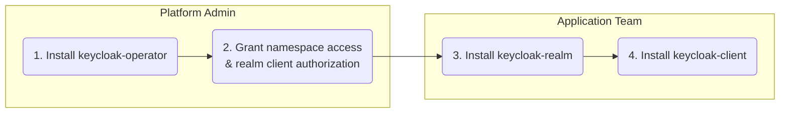

# Keycloak Operator Helm Charts

This directory contains three Helm charts for deploying and managing Keycloak infrastructure with GitOps compatibility.

These charts are the recommended deployment path. Managing raw `Keycloak`, `KeycloakRealm`, or `KeycloakClient` manifests directly is supported, but it is an advanced/manual workflow. See [Helm vs Direct CR Deployments](../docs/how-to/helm-vs-cr-deployments.md).

## Charts Overview

### 1. keycloak-operator

**Purpose:** Install the Keycloak Operator for platform administrators.

**Installs:**
- Operator deployment with HA support
- CRDs (Keycloak, KeycloakRealm, KeycloakClient)
- RBAC (ClusterRole, ClusterRoleBinding, ServiceAccount)
- Optional: Prometheus ServiceMonitor
- Optional: Keycloak instance

**Target Users:** Platform administrators, cluster operators

### 2. keycloak-realm

**Purpose:** Deploy Keycloak realms for development teams.

**Installs:**
- KeycloakRealm custom resource
- Realm configuration (security, themes, tokens, SMTP, etc.)

**Target Users:** Development teams, realm administrators

### 3. keycloak-client

**Purpose:** Deploy OAuth2/OIDC clients for applications.

**Installs:**
- KeycloakClient custom resource
- Client configuration (redirect URIs, scopes, roles, etc.)

**Target Users:** Application developers, service owners

## Installation Flow



## Quick Start


## Quick Start

### Step 1: Install the Operator

```bash
# Install operator
helm install keycloak-operator ./charts/keycloak-operator \
  --namespace keycloak-system \
  --create-namespace

# Wait for operator to be ready
kubectl wait --for=condition=available deployment/keycloak-operator \
  -n keycloak-system --timeout=300s

```


### Step 2: Create a Realm

Application teams create realms:

```bash
# Create a realm
helm install my-realm ./charts/keycloak-realm \
  --namespace my-team \
  --set realmName=myteam \
  --set displayName="My Team Realm" \
  --set operatorRef.namespace=keycloak-system \

# Wait for realm to be ready
kubectl wait --for=jsonpath='{.status.phase}'=Ready \
  keycloakrealm/my-realm \
  -n my-team --timeout=300s

```

### Step 3: Create Additional Realms (Optional)

Create additional realms as needed:

```bash
# Create additional realms without any extra token distribution step
helm install another-realm ./charts/keycloak-realm \
  --namespace my-team \
  --set realmName=another \
  --set displayName="Another Realm" \
  --set operatorRef.namespace=keycloak-system

# Authorization remains declarative through RBAC and clientAuthorizationGrants
```

### Step 4: Create a Client

Create clients within a realm:

```bash
# Create a client
helm install my-client ./charts/keycloak-client \
  --namespace my-team \
  --set clientId=myapp \
  --set realmRef.name=my-realm \
  --set realmRef.namespace=my-team \
  --set redirectUris[0]="https://myapp.example.com/callback" \
  --set webOrigins[0]="https://myapp.example.com"

# Wait for client to be ready
kubectl wait --for=jsonpath='{.status.phase}'=Ready \
  keycloakclient/my-client \
  -n my-team --timeout=300s
```

For confidential clients, the chart creates a same-namespace Secret containing the ready-to-consume connection data your workload needs:

- `client-id`
- `client-secret`
- `issuer`
- `keycloak-url`
- `realm`
- `token-endpoint`
- `userinfo-endpoint`
- `jwks-endpoint`

If you do not set `secretName`, the default secret name is `<release-fullname>-credentials`. For the example above, that becomes `my-client-keycloak-client-credentials`.

Wire that Secret directly into an application Deployment in the same namespace instead of manually reading it:

```yaml
apiVersion: apps/v1
kind: Deployment
metadata:
  name: myapp
  namespace: my-team
spec:
  replicas: 1
  selector:
    matchLabels:
      app: myapp
  template:
    metadata:
      labels:
        app: myapp
    spec:
      containers:
        - name: myapp
          image: ghcr.io/example/myapp:latest
          env:
            - name: OIDC_CLIENT_ID
              valueFrom:
                secretKeyRef:
                  name: my-client-keycloak-client-credentials
                  key: client-id
            - name: OIDC_CLIENT_SECRET
              valueFrom:
                secretKeyRef:
                  name: my-client-keycloak-client-credentials
                  key: client-secret
            - name: OIDC_ISSUER
              valueFrom:
                secretKeyRef:
                  name: my-client-keycloak-client-credentials
                  key: issuer
            - name: OIDC_TOKEN_ENDPOINT
              valueFrom:
                secretKeyRef:
                  name: my-client-keycloak-client-credentials
                  key: token-endpoint
```

## Using with GitOps

All charts are designed for GitOps workflows. Create values files in your Git repository:

### Example: ArgoCD Application (First Realm)

Example realm configuration:

```yaml
apiVersion: argoproj.io/v1alpha1
kind: Application
metadata:
  name: my-realm
  namespace: argocd
spec:
  project: default
  source:
    repoURL: https://github.com/your-org/your-repo
    targetRevision: main
    path: charts/keycloak-realm
    helm:
      values: |
        realmName: myteam
        displayName: "My Team Realm"
        operatorRef:
          namespace: keycloak-system
        security:
          registrationAllowed: false
          resetPasswordAllowed: true
        smtpServer:
          enabled: true
          host: smtp.example.com
          from: noreply@myteam.com
          passwordSecret:
            name: smtp-credentials
  destination:
    server: https://kubernetes.default.svc
    namespace: my-team
  syncPolicy:
    automated:
      prune: true
      selfHeal: true
```

### Example: ArgoCD Application (Additional Realms)

## Helm Repository

The charts are published to a Helm repository hosted on GitHub Pages with **full version history**.

### Add the Helm Repository

```bash
# Add the Keycloak Operator Helm repository
helm repo add keycloak-operator https://vriesdemichael.github.io/keycloak-operator/charts

# Update your local Helm chart repository cache
helm repo update
```

### List Available Versions

All chart versions are preserved and available for installation:

```bash
# List all available versions for operator chart
helm search repo keycloak-operator/keycloak-operator --versions

# List all available versions for realm chart
helm search repo keycloak-operator/keycloak-realm --versions

# List all available versions for client chart
helm search repo keycloak-operator/keycloak-client --versions
```

### Install Specific Version

You can install any version of a chart:

```bash
# Install specific operator chart version
helm install keycloak-operator keycloak-operator/keycloak-operator \
  --version 0.1.4 \
  --namespace keycloak-system \
  --create-namespace

# Install specific realm chart version
helm install my-realm keycloak-operator/keycloak-realm \
  --version 0.1.2 \
  --namespace my-team \
  --set realmName=myteam

# Install specific client chart version
helm install my-client keycloak-operator/keycloak-client \
  --version 0.1.1 \
  --namespace my-team \
  --set clientId=myapp
```

### Install from Helm Repository

Install the latest version (recommended for new deployments):

```bash
# Install operator chart (latest)
helm install keycloak-operator keycloak-operator/keycloak-operator \
  --namespace keycloak-system \
  --create-namespace

# Install realm chart (latest)
helm install my-realm keycloak-operator/keycloak-realm \
  --namespace my-team \
  --set realmName=myteam \
  --set operatorRef.namespace=keycloak-system

# Install client chart (latest)
helm install my-client keycloak-operator/keycloak-client \
  --namespace my-team \
  --set clientId=myapp \
  --set realmRef.name=my-realm
```

**Note:** The examples in this README use local chart paths (`./charts/...`) for development and testing. In production, use the Helm repository as shown above.

### Version Compatibility

Each chart version indicates which operator version it's compatible with via the `appVersion` field:

```bash
# Check which operator version a chart deploys
helm show chart keycloak-operator/keycloak-operator --version 0.1.4 | grep appVersion
# Output: appVersion: "v0.2.14"
```

For more details on versioning, see the [Versioning Documentation](https://vriesdemichael.github.io/keycloak-operator/latest/versioning/).

## Chart Documentation

Each chart has its own README with detailed documentation:

- [keycloak-operator/README.md](keycloak-operator/README.md)
- [keycloak-realm/README.md](keycloak-realm/README.md)
- [keycloak-client/README.md](keycloak-client/README.md)

## Configuration

### Operator Chart Values

Key configuration options:

```yaml
operator:
  replicaCount: 2
  image:
    repository: keycloak-operator
    tag: "1.0.0"
  resources:
    limits:
      cpu: 500m
      memory: 512Mi

keycloak:
  enabled: true  # Deploy a Keycloak instance
  replicas: 3
  version: "26.0.0"
```

### Realm Chart Values

Key configuration options:

```yaml
realmName: myteam
displayName: "My Team"

security:
  registrationAllowed: false
  resetPasswordAllowed: true
  bruteForceProtected: true

smtpServer:
  enabled: true
  host: smtp.example.com
  from: noreply@example.com

tokenSettings:
  accessTokenLifespan: 300
  ssoSessionIdleTimeout: 1800
```

### Client Chart Values

Key configuration options:

```yaml
clientId: myapp

publicClient: false
standardFlowEnabled: true
directAccessGrantsEnabled: true
serviceAccountsEnabled: false

redirectUris:
  - "https://myapp.example.com/callback"

webOrigins:
  - "https://myapp.example.com"

serviceAccountRoles:
  realmRoles:
    - view-users
```

## Testing

Test chart rendering without installing:

```bash
# Operator chart
helm template test-operator ./charts/keycloak-operator

# Realm chart
helm template test-realm ./charts/keycloak-realm \
  --set realmName=test

# Client chart
helm template test-client ./charts/keycloak-client \
  --set clientId=test \
  --set realmRef.name=test-realm \
  --set realmRef.namespace=test \
```

Perform dry-run installation:

```bash
helm install test ./charts/keycloak-operator --dry-run --debug
```

## Upgrading

To upgrade an existing release:

```bash
# Upgrade operator
helm upgrade keycloak-operator ./charts/keycloak-operator \
  -n keycloak-system

# Upgrade realm
helm upgrade my-realm ./charts/keycloak-realm \
  -n my-team \
  --reuse-values \
  --set security.resetPasswordAllowed=false

# Upgrade client
helm upgrade my-client ./charts/keycloak-client \
  -n my-team \
  --reuse-values
```

## Uninstalling

```bash
# Delete client
helm uninstall my-client -n my-team

# Delete realm
helm uninstall my-realm -n my-team

# Delete operator (WARNING: This will delete all Keycloak instances)
helm uninstall keycloak-operator -n keycloak-system
```

## Troubleshooting

### Check Operator Status

```bash
kubectl get deployment keycloak-operator -n keycloak-system
kubectl logs -n keycloak-system -l app.kubernetes.io/name=keycloak-operator
```

### Check Realm Status

```bash
kubectl get keycloakrealm -A
kubectl describe keycloakrealm my-realm -n my-team
```

### Check Client Status

```bash
kubectl get keycloakclient -A
kubectl describe keycloakclient my-client -n my-team
```

### Common Issues

**Issue:** Realm stuck in "Failed" state with "Authorization failed" message

**Solution:** Verify the namespace has the expected RBAC wiring and that any referenced Secret has the required operator-read label.

**Issue:** Client stuck in "Failed" state

**Solution:** Verify the realm grants the namespace via `clientAuthorizationGrants` and that the realm is Ready:
```bash
kubectl get keycloakrealm my-realm -n my-team -o jsonpath='{.status}'
```

## Contributing

Contributions are welcome! Please see the main repository README for guidelines.

## License

See LICENSE file in the repository root.
