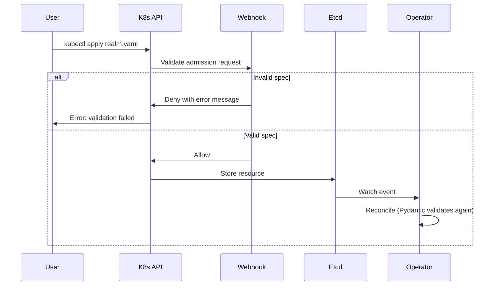

# Admission Webhooks

The Keycloak Operator includes Kubernetes admission webhooks that validate resource specifications before they are stored in etcd. This provides immediate feedback on configuration errors and enforces resource quotas.

## What Are Admission Webhooks?

Admission webhooks intercept requests to the Kubernetes API server and validate them before the resources are persisted. This means:

- **Immediate feedback**: `kubectl apply` fails immediately if the spec is invalid
- **Clear error messages**: You see exactly what's wrong and how to fix it
- **Prevention**: Invalid resources never enter etcd
- **Better GitOps**: ArgoCD/Flux show validation errors immediately

Without webhooks, Pydantic validation happens during reconciliation, which means resources appear created successfully but fail later.

## Features

### 1. Specification Validation

Validates resource specs against business rules:

```yaml
apiVersion: vriesdemichael.github.io/v1
kind: KeycloakRealm
metadata:
  name: invalid-realm
spec:
  keycloakRef:
    name: "INVALID NAME!"  # ❌ Fails immediately: invalid format
    namespace: default
```

**Error message**:
```
Error from server: admission webhook "validate.keycloakrealm.vriesdemichael.github.io" denied the request:
Invalid keycloakRef.name: must match pattern ^[a-z0-9]([-a-z0-9]*[a-z0-9])?$
```

### 2. Resource Quotas

Enforces limits to prevent namespace abuse:

**Realms per namespace** (configured in Keycloak CR):
```yaml
apiVersion: vriesdemichael.github.io/v1
kind: Keycloak
metadata:
  name: keycloak
  namespace: keycloak-system
spec:
  realmQuota:
    perNamespace: 5  # Max 5 realms per namespace
```

**Clients per namespace** (configured in webhook settings):
```yaml
webhooks:
  enabled: true
  quotas:
    clientsPerNamespace: 50  # Max 50 clients per namespace
```

When quota is exceeded:
```
Error from server: admission webhook "validate.keycloakrealm.vriesdemichael.github.io" denied the request:
Namespace 'tenant-a' has reached the maximum of 5 realms.
Delete an existing realm before creating a new one.
```

### 3. One Keycloak Per Namespace

Prevents conflicts by enforcing only one Keycloak instance per namespace:

```yaml
# First Keycloak - OK
apiVersion: vriesdemichael.github.io/v1
kind: Keycloak
metadata:
  name: keycloak-primary
  namespace: keycloak-system
---
# Second Keycloak - REJECTED
apiVersion: vriesdemichael.github.io/v1
kind: Keycloak
metadata:
  name: keycloak-secondary  # ❌ Fails: already have keycloak-primary
  namespace: keycloak-system
```

**Error message**:
```
Error from server: admission webhook "validate.keycloak.vriesdemichael.github.io" denied the request:
Only one Keycloak instance allowed per namespace.
Existing instance: keycloak-primary
```

## Prerequisites

### cert-manager (Required for Webhooks)

Admission webhooks require TLS certificates for secure communication with the Kubernetes API server. The operator uses [cert-manager](https://cert-manager.io/) to automatically generate and rotate these certificates.

**If you have cert-manager installed** (most production clusters do):
- Webhooks work out of the box
- Certificates are automatically managed
- No additional configuration needed

**If you don't have cert-manager**:

Option 1 - Install cert-manager (recommended):
```bash
kubectl apply -f https://github.com/cert-manager/cert-manager/releases/download/v1.14.4/cert-manager.yaml
kubectl wait --for=condition=available deployment/cert-manager -n cert-manager --timeout=2m
```

Option 2 - Disable webhooks:
```yaml
# values.yaml
webhooks:
  enabled: false
```

> **Note**: Disabling webhooks means you won't get immediate validation feedback. Resources will still be validated during reconciliation via Pydantic, but errors will appear in the operator logs and resource status rather than blocking `kubectl apply`.

See [Decision Record 065](decisions/065-webhook-certificate-management-with-cert-manager.yaml) for technical details on why cert-manager is used.

## Configuration

Webhooks are configured in the operator Helm chart `values.yaml`:

```yaml
webhooks:
  # Enable/disable admission webhooks
  enabled: true

  # Webhook server port (internal)
  port: 8443

  # Timeout for webhook responses
  timeoutSeconds: 10

  # Failure policy: Fail (reject on error) or Ignore (allow on error)
  # Fail = fail-closed (more secure)
  # Ignore = fail-open (more available)
  failurePolicy: Fail

  # Resource quotas
  quotas:
    # Maximum realms per namespace (0 = unlimited)
    realmsPerNamespace: 10

    # Maximum clients per namespace (0 = unlimited)
    clientsPerNamespace: 100
```

### Disabling Webhooks

If you don't want admission webhooks (e.g., for testing or if you have external validation):

```yaml
webhooks:
  enabled: false
```

**Note**: With webhooks disabled, validation still happens via Pydantic during reconciliation, but you won't get immediate feedback.

## How It Works



## Bootstrap Considerations

When deploying the operator for the first time:

1. **Operator pod must be ready** before creating Keycloak CRs
2. **Webhook server must be listening** on port 8443
3. **ValidatingWebhookConfiguration** must be created (auto-managed by Kopf)

The operator Helm chart handles this via:

- **Readiness probe**: Checks both `/healthz` endpoint AND webhook port 8443
- **Helm --wait**: Waits for operator pod to be ready before completing
- **ArgoCD sync waves**: Operator in wave 0, Keycloak CRs in wave 1

If you're deploying Keycloak CRs separately:

```bash
# Option 1: Use Helm --wait (recommended)
helm install keycloak-operator charts/keycloak-operator --wait

# Option 2: Wait manually
kubectl wait --for=condition=ready pod -l app.kubernetes.io/name=keycloak-operator -n keycloak-system --timeout=120s

# Then create your Keycloak resources
kubectl apply -f my-keycloak.yaml
```

## Troubleshooting

### Webhook Timeout

**Symptom**: `context deadline exceeded` error when creating resources

**Cause**: Webhook server not responding within `timeoutSeconds`

**Solutions**:
1. Check operator logs: `kubectl logs -l app.kubernetes.io/name=keycloak-operator -n keycloak-system`
2. Check operator pod is ready: `kubectl get pods -n keycloak-system`
3. Check webhook service has endpoints: `kubectl get endpoints -n keycloak-system`
4. Increase timeout (if needed): `webhooks.timeoutSeconds: 30`

### Webhook Connection Refused

**Symptom**: `dial tcp: connection refused` error

**Cause**: Operator pod not ready yet, or webhook server crashed

**Solutions**:
1. Wait for operator pod to be ready: `kubectl wait --for=condition=ready pod -l app.kubernetes.io/name=keycloak-operator`
2. Check operator logs for startup errors
3. Verify RBAC permissions for `validatingwebhookconfigurations`

### Validation Errors

**Symptom**: `admission webhook denied the request: ...`

**Cause**: Your resource spec doesn't pass validation

**Solution**: Read the error message carefully - it tells you exactly what's wrong:

```
Error from server: admission webhook "validate.keycloakrealm.vriesdemichael.github.io" denied the request:
Invalid spec.keycloakRef.name: must match pattern ^[a-z0-9]([-a-z0-9]*[a-z0-9])?$
```

Fix the spec according to the error message.

### Bypassing Webhooks (Emergency Only)

If webhooks are blocking critical operations and you need to bypass them temporarily:

```bash
# Disable webhooks in Helm values
helm upgrade keycloak-operator charts/keycloak-operator \
  --set webhooks.enabled=false --wait

# Or delete the webhook config manually
kubectl delete validatingwebhookconfiguration -l kopf.zalando.org/managed=vriesdemichael.github.io
```

**⚠️ Warning**: This disables validation. Only use for emergency recovery.

## Monitoring

Check webhook health via metrics (if Prometheus enabled):

```promql
# Webhook request rate
rate(kopf_admission_requests_total[5m])

# Webhook rejections
rate(kopf_admission_rejections_total[5m])

# Webhook latency
histogram_quantile(0.95, rate(kopf_admission_duration_seconds_bucket[5m]))
```

Or check operator logs:

```bash
kubectl logs -l app.kubernetes.io/name=keycloak-operator -n keycloak-system | grep -i webhook
```

## Technical Details

- **Implementation**: Uses Kopf's `@kopf.on.validate()` decorators
- **Certificates**: Self-signed, auto-generated by Kopf (via `kopf[dev]` extra)
- **CA Bundle**: Automatically injected into ValidatingWebhookConfigurations by Kopf
- **Cert Rotation**: Handled automatically by Kopf
- **Management**: ValidatingWebhookConfigurations auto-created and managed by operator

See [ADR-040: Admission Webhooks](decisions/040-admission-webhooks-for-validation.yaml) for design rationale.
