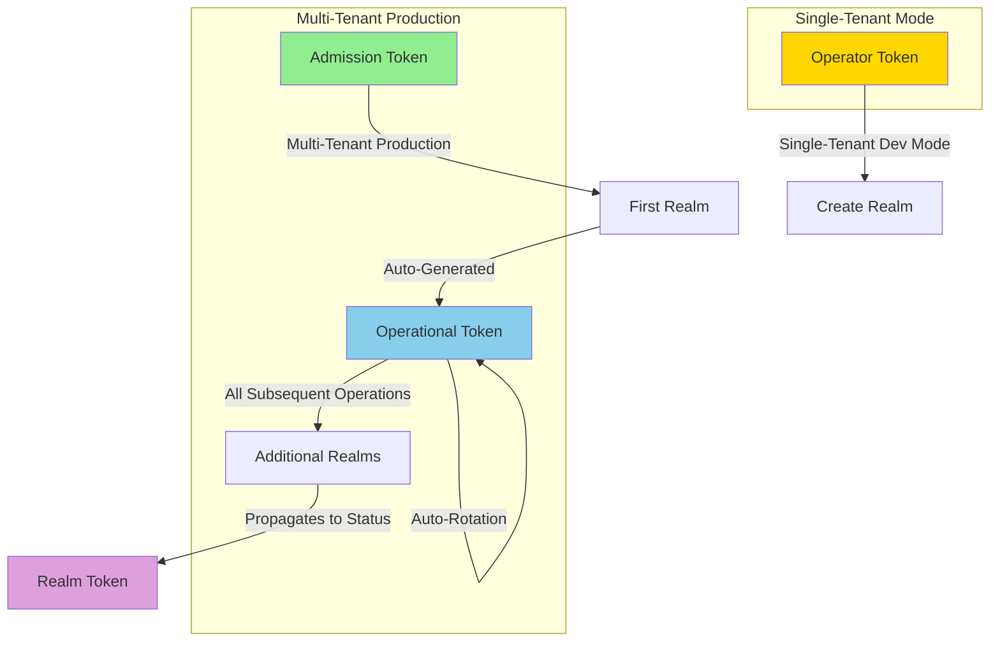

# Architecture

This operator is structured into clear layers to keep reconciliation logic maintainable and testable.

## High-Level Components

| Layer | Purpose |
|-------|---------|
| CRDs / Models | Pydantic models define the spec & status of custom resources. |
| Handlers | Kopf handlers reacting to create/update/delete events. |
| Services (Reconcilers) | Idempotent business logic for converging desired -> actual state. |
| Utils | Reusable helpers: Kubernetes API interactions, Keycloak admin client, validation. |
| Observability | Metrics, health endpoints, structured logging. |

## Token System Architecture

The operator uses a sophisticated multi-tier token system to balance security, multi-tenancy, and operational simplicity.

### Token Types



### Token Lifecycle

| Token Type | Purpose | Lifecycle | Rotation | Usage |
|------------|---------|-----------|----------|-------|
| **Operator Token** | Dev/evaluation mode | Created with operator | Manual | Direct realm creation (single-tenant only) |
| **Admission Token** | Bootstrap namespace | Platform team creates | Manual | First realm in namespace |
| **Operational Token** | Day-to-day operations | Auto-generated from first realm | Every 90 days | All subsequent realms |
| **Realm Token** | Client access | Created per realm | Managed by realm | OAuth2/OIDC clients |

### Single-Tenant vs Multi-Tenant

#### Single-Tenant / Development Mode

Best for: Evaluation, development, testing

```yaml
# Use operator token directly (simple, but no multi-tenancy)
spec:
  operatorRef:
    namespace: keycloak-system
    authorizationSecretRef:
      name: keycloak-operator-auth-token
```

**Flow:**
1. Operator creates `keycloak-operator-auth-token` on startup
2. Teams use operator token directly for all realms
3. No namespace isolation, no token rotation

**Limitations:**
- Single point of access (operator token compromise affects all realms)
- No namespace-based RBAC isolation
- Manual token rotation required
- Not suitable for production multi-tenant environments

#### Multi-Tenant / Production Mode

Best for: Production, multi-team environments

```yaml
# First realm uses admission token
spec:
  operatorRef:
    namespace: keycloak-system
    authorizationSecretRef:
      name: my-team-admission-token
```

**Flow:**
1. Platform team generates unique admission token per team
2. Platform team creates secret in team's namespace with discovery labels
3. Platform team registers token in operator's metadata ConfigMap
4. Team creates first realm using admission token
5. Operator auto-generates operational token, stores in namespace
6. All subsequent realms auto-discover operational token
7. Operational token auto-rotates every 90 days with zero downtime

**Benefits:**
- Namespace-level RBAC isolation (teams can only manage their realms)
- Automatic token rotation (security best practice)
- Admission token can be revoked after first realm (principle of least privilege)
- Platform team controls which namespaces can create realms
- Each team has independent operational token

### Token Discovery Mechanism

The operator discovers operational tokens using Kubernetes labels:

```yaml
apiVersion: v1
kind: Secret
metadata:
  name: my-team-operational-token
  namespace: my-team
  labels:
    keycloak.vriesdemichael.github.io/managed-by: keycloak-operator
    keycloak.vriesdemichael.github.io/operator-instance: default
    keycloak.vriesdemichael.github.io/token-type: operational
```

When creating a realm, the operator:
1. Checks if realm specifies an authorization secret (explicit)
2. If not, searches namespace for secret with discovery labels (auto-discovery)
3. Uses discovered operational token
4. Falls back to error if no token found

### Security Considerations

- **Operator token** bypasses multi-tenant security - only use for dev/evaluation
- **Admission tokens** are one-time bootstrap credentials - can be revoked after first realm
- **Operational tokens** are namespace-scoped - compromise affects only that namespace's realms
- **Realm tokens** are realm-specific - compromise affects only that realm's clients
- **Token rotation** happens automatically for operational tokens (90-day default)
- **Token metadata** tracked in ConfigMap for audit trail

See [Security Model](security.md) for detailed security architecture and [Token Management](operations/token-management.md) for operational procedures.

## Reconciliation Flow

1. Kubernetes emits an event for a custom resource (e.g. `KeycloakRealm`).
2. Kopf invokes the registered handler in `handlers/realm.py`.
3. Handler validates input and delegates to a reconciler in `services/realm_reconciler.py`.
4. Reconciler:
   - Loads current state from Keycloak & cluster
   - Computes diff against desired spec
   - Applies required create/update/delete operations
   - Emits metrics & logs
5. Status field may be updated in the CR to reflect success or error.

## Key Modules

- `models/` define `Keycloak`, `KeycloakRealm`, `KeycloakClient` domain schemas.
- `handlers/` contain Kopf decorated async functions with minimal logic.
- `services/` hold reconcilers orchestrating API calls & ensuring idempotency.
- `utils/keycloak_admin.py` wraps Keycloak REST admin endpoints.
- `observability/metrics.py` defines Prometheus collectors.

## Error Handling

Custom exceptions in `errors/operator_errors.py` categorize recoverable vs fatal failures. Handlers catch and translate them to appropriate Kubernetes events/logs.

## Scaling Strategy

When considering scaling in a Keycloak deployment managed by this operator, it's critical to understand that there are **two distinct types of scaling**, each serving different purposes and having different performance characteristics.

### Two Types of Scaling

#### 1. Operator Scaling (Reconciliation)

The operator itself performs reconciliation actions:
- Watches Keycloak custom resources
- Reconciles desired state with actual state
- Makes Admin API calls to configure Keycloak
- Manages Kubernetes resources

**Key Point:** Operator scaling is rarely the bottleneck.

#### 2. Keycloak Instance Scaling (End-User Traffic)

The Keycloak instance handles:
- End-user authentication and authorization requests
- Session management
- Token generation and validation
- User database queries
- Admin API calls (triggered by operator or administrators)

**Key Point:** This is where you will hit performance limits first.

### Where Bottlenecks Occur

In virtually all real-world scenarios, **you will hit Keycloak instance limitations before operator limitations**, even after vertically scaling both components to their maximum capacity.

The operator's workload (reconciliation loops and occasional Admin API calls) is minimal compared to the Keycloak instance's workload (continuous authentication/authorization requests from thousands or millions of end users).

### When to Scale What

If you're experiencing performance issues:

1. **First, scale the Keycloak instance itself:**
   - Increase replicas for horizontal scaling
   - Add database read replicas
   - Optimize caching configuration
   - Review realm and client configuration for performance

2. **Only consider operator scaling if:**
   - You have an extremely high rate of realm/client configuration changes
   - Reconciliation loops are measurably slow
   - You can verify that the operator is the actual bottleneck (use metrics/profiling)

### Multi-Operator Deployment Pattern

If you genuinely need more operator capacity (or want to isolate workloads), this operator supports running multiple instances side-by-side in the same cluster.

Each realm can target a specific operator instance using the `operatorRef` field. This allows you to:

- Distribute realm management across multiple operators
- Isolate different teams or environments to different operators
- Scale operator capacity horizontally when needed

**Example configuration:**

```yaml
# yaml-language-server: $schema=https://vriesdemichael.github.io/keycloak-operator/schemas/v1/KeycloakRealm.json
apiVersion: vriesdemichael.github.io/v1
kind: KeycloakRealm
metadata:
  name: my-realm
spec:
  realmName: my-realm
  operatorRef:
    namespace: keycloak-system
    authorizationSecretRef:
      name: keycloak-operator-auth-token
  # ... rest of realm config
```

**When to use multiple operators:**

- Large number of realms with frequent configuration changes
- Workload isolation (e.g., production vs non-production)
- Geographic distribution across regions/clusters
- Huge monolithic realms that cannot be subdivided

**When NOT to use multiple operators:**

- To improve end-user authentication performance (scale Keycloak instead)
- As a first resort (vertical scaling is usually sufficient)
- Without measuring (verify the operator is actually your bottleneck)

### Recommended Approach

For most use cases:

1. Start with a single operator instance with reasonable resource limits
2. Scale your Keycloak instances to meet end-user authentication demands
3. Monitor operator performance using available metrics
4. Only deploy additional operators when you can demonstrate that reconciliation performance is actually limiting your operations

### Common Misconception

> "Python operators don't scale as well as Go operators, so I need multiple instances."

**Reality:** For this workload, the language choice has minimal impact. The operator spends most of its time waiting for Kubernetes API responses and Keycloak Admin API calls, not doing CPU-intensive work. A single Python-based operator can easily manage dozens of realms without performance degradation.

The scaling strategy should be driven by **actual performance metrics and requirements**, not by assumptions about implementation language.

## Future Enhancements

- Finalizers for deterministic teardown
- Smarter diffing of realm/client sub-resources
- Rate limiting & backoff policies
- Pluggable auth strategies for Keycloak admin API

Return to the [index](index.md) or continue with the [development guide](development.md).
