# Architecture

This operator is structured into clear layers to keep reconciliation logic maintainable and testable.

## High-Level Components

| Layer | Purpose |
|-------|---------|
| CRDs / Models | Pydantic models define the spec & status of custom resources. |
| Handlers | Kopf handlers reacting to create/update/delete events. |
| Services (Reconcilers) | Idempotent business logic for converging desired -> actual state. |
| Utils | Reusable helpers: Kubernetes API interactions, Keycloak admin client, validation. |
| Observability | Metrics, health endpoints, structured logging. |


## Authorization Architecture

The operator uses **Kubernetes RBAC** combined with **declarative namespace grant lists** for multi-tenant authorization.

### Authorization Model


### Two-Level Authorization

| Level | Mechanism | Controls | Example |
|-------|-----------|----------|---------|
| **Level 1: Realm Creation** | Kubernetes RBAC | Who can create realms | RoleBinding grants \`create\` on \`KeycloakRealm\` |
| **Level 2: Client Creation** | Namespace Grant List | Which namespaces can create clients in a realm | Realm's \`spec.clientAuthorizationGrants\` |

### Realm Creation Authorization

**Controlled by**: Standard Kubernetes RBAC

Any user/ServiceAccount with permission to create \`KeycloakRealm\` resources in a namespace can create realms:

\`\`\`yaml
apiVersion: rbac.authorization.k8s.io/v1
kind: Role
metadata:
  name: realm-manager
  namespace: my-app
rules:
  - apiGroups: ["vriesdemichael.github.io"]
    resources: ["keycloakrealms"]
    verbs: ["create", "update", "patch", "delete"]
\`\`\`

**Benefits:**
- Native Kubernetes authorization
- Integrates with existing RBAC/SSO
- GitOps-friendly (ArgoCD ServiceAccounts)
- Auditable via Kubernetes audit logs

### Client Creation Authorization

**Controlled by**: Realm's \`clientAuthorizationGrants\` field

Only namespaces explicitly listed in a realm's grant list can create clients in that realm:

\`\`\`yaml
apiVersion: vriesdemichael.github.io/v1
kind: KeycloakRealm
metadata:
  name: shared-realm
  namespace: platform
spec:
  realmName: shared
  instanceRef:
    name: keycloak
    namespace: keycloak-system
  # Only these namespaces can create clients
  clientAuthorizationGrants:
    - platform      # Same namespace
    - app-team-a    # Cross-namespace
    - app-team-b    # Cross-namespace
\`\`\`

**Authorization Flow:**

1. User creates \`KeycloakClient\` in namespace \`app-team-a\`
2. Operator reads client's \`realmRef\` to find realm
3. Operator checks if \`app-team-a\` is in realm's \`clientAuthorizationGrants\`
4. If authorized: Client created in Keycloak
5. If not authorized: Client enters \`Error\` phase with clear message

**Example: Client in authorized namespace**

\`\`\`yaml
apiVersion: vriesdemichael.github.io/v1
kind: KeycloakClient
metadata:
  name: my-client
  namespace: app-team-a  # Must be in realm's grant list
spec:
  clientId: my-app
  realmRef:
    name: shared-realm
    namespace: platform
  publicClient: false
\`\`\`

### Security Considerations

- **Namespace Isolation**: Client credentials only exist in client's namespace
- **Least Privilege**: Realm owners control which namespaces can create clients
- **Revocation**: Remove namespace from grant list to prevent new clients
- **Audit Trail**: All authorization changes tracked in Git and Kubernetes audit logs
- **No Secrets in Git**: Authorization is declarative (namespace names), not secret-based

See [Security Model](security.md) for detailed authorization architecture and best practices.


## Reconciliation Flow

The operator follows a consistent reconciliation pattern for all custom resources:


**Reconciliation Steps:**

1. **Event Reception**: Kubernetes emits event for custom resource (create/update/delete)
2. **Handler Invocation**: Kopf invokes registered handler (`handlers/realm.py`, etc.)
3. **Input Validation**: Handler validates spec fields and authorization
4. **Delegation**: Handler delegates to reconciler service (`services/realm_reconciler.py`)
5. **State Loading**: Reconciler loads current state from Keycloak and Kubernetes APIs
6. **Diff Computation**: Compare desired spec with actual state
7. **Change Application**: Apply required create/update/delete operations via Keycloak Admin API
8. **Status Update**: Update custom resource status field (Ready/Failed)
9. **Observability**: Emit metrics, logs, and Kubernetes events

**Key Principles:**

- **Idempotent**: Reconciler can be called multiple times with same input
- **Thin Handlers**: Handlers contain minimal logic, delegate to services
- **Thick Services**: Reconcilers contain all business logic
- **State-Based**: Always compare current state vs desired state (not event-based)
- **Error Recovery**: Failed reconciliations retry with exponential backoff

## Key Modules

- `models/` define `Keycloak`, `KeycloakRealm`, `KeycloakClient` domain schemas.
- `handlers/` contain Kopf decorated async functions with minimal logic.
- `services/` hold reconcilers orchestrating API calls & ensuring idempotency.
- `utils/keycloak_admin.py` wraps Keycloak REST admin endpoints.
- `observability/metrics.py` defines Prometheus collectors.

## Error Handling

Custom exceptions in `errors/operator_errors.py` categorize recoverable vs fatal failures. Handlers catch and translate them to appropriate Kubernetes events/logs.

## Scaling Strategy

When considering scaling in a Keycloak deployment managed by this operator, it's critical to understand that there are **two distinct types of scaling**, each serving different purposes and having different performance characteristics.

### Two Types of Scaling

#### 1. Operator Scaling (Reconciliation)

The operator itself performs reconciliation actions:
- Watches Keycloak custom resources
- Reconciles desired state with actual state
- Makes Admin API calls to configure Keycloak
- Manages Kubernetes resources

**Key Point:** Operator scaling is rarely the bottleneck.

#### 2. Keycloak Instance Scaling (End-User Traffic)

The Keycloak instance handles:
- End-user authentication and authorization requests
- Session management
- Token generation and validation
- User database queries
- Admin API calls (triggered by operator or administrators)

**Key Point:** This is where you will hit performance limits first.

### Where Bottlenecks Occur

In virtually all real-world scenarios, **you will hit Keycloak instance limitations before operator limitations**, even after vertically scaling both components to their maximum capacity.

The operator's workload (reconciliation loops and occasional Admin API calls) is minimal compared to the Keycloak instance's workload (continuous authentication/authorization requests from thousands or millions of end users).

### When to Scale What

If you're experiencing performance issues:

1. **First, scale the Keycloak instance itself:**
   - Increase replicas for horizontal scaling
   - Add database read replicas
   - Optimize caching configuration
   - Review realm and client configuration for performance

2. **Only consider operator scaling if:**
   - You have an extremely high rate of realm/client configuration changes
   - Reconciliation loops are measurably slow
   - You can verify that the operator is the actual bottleneck (use metrics/profiling)

### Multi-Operator Deployment Pattern

If you genuinely need more operator capacity (or want to isolate workloads), this operator supports running multiple instances side-by-side in the same cluster.

Each realm can target a specific operator instance using the `operatorRef` field. This allows you to:

- Distribute realm management across multiple operators
- Isolate different teams or environments to different operators
- Scale operator capacity horizontally when needed


**Key Benefits of Multi-Operator Pattern:**

- **Workload Isolation**: Production and development operators are completely independent
- **Blast Radius Reduction**: Issues with dev operator don't affect production realms
- **Independent Scaling**: Each operator can be sized according to its workload
- **Team Autonomy**: Teams can target different operators based on environment
- **Upgrade Safety**: Test operator upgrades in dev before rolling to production

**Example configuration:**

```yaml
# yaml-language-server: $schema=https://vriesdemichael.github.io/keycloak-operator/schemas/v1/KeycloakRealm.json
apiVersion: vriesdemichael.github.io/v1
kind: KeycloakRealm
metadata:
  name: my-realm
spec:
  realmName: my-realm
  operatorRef:
    namespace: keycloak-system
  # ... rest of realm config
```

**When to use multiple operators:**

- Large number of realms with frequent configuration changes
- Workload isolation (e.g., production vs non-production)
- Geographic distribution across regions/clusters
- Huge monolithic realms that cannot be subdivided

**When NOT to use multiple operators:**

- To improve end-user authentication performance (scale Keycloak instead)
- As a first resort (vertical scaling is usually sufficient)
- Without measuring (verify the operator is actually your bottleneck)

### Recommended Approach

For most use cases:

1. Start with a single operator instance with reasonable resource limits
2. Scale your Keycloak instances to meet end-user authentication demands
3. Monitor operator performance using available metrics
4. Only deploy additional operators when you can demonstrate that reconciliation performance is actually limiting your operations

### Common Misconception

> "Python operators don't scale as well as Go operators, so I need multiple instances."

**Reality:** For this workload, the language choice has minimal impact. The operator spends most of its time waiting for Kubernetes API responses and Keycloak Admin API calls, not doing CPU-intensive work. A single Python-based operator can easily manage dozens of realms without performance degradation.

The scaling strategy should be driven by **actual performance metrics and requirements**, not by assumptions about implementation language.

## Rate Limiting Architecture

The operator implements a three-layer rate limiting strategy to protect Keycloak instances from API overload, particularly during mass reconciliation events (operator restarts, database reconnections, or intentional/malicious resource spam).

```mermaid
flowchart TB
    subgraph Reconciliation["Reconciliation Request Flow"]
        Event[Kubernetes Event<br/>create/update/delete]
        Jitter[Layer 3: Jitter<br/>Random delay 0-5s<br/>Prevents thundering herd]
        NSLimit[Layer 2: Namespace Limiter<br/>5 req/s per namespace<br/>Fair allocation]
        GlobalLimit[Layer 1: Global Limiter<br/>50 req/s cluster-wide<br/>Total protection]
        API[Keycloak Admin API]
    end

    subgraph Limits["Token Bucket Rate Limiters"]
        subgraph Global["Global Bucket"]
            GT[Tokens: 50/sec<br/>Burst: 100]
        end

        subgraph NS1["Namespace: team-a"]
            NS1T[Tokens: 5/sec<br/>Burst: 10]
        end

        subgraph NS2["Namespace: team-b"]
            NS2T[Tokens: 5/sec<br/>Burst: 10]
        end

        subgraph NS3["Namespace: team-c"]
            NS3T[Tokens: 5/sec<br/>Burst: 10]
        end
    end

    Event --> Jitter
    Jitter --> NSLimit
    NSLimit --> NS1T
    NSLimit --> NS2T
    NSLimit --> NS3T

    NS1T --> GlobalLimit
    NS2T --> GlobalLimit
    NS3T --> GlobalLimit

    GlobalLimit --> GT
    GT --> API

    style Event fill:#e1f5ff
    style Jitter fill:#fff9c4
    style NSLimit fill:#f3e5f5
    style GlobalLimit fill:#ffccbc
    style API fill:#c8e6c9
    style GT fill:#ffab91
    style NS1T fill:#ce93d8
    style NS2T fill:#ce93d8
    style NS3T fill:#ce93d8
```



### Rate Limiting Layers Explained

#### Layer 3: Jitter (Reconciliation Start)
- **Purpose**: Prevent "thundering herd" when operator restarts with 100+ resources
- **Implementation**: Random delay (0-5 seconds) before reconciliation starts
- **Configuration**: `RECONCILE_JITTER_MAX_SECONDS` (default: 5.0)
- **Effect**: Spreads reconciliation across time window instead of all at once

#### Layer 2: Per-Namespace Rate Limiting
- **Purpose**: Fair resource allocation across teams/namespaces
- **Implementation**: Token bucket algorithm, one bucket per namespace
- **Configuration**: `KEYCLOAK_API_NAMESPACE_RATE_LIMIT_TPS` (default: 5 req/s)
- **Burst Capacity**: `KEYCLOAK_API_NAMESPACE_BURST` (default: 10)
- **Effect**: Prevents one team from monopolizing API capacity

**Example**: If `team-a` creates 1000 realms:
- Rate limited to 5 req/s = 200 seconds minimum
- Other teams' realms still reconcile at their namespace rate limits
- No team can starve others of API capacity

#### Layer 1: Global Rate Limiting
- **Purpose**: Absolute protection of Keycloak instance from overload
- **Implementation**: Token bucket algorithm, shared across all namespaces
- **Configuration**: `KEYCLOAK_API_GLOBAL_RATE_LIMIT_TPS` (default: 50 req/s)
- **Burst Capacity**: `KEYCLOAK_API_GLOBAL_BURST` (default: 100)
- **Effect**: Hard cap on total API requests across entire cluster

**Example**: With 20 teams each creating 100 realms:
- Namespace limits allow each team 5 req/s (total theoretical: 100 req/s)
- Global limit enforces actual maximum of 50 req/s
- Teams fairly share the 50 req/s capacity

### Protection Scenarios

| Scenario | Protection Mechanism | Result |
|----------|---------------------|--------|
| Operator restart (50 resources) | Jitter spreads starts over 5s | Smooth reconciliation, not instant spike |
| Database reconnection (100 resources) | Jitter + namespace limits | Controlled recovery, API not overwhelmed |
| Malicious spam (1000 realms in one namespace) | Namespace limit (5 req/s) | 200 seconds minimum, other teams unaffected |
| 20 teams creating resources simultaneously | Global limit (50 req/s) | Fair sharing, no single team monopolizes |

### Configuration Example

```yaml
# Operator deployment configuration
env:
  # Layer 1: Global limit (protect Keycloak)
  - name: KEYCLOAK_API_GLOBAL_RATE_LIMIT_TPS
    value: "50"
  - name: KEYCLOAK_API_GLOBAL_BURST
    value: "100"

  # Layer 2: Namespace limits (fair allocation)
  - name: KEYCLOAK_API_NAMESPACE_RATE_LIMIT_TPS
    value: "5"
  - name: KEYCLOAK_API_NAMESPACE_BURST
    value: "10"

  # Layer 3: Jitter (thundering herd prevention)
  - name: RECONCILE_JITTER_MAX_SECONDS
    value: "5.0"
```

### Monitoring Rate Limiting

The operator exposes Prometheus metrics for rate limiting (when implemented):

- `keycloak_operator_rate_limit_wait_seconds`: Time spent waiting for rate limit tokens
- `keycloak_operator_rate_limit_denied_total`: Number of requests denied (should be 0)
- `keycloak_operator_rate_limit_tokens_available`: Current token bucket levels

See [Observability](observability.md) for complete metrics documentation.

## Future Enhancements

- Finalizers for deterministic teardown
- Smarter diffing of realm/client sub-resources
- Rate limiting & backoff policies
- Pluggable auth strategies for Keycloak admin API

## See Also

**Core Architecture:**

- [Security Model](security.md) - Token system security architecture and authorization model
- [Observability](observability.md) - Metrics, health checks, and monitoring
- [Development Guide](development.md) - Code structure and development workflow

**Operational Guides:**

- [Security Model](security.md) - Authorization and access control
- [Troubleshooting](operations/troubleshooting.md) - Debugging common issues
- [High Availability Deployment](how-to/ha-deployment.md) - Production deployment patterns

**Quickstart:**

- [Getting Started](quickstart/README.md) - Deploy your first Keycloak realm
- [End-to-End Setup](how-to/end-to-end-setup.md) - Complete production deployment

**API Reference:**

- [Keycloak CRD](reference/keycloak-crd.md) - Keycloak instance configuration
- [KeycloakRealm CRD](reference/keycloak-realm-crd.md) - Realm configuration
- [KeycloakClient CRD](reference/keycloak-client-crd.md) - Client configuration

Return to the [index](index.md) or continue with the [development guide](development.md).
