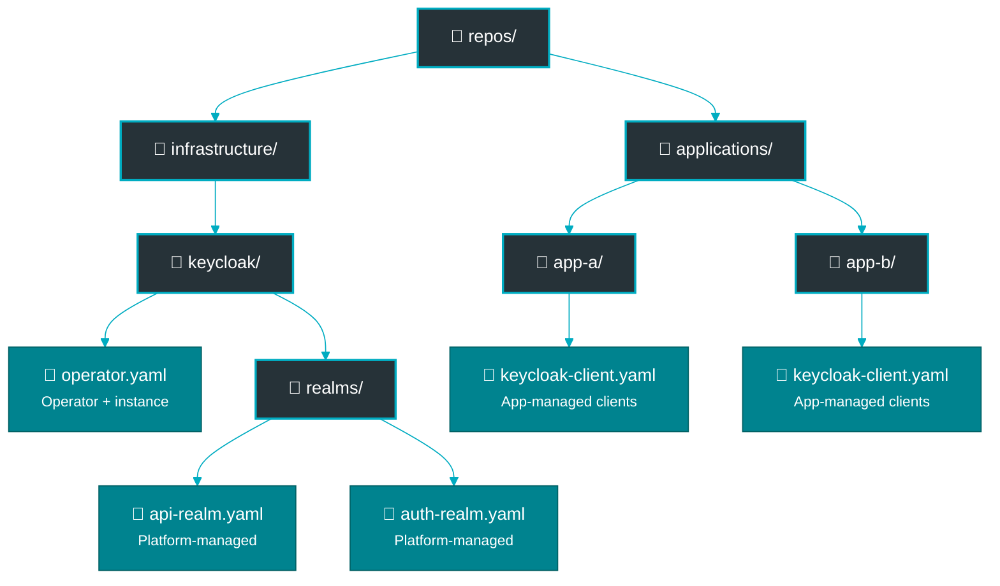

# Security Model

This document explains the security and authorization model of the Keycloak operator.

## Overview

The Keycloak operator uses **Kubernetes RBAC** combined with **declarative namespace grant lists** for authorization.

## Design Philosophy

**Key principle**: Application teams should manage their own Keycloak realms and clients without requiring platform team intervention for each resource. This is the **"Realm-as-Tenant"** model.

### Roles & Responsibilities

The security model is designed to support distinct roles (Platform Team, Realm Owner, Client Owner). For a detailed breakdown of who is responsible for what, see the [Team Responsibilities Matrix](../how-to/multi-tenant.md#roles--responsibilities-matrix).

### Why Not Traditional RBAC Alone?

Pure RBAC approaches don't scale for multi-tenant Keycloak:
- ❌ Can't express "team A can create clients in realm X but not realm Y"
- ❌ Adding teams requires updating cluster-wide RBAC
- ❌ Cross-namespace authorization requires complex RoleBinding hierarchies
- ❌ Doesn't support GitOps workflows well

### Why Not Tokens?

Token-based systems (like this operator previously used) create operational overhead:
- ❌ Token generation, distribution, and rotation lifecycle
- ❌ Manual secret syncing between namespaces
- ❌ Not GitOps-native (secrets don't belong in Git)
- ❌ Complexity increases with team churn

### The Solution: RBAC + Namespace Grants

The operator combines Kubernetes RBAC with declarative namespace authorization:
- ✅ **Realm Creation**: Controlled by Kubernetes RBAC.
- ✅ **Client Creation**: Controlled by realm's `clientAuthorizationGrants` list
- ✅ **Fully Declarative**: All authorization in Git-committable manifests
- ✅ **Self-Service**: Teams can grant access via PR workflow
- ✅ **Clear Audit Trail**: Git history shows all authorization changes

## Authorization Model

### Level 1: Realm Creation

**Who controls it**: Kubernetes RBAC

Any user with permission to create `KeycloakRealm` resources in a namespace can create realms.

**Example: Grant realm creation permission**

```yaml
apiVersion: rbac.authorization.k8s.io/v1
kind: Role
metadata:
  name: realm-manager
  namespace: my-app
rules:
  - apiGroups: ["vriesdemichael.github.io"]
    resources: ["keycloakrealms"]
    verbs: ["create", "update", "patch", "delete"]
---
apiVersion: rbac.authorization.k8s.io/v1
kind: RoleBinding
metadata:
  name: team-realm-managers
  namespace: my-app
subjects:
  - kind: ServiceAccount
    name: argocd-app-controller
    namespace: argocd
  - kind: Group
    name: my-app-team
    apiGroup: rbac.authorization.k8s.io
roleRef:
  kind: Role
  name: realm-manager
  apiGroup: rbac.authorization.k8s.io
```

**Best Practices:**
- Use namespace-scoped Roles (not ClusterRoles) for realm management
- Grant to ServiceAccounts for GitOps tools (ArgoCD, Flux)
- Use Groups to manage team access

### Level 2: Client Creation

**Who controls it**: Realm owner via `clientAuthorizationGrants`

Clients require **explicit namespace authorization** from the realm. Only namespaces listed in `clientAuthorizationGrants` can create clients in that realm.

**Example: Realm with client authorization**

```yaml
apiVersion: vriesdemichael.github.io/v1
kind: KeycloakRealm
metadata:
  name: my-realm
  namespace: my-app
spec:
  realmName: my-app
  instanceRef:
    name: keycloak
    namespace: keycloak-system
  # Grant these namespaces permission to create clients
  clientAuthorizationGrants:
    - my-app              # Same namespace (common)
    - my-app-staging      # Staging environment
    - partner-app         # External team integration
```

**Authorization Check:**

When a `KeycloakClient` resource is created:

1. Operator reads the client's `realmRef` to find the realm
2. Operator reads the realm's `spec.clientAuthorizationGrants`
3. Operator checks if client's namespace is in the grant list
4. If **not authorized**: Client enters `Error` phase with clear message
5. If **authorized**: Client is created in Keycloak

**Example: Client in authorized namespace**

```yaml
apiVersion: vriesdemichael.github.io/v1
kind: KeycloakClient
metadata:
  name: my-client
  namespace: my-app  # ← This namespace must be in realm's grants
spec:
  clientId: my-app
  realmRef:
    name: my-realm
    namespace: my-app
  publicClient: false
  standardFlowEnabled: true
```

**Status when unauthorized:**

```yaml
status:
  phase: Error
  conditions:
    - type: Ready
      status: "False"
      reason: NamespaceNotAuthorized
      message: "Namespace 'my-app' is not authorized to create clients in realm 'my-realm'. Add 'my-app' to realm's clientAuthorizationGrants."
```

### Namespace Authorization Workflow

**Scenario**: Team B wants to create a client in Team A's realm

1. **Team B creates PR** updating Team A's realm manifest:
   ```yaml
   clientAuthorizationGrants:
     - team-a
     - team-b  # ← Add this line
   ```

2. **Team A reviews PR**:
   - Reviews which resources Team B will create
   - Checks security implications
   - Approves or requests changes

3. **PR merged**: ArgoCD/Flux applies the change

4. **Team B can create client**: Operator allows client creation

**Benefits:**
- ✅ Clear approval trail in Git history
- ✅ Standard PR workflow (no special tools)
- ✅ Team A retains full control
- ✅ Reversible (remove from grant list)

## Security Properties

### Namespace Isolation

- **No cross-namespace secrets**: Client credentials only in client's namespace
- **Realm secrets isolated**: Each realm's secrets only in realm's namespace
- **Operator service account**: Has cluster-wide read for authorization checks

### Least Privilege

- **Realm creators**: Only need RBAC in their namespace
- **Client creators**: Only need namespace in grant list
- **Operator**: Runs with minimal RBAC (see ADR 032)

### Revocation

**Removing client access:**

Update realm's `clientAuthorizationGrants` to remove namespace:

```bash
kubectl patch keycloakrealm my-realm -n my-app --type=merge -p '
spec:
  clientAuthorizationGrants:
    - my-app
    # team-b removed
'
```

**Effect:**
- ✅ Existing clients continue to work (by design)
- ✅ New client creation from `team-b` namespace fails
- ✅ Updates to existing clients from `team-b` fail

**To fully revoke**: Delete the client CR from `team-b` namespace

### Audit Trail

All authorization changes are auditable:

**Via Kubernetes audit logs:**
```bash
# Who created/modified the realm grant list?
kubectl get events --field-selector involvedObject.name=my-realm -n my-app

# Audit log query (if enabled)
grep "keycloakrealm" /var/log/kubernetes/audit/audit.log | grep clientAuthorizationGrants
```

**Via Git history:**
```bash
# Who added team-b to grant list?
git log -p -- realms/my-realm.yaml | grep clientAuthorizationGrants
```

## RBAC Configuration

### Operator Service Account

The operator needs these cluster-wide permissions:

**Read access for authorization checks:**
```yaml
- apiGroups: ["vriesdemichael.github.io"]
  resources: ["keycloakrealms"]
  verbs: ["get", "list", "watch"]
```

**Write access for status updates:**
```yaml
- apiGroups: ["vriesdemichael.github.io"]
  resources: ["keycloakrealms/status", "keycloakclients/status"]
  verbs: ["update", "patch"]
```

**Secret access (read-only):**
```yaml
- apiGroups: [""]
  resources: ["secrets"]
  verbs: ["get", "list"]
```

See [ADR 032](../decisions/032-minimal-rbac-with-namespaced-service-accounts.yaml) for complete RBAC design.

### Application Team RBAC

**Minimal permissions for realm management:**

```yaml
apiVersion: rbac.authorization.k8s.io/v1
kind: Role
metadata:
  name: keycloak-realm-manager
  namespace: my-app
rules:
  - apiGroups: ["vriesdemichael.github.io"]
    resources: ["keycloakrealms"]
    verbs: ["get", "list", "watch", "create", "update", "patch", "delete"]
  - apiGroups: ["vriesdemichael.github.io"]
    resources: ["keycloakclients"]
    verbs: ["get", "list", "watch", "create", "update", "patch", "delete"]
```

**For GitOps (ArgoCD/Flux):**

```yaml
apiVersion: rbac.authorization.k8s.io/v1
kind: RoleBinding
metadata:
  name: argocd-keycloak-manager
  namespace: my-app
subjects:
  - kind: ServiceAccount
    name: argocd-application-controller
    namespace: argocd
roleRef:
  kind: Role
  name: keycloak-realm-manager
  apiGroup: rbac.authorization.k8s.io
```

## Common Patterns

### Single-Namespace Application

**Scenario**: App team manages realm and clients in same namespace

```yaml
apiVersion: vriesdemichael.github.io/v1
kind: KeycloakRealm
metadata:
  name: my-realm
  namespace: my-app
spec:
  clientAuthorizationGrants:
    - my-app  # Same namespace
```

**Benefits:**
- Simple authorization (self-authorization)
- All resources co-located
- Easy to manage via GitOps

### Multi-Environment Setup

**Scenario**: Shared realm across dev/staging/prod

```yaml
apiVersion: vriesdemichael.github.io/v1
kind: KeycloakRealm
metadata:
  name: shared-realm
  namespace: identity-platform
spec:
  clientAuthorizationGrants:
    - my-app-dev
    - my-app-staging
    - my-app-prod
```

**Benefits:**
- Centralized realm management
- Each environment has isolated clients
- Platform team controls realm, app teams control clients

### Partner Integration

**Scenario**: External partner needs OAuth2 client

```yaml
apiVersion: vriesdemichael.github.io/v1
kind: KeycloakRealm
metadata:
  name: api-realm
  namespace: api-platform
spec:
  clientAuthorizationGrants:
    - api-platform        # Internal clients
    - partner-acme-corp   # Partner's namespace
    - partner-globex      # Another partner
```

**Workflow:**
1. Platform team creates namespace: `partner-acme-corp`
2. Platform team adds to grant list via PR
3. Platform team gives partner RBAC in their namespace
4. Partner creates client via GitOps or kubectl

### Temporary Access

**Scenario**: Grant temporary access for testing

```yaml
apiVersion: vriesdemichael.github.io/v1
kind: KeycloakRealm
metadata:
  name: my-realm
  namespace: my-app
  annotations:
    grant-expires: "2025-12-31"
    grant-reason: "Q4 integration testing"
spec:
  clientAuthorizationGrants:
    - my-app
    - test-team  # Temporary grant
```

**Cleanup:**
- Set calendar reminder for expiration date
- Remove from grant list after testing complete
- Document in Git commit message

## Security Best Practices

### Principle of Least Privilege

**Do:**
- ✅ Grant namespace access only when needed
- ✅ Use namespace-scoped Roles instead of ClusterRoles
- ✅ Regularly audit `clientAuthorizationGrants` lists
- ✅ Document why each namespace is granted access

**Don't:**
- ❌ Add wildcard namespace grants (not supported)
- ❌ Grant access "just in case"
- ❌ Leave expired grants in place

### Realm Ownership

**Clear ownership model:**
- One team owns each realm
- Owner team controls `clientAuthorizationGrants`
- Owner team reviews PRs adding new namespaces
- Owner team monitors client creation

**Example ownership annotation:**

```yaml
apiVersion: vriesdemichael.github.io/v1
kind: KeycloakRealm
metadata:
  name: my-realm
  namespace: my-app
  labels:
    owner-team: platform-team
    contact: platform-team@company.com
spec:
  clientAuthorizationGrants: [...]
```

### GitOps Integration

**Recommended structure:**



**Benefits:**
- Clear separation of concerns
- Realm authorization changes go through platform repo PRs
- Application teams manage own clients in app repos

### Monitoring and Alerts

**Metrics to monitor:**
- Client creation failures due to authorization
- Namespaces added/removed from grant lists
- Client creation rate per namespace

**Example Prometheus alert:**

```yaml
groups:
  - name: keycloak-operator
    rules:
      - alert: UnauthorizedClientCreationAttempts
        expr: |
          increase(keycloak_client_reconciliation_errors{
            reason="NamespaceNotAuthorized"
          }[5m]) > 5
        annotations:
          summary: "Multiple unauthorized client creation attempts"
          description: "Namespace {{ $labels.namespace }} attempted to create clients without authorization"
```

## Troubleshooting

### Client Shows "Namespace Not Authorized"

**Symptom:**
```yaml
status:
  phase: Error
  conditions:
    - type: Ready
      status: "False"
      reason: NamespaceNotAuthorized
```

**Solution:**

1. Check realm's grant list:
   ```bash
   kubectl get keycloakrealm <realm-name> -n <realm-namespace> \
     -o jsonpath='{.spec.clientAuthorizationGrants}'
   ```

2. Add your namespace:
   ```bash
   kubectl patch keycloakrealm <realm-name> -n <realm-namespace> --type=merge -p '
   spec:
     clientAuthorizationGrants:
       - existing-namespace
       - your-namespace
   '
   ```

### Realm in Different Namespace

**Symptom:** Client references realm in different namespace

**This is supported!** Cross-namespace realm references are allowed:

```yaml
apiVersion: vriesdemichael.github.io/v1
kind: KeycloakClient
metadata:
  name: my-client
  namespace: my-app
spec:
  realmRef:
    name: shared-realm
    namespace: platform  # Different namespace ✅
```

**Requirement:** `my-app` must be in `shared-realm`'s `clientAuthorizationGrants`

### Cannot Update Existing Client

**Symptom:** Updates to client fail with authorization error

**Cause:** Namespace was removed from grant list after client creation

**Solution:**
1. Existing clients continue to work (runtime not affected)
2. To allow updates: Re-add namespace to grant list
3. Or: Transfer ownership by recreating client in authorized namespace

## Related Documentation

- [ADR 017](../decisions/017-kubernetes-rbac-over-keycloak-security.yaml) - Kubernetes RBAC over Keycloak security
- [ADR 032](../decisions/032-minimal-rbac-with-namespaced-service-accounts.yaml) - Minimal RBAC design
- [ADR 063](../decisions/063-namespace-grant-list-authorization.yaml) - Namespace grant list authorization
- [Architecture](architecture.md) - How authorization fits into overall design
- [Quick Start](../quickstart/README.md) - Practical authorization examples
