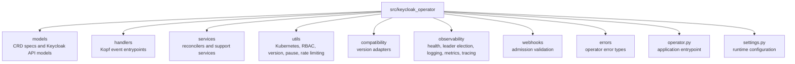

# Development Guide

This guide is the developer-facing entry point for working on the operator, charts, and docs.

Start with the repository workflow in `AGENTS.md` and `RELEASES.md`, then use this page as the shorter operational companion for setup, architecture, and day-to-day commands.

## Prerequisites

The repository currently expects these tools locally:

| Tool | Expected version | Why it is needed |
| --- | --- | --- |
| Python | `>=3.14` | operator runtime and local commands |
| `uv` | current | Python environment and task execution |
| Docker | current | building operator and test images |
| kind | current | fresh-cluster integration testing |
| kubectl | current | Kubernetes inspection and debugging |
| Helm | current | chart rendering and operator deployment |
| go-task | current | canonical task runner |
| yq | current | YAML processing in scripts and release tasks |
| jq | current | JSON processing in scripts |

If you are missing prerequisites, run:

```bash
task dev:setup
```

That task checks the local toolchain and installs the pre-commit hooks.

## Expected Workflow

The repository is opinionated. The normal loop is:

1. create a feature branch
2. make the change
3. run quality checks
4. run the relevant tests
5. run `task test:all` before committing code or chart changes
6. commit with a conventional commit message that matches `RELEASES.md`

Useful commands:

```bash
task quality:check
task test:unit
task test:all
```

## Repository Layout

The current Python package layout is:


```mermaid
flowchart TD
    root[src/keycloak_operator]
    root --> models[models<br/>CRD specs and Keycloak API models]
    root --> handlers[handlers<br/>Kopf event entrypoints]
    root --> services[services<br/>reconcilers and support services]
    root --> utils[utils<br/>Kubernetes, RBAC, version, pause, rate limiting]
    root --> compatibility[compatibility<br/>version adapters]
    root --> observability[observability<br/>health, leader election, logging, metrics, tracing]
    root --> webhooks[webhooks<br/>admission validation]
    root --> errors[errors<br/>operator error types]
    root --> operator[operator.py<br/>application entrypoint]
    root --> settings[settings.py<br/>runtime configuration]
```

Important implementation boundaries:

- handlers stay thin and hand off to reconcilers
- services contain reconciliation logic and operational behavior
- compatibility adapters absorb Keycloak version differences
- observability code owns health, metrics, tracing, and leader-election behavior
- webhooks handle admission-time validation before resources enter reconciliation

## Running The Operator Locally

For fast iteration against the cluster in your current kubeconfig:

```bash
uv run keycloak-operator
```

Use this when you want to debug reconciliation behavior without rebuilding the container image.

## Quality And Testing

Run quality checks with the Taskfile instead of stitching commands together by hand:

```bash
task quality:check
```

Testing guidance lives in the dedicated [Testing Guide](development/testing.md), but the key rules are:

- use `task test:unit` for fast unit feedback
- use `task test:all` for the full project gate
- integration tests rely on a fresh Kind cluster and the patterns in `tests/integration/TESTING.md`

## Decision Records

Architectural and development decisions live in `docs/decisions/`.

Before making non-trivial changes, review the decision records so you do not accidentally work against an established rule. When you need a full rendered doc set, use:

```bash
task docs:build
```

## Documentation Workflow

Use the Taskfile for docs validation:

```bash
task docs:build
```

For maintainers working with versioned docs metadata:

```bash
uv run --group docs mike list
```

`mkdocs serve` is for humans previewing documentation locally. Do not use it as an automated agent workflow.

## Release Workflow

Do not maintain a parallel release checklist in this page. The authoritative release and commit-scoping rules are in `RELEASES.md`.

Read that file before committing if your change affects releaseable components.

## Common Pitfalls

| Symptom | Usually means | Fix |
| --- | --- | --- |
| `ModuleNotFoundError` or missing dependencies | command was not run through `uv` or `task` | rerun with `uv run ...` or the Taskfile target |
| type-check or pre-commit failures | formatting, lint, or typing drift | run `task quality:check` and fix the real issue |
| integration failures with DNS errors | test skipped port-forwarding | follow `tests/integration/TESTING.md` and use `keycloak_port_forward` |
| docs build passes locally but links are stale | page moved without cross-link updates | run `task docs:build` and fix warnings before committing |

## Related Guides

- [Testing Guide](development/testing.md)
- [Architecture](concepts/architecture.md)
- [Version Support](reference/keycloak-version-support.md)
