# Development Guide

This guide covers everything you need to know to develop, test, and contribute to the Keycloak Operator.

## Prerequisites

Before starting development, ensure you have these tools installed:

| Tool | Version | Purpose | Installation |
|------|---------|---------|--------------|
| **Python** | 3.11+ | Operator runtime | [python.org](https://python.org) |
| **uv** | Latest | Python package manager | `curl -LsSf https://astral.sh/uv/install.sh \| sh` |
| **Docker** | 20.10+ | Build container images | [docker.com](https://docker.com) |
| **kubectl** | 1.26+ | Kubernetes CLI | [kubernetes.io](https://kubernetes.io/docs/tasks/tools/) |
| **kind** | 0.20+ | Local Kubernetes clusters | [kind.sigs.k8s.io](https://kind.sigs.k8s.io) |
| **helm** | 3.8+ | Package manager | [helm.sh](https://helm.sh) |
| **go-task** | Latest | Build automation | [taskfile.dev](https://taskfile.dev) |
| **yq** | 4.x | YAML processing | [github.com/mikefarah/yq](https://github.com/mikefarah/yq) |
| **jq** | 1.6+ | JSON processing | Usually available via package manager |

## Environment Setup

Install dependencies with [uv](https://github.com/astral-sh/uv):

```bash
# Clone the repository
git clone https://github.com/vriesdemichael/keycloak-operator.git
cd keycloak-operator

# Install all dependencies and pre-commit hooks
task dev:setup
```

This will:
- Set up pre-commit hooks for code quality
- Verify your local environment has all required tools (docker, kind, helm, yq, etc.)

### Pre-commit Hooks

Pre-commit hooks automatically run code quality checks before each commit:

```bash
# Install hooks (done automatically with 'task dev:setup')
task dev:hooks

# Run hooks manually on all files
uv run --group quality pre-commit run --all-files

# Skip hooks for a specific commit (not recommended)
git commit --no-verify
```

The hooks will:
- Format code with Ruff
- Lint code with Ruff (with auto-fix)
- Run type checking with Basedpyright
- Check YAML, Markdown, and other file formats
- Validate conventional commit messages

## Coding Standards

The project enforces high code quality standards. Always run quality checks before committing:

```bash
# Run all quality checks (linting, formatting, type checking)
task quality:check

# Individual checks
task quality:format          # Format code with Ruff
task quality:lint           # Lint code with Ruff (with auto-fix)
task quality:type-check     # Type check with Basedpyright
```

**Development Workflow:**
1. Make your code changes
2. Run `task quality:check` to fix formatting and find issues
3. Fix any type errors or linting issues
4. Run `task test:unit` to verify unit tests pass
5. Commit your changes (pre-commit hooks will run automatically)

**Note:** Pre-commit hooks enforce these standards automatically, but you can also run them manually.

## Running the Operator Locally

You can run the operator process directly (it will watch the cluster your kubeconfig points to):

```bash
uv run keycloak-operator
```

This is useful for:
- Quick testing of code changes
- Debugging with print statements or debuggers
- Watching logs in real-time
- Rapid iteration without building container images

**Requirements:**
- Active Kubernetes cluster (minikube, kind, or remote cluster)
- kubectl configured to point to that cluster
- CRDs installed on the cluster
- (Optional) Keycloak instance running in the cluster

## Testing

The project has comprehensive test coverage with two types of tests:

### Unit Tests

Fast tests that mock Kubernetes and Keycloak interactions:

```bash
# Run all unit tests
task test:unit

# Run specific test file
uv run pytest tests/unit/test_keycloak_admin.py

# Run with coverage report
uv run pytest tests/unit --cov=src/keycloak_operator --cov-report=html
```

**When to write unit tests:**
- Testing business logic in reconcilers
- Validating data transformations
- Testing utility functions
- Verifying error handling

### Integration Tests

Real Kubernetes tests using Kind clusters:

```bash
# Run complete test suite (creates fresh cluster, runs tests)
task test:all
```

**Integration test workflow:**
1. Recreates Kind cluster
2. Installs CloudNativePG operator
3. Deploys test Keycloak instance
4. Builds operator container image
5. Deploys operator via Helm
6. Runs tests against real cluster

**When to write integration tests:**
- Testing end-to-end resource creation/update/deletion
- Verifying operator behavior in real Kubernetes environment
- Testing multi-resource interactions
- Validating status updates and reconciliation loops

See [Testing Guide](development/testing.md) for detailed testing patterns and best practices.

### Pre-Commit Testing

**CRITICAL:** Always run the complete test suite before committing changes to operator code:

```bash
# Required before committing operator or chart changes
task test:all
```

This ensures:
- Code quality checks pass
- Unit tests pass
- Integration tests pass on fresh cluster
- No regressions introduced

## Code Architecture

The operator follows a clean layered architecture:

```mermaid
%%{init: {'theme':'base', 'themeVariables': { 'primaryColor':'#00b8d9','primaryTextColor':'#fff','primaryBorderColor':'#0097a7','lineColor':'#00acc1','secondaryColor':'#006064','tertiaryColor':'#fff'}}}%%
graph TB
    root["📁 src/keycloak_operator/"]

    models["📁 models/<br/><small>Pydantic models for CRDs</small>"]
    keycloak_py["📄 keycloak.py<br/><small>Keycloak CRD spec/status</small>"]
    realm_py["📄 realm.py<br/><small>KeycloakRealm CRD spec/status</small>"]
    client_py["📄 client.py<br/><small>KeycloakClient CRD spec/status</small>"]
    keycloak_api["📄 keycloak_api.py<br/><small>Keycloak Admin API models</small>"]

    handlers["📁 handlers/<br/><small>Kopf event handlers (thin layer)</small>"]
    h_keycloak["📄 keycloak.py"]
    h_realm["📄 realm.py"]
    h_client["📄 client.py"]
    h_timers["📄 timers.py<br/><small>Drift detection</small>"]

    services["📁 services/<br/><small>Business logic (thick layer)</small>"]
    s_keycloak["📄 keycloak_reconciler.py"]
    s_realm["📄 realm_reconciler.py"]
    s_client["📄 client_reconciler.py"]
    s_drift["📄 drift_detection.py"]

    utils["📁 utils/<br/><small>Reusable utilities</small>"]
    u_admin["📄 keycloak_admin.py"]
    u_k8s["📄 kubernetes.py"]
    u_rate["📄 rate_limiter.py"]
    u_valid["📄 validation.py"]

    observability["📁 observability/<br/><small>Monitoring & logging</small>"]
    o_metrics["📄 metrics.py"]
    o_logging["📄 logging.py"]

    errors["📁 errors/<br/><small>Custom exceptions</small>"]
    e_ops["📄 operator_errors.py"]

    root --> models
    root --> handlers
    root --> services
    root --> utils
    root --> observability
    root --> errors

    models --> keycloak_py
    models --> realm_py
    models --> client_py
    models --> keycloak_api

    handlers --> h_keycloak
    handlers --> h_realm
    handlers --> h_client
    handlers --> h_timers

    services --> s_keycloak
    services --> s_realm
    services --> s_client
    services --> s_drift

    utils --> u_admin
    utils --> u_k8s
    utils --> u_rate
    utils --> u_valid

    observability --> o_metrics
    observability --> o_logging

    errors --> e_ops

    style root fill:#263238,stroke:#00acc1,stroke-width:2px,color:#fff
    style models fill:#263238,stroke:#00acc1,stroke-width:2px,color:#fff
    style handlers fill:#263238,stroke:#00acc1,stroke-width:2px,color:#fff
    style services fill:#263238,stroke:#00acc1,stroke-width:2px,color:#fff
    style utils fill:#263238,stroke:#00acc1,stroke-width:2px,color:#fff
    style observability fill:#263238,stroke:#00acc1,stroke-width:2px,color:#fff
    style errors fill:#263238,stroke:#00acc1,stroke-width:2px,color:#fff
```



### Design Principles

1. **Handlers are thin** - They validate input and delegate to reconcilers
2. **Reconcilers are idempotent** - Running twice produces same result
3. **Services contain business logic** - No Kubernetes/Kopf coupling
4. **Models are type-safe** - Pydantic validates all data
5. **Utils are reusable** - No business logic in utilities

See [Architecture](concepts/architecture.md) for detailed architecture diagrams and explanations.

## How to Add New CRD Fields

Follow these steps to add a new field to an existing CRD:

### 1. Update the Pydantic Model

Edit the appropriate model file (`models/keycloak.py`, `models/realm.py`, or `models/client.py`):

```python
# Example: Adding email verification to KeycloakRealm
from pydantic import BaseModel, Field

class RealmSecurity(BaseModel):
    """Security settings for the realm."""

    registration_allowed: bool = Field(default=False)
    reset_password_allowed: bool = Field(default=True)

    # NEW FIELD
    verify_email: bool = Field(
        default=False,
        description="Require users to verify their email address"
    )
```

### 2. Update Keycloak API Models

If the Keycloak version is bumped, or you need to update the Pydantic models for the Keycloak Admin API:

```bash
# Regenerate Keycloak API models from OpenAPI spec
task keycloak:models
```

### 3. Generate CRD JSON Schemas

To update the JSON schemas used for IDE autocomplete (based on the CRD YAML files):

```bash
# Generate JSON schemas for IDEs
task crds:schemas
```

### 4. Update the Reconciler

Add logic to handle the new field in the appropriate reconciler:

```python
# In services/realm_reconciler.py
def _build_realm_config(self, spec: KeycloakRealmSpec) -> RealmRepresentation:
    """Build Keycloak realm configuration from CRD spec."""
    config = RealmRepresentation(
        realm=spec.realm_name,
        enabled=True,
        # ... existing fields ...
    )

    if spec.security:
        config.registration_allowed = spec.security.registration_allowed
        config.reset_credentials_allowed = spec.security.reset_password_allowed

        # NEW FIELD HANDLING
        config.verify_email = spec.security.verify_email

    return config
```

### 4. Add Unit Tests

Test the new field behavior:

```python
# In tests/unit/test_realm_reconciler.py
@pytest.mark.asyncio
async def test_realm_with_email_verification():
    """Test realm creation with email verification enabled."""
    spec = KeycloakRealmSpec(
        realm_name="test",
        security=RealmSecurity(verify_email=True)
    )

    config = reconciler._build_realm_config(spec)
    assert config.verify_email is True
```

### 5. Add Integration Test

Test end-to-end behavior:

```python
# In tests/integration/test_realm.py
@pytest.mark.asyncio
async def test_realm_email_verification(test_namespace):
    """Test realm with email verification configured."""
    realm_name = f"test-email-{uuid.uuid4().hex[:8]}"

    realm = create_realm_resource(
        name=realm_name,
        namespace=test_namespace,
        spec={
            "realmName": realm_name,
            "security": {"verifyEmail": True}
        }
    )

    # Wait for realm to be ready
    await wait_for_realm_ready(realm_name, test_namespace)

    # Verify in Keycloak
    keycloak_realm = await admin_client.get_realm(realm_name)
    assert keycloak_realm.verify_email is True
```

### 6. Update Documentation

Update the CRD reference documentation:

```bash
# Add field to docs/reference/keycloak-realm-crd.md
| Field | Type | Required | Default | Description |
|-------|------|----------|---------|-------------|
| `security.verifyEmail` | boolean | No | `false` | Require email verification |
```

### 7. Run Complete Test Suite

```bash
task test:all
```

## How to Add New Reconciliation Logic

Follow these steps to add a new feature requiring reconciliation:

### 1. Identify the Trigger

Determine what should trigger this reconciliation:
- **Create event**: New resource created
- **Update event**: Resource spec changed
- **Delete event**: Resource deleted
- **Timer event**: Periodic reconciliation (drift detection)

### 2. Add Handler (if needed)

If this is a new resource type, create a handler:

```python
# In handlers/my_resource.py
import kopf

@kopf.on.create('vriesdemichael.github.io', 'v1', 'myresources')
async def create_my_resource(spec, name, namespace, **kwargs):
    """Handle MyResource creation."""
    reconciler = MyResourceReconciler()
    await reconciler.reconcile(name, namespace, spec)

@kopf.on.update('vriesdemichael.github.io', 'v1', 'myresources')
async def update_my_resource(spec, name, namespace, **kwargs):
    """Handle MyResource updates."""
    reconciler = MyResourceReconciler()
    await reconciler.reconcile(name, namespace, spec)
```

### 3. Create Reconciler Service

Implement the business logic:

```python
# In services/my_resource_reconciler.py
from keycloak_operator.utils.keycloak_admin import KeycloakAdminClient

class MyResourceReconciler:
    """Reconciler for MyResource custom resources."""

    async def reconcile(
        self,
        name: str,
        namespace: str,
        spec: MyResourceSpec
    ) -> None:
        """Reconcile MyResource to desired state."""
        # 1. Get current state from Keycloak
        current = await self._get_current_state(name)

        # 2. Compute desired state from spec
        desired = self._build_desired_state(spec)

        # 3. Compute diff
        changes = self._compute_diff(current, desired)

        # 4. Apply changes idempotently
        if changes:
            await self._apply_changes(name, changes)

        # 5. Update status
        await self._update_status(name, namespace, "Ready")
```

### 4. Make it Idempotent

Ensure reconciler can run multiple times safely:

```python
async def _apply_changes(self, name: str, changes: dict) -> None:
    """Apply changes idempotently."""
    # Check if resource already exists
    existing = await self.admin_client.get_resource(name)

    if existing:
        # Update only if changed
        if self._has_changed(existing, changes):
            await self.admin_client.update_resource(name, changes)
    else:
        # Create new resource
        await self.admin_client.create_resource(name, changes)
```

### 5. Add Error Handling

Handle errors gracefully:

```python
from keycloak_operator.errors.operator_errors import (
    ReconciliationError,
    KeycloakAPIError
)

async def reconcile(self, name: str, namespace: str, spec: MyResourceSpec) -> None:
    """Reconcile with error handling."""
    try:
        await self._reconcile_impl(name, namespace, spec)
        await self._update_status(name, namespace, "Ready")
    except KeycloakAPIError as e:
        logger.error(f"Keycloak API error: {e}")
        await self._update_status(name, namespace, "Failed", str(e))
        raise ReconciliationError(f"Failed to reconcile {name}") from e
    except Exception as e:
        logger.exception(f"Unexpected error reconciling {name}")
        await self._update_status(name, namespace, "Failed", str(e))
        raise
```

### 6. Add Metrics

Track reconciliation metrics:

```python
from keycloak_operator.observability.metrics import (
    reconciliation_duration,
    reconciliation_total
)

async def reconcile(self, name: str, namespace: str, spec: MyResourceSpec) -> None:
    """Reconcile with metrics."""
    with reconciliation_duration.labels(resource_type="myresource").time():
        try:
            await self._reconcile_impl(name, namespace, spec)
            reconciliation_total.labels(
                resource_type="myresource",
                status="success"
            ).inc()
        except Exception:
            reconciliation_total.labels(
                resource_type="myresource",
                status="failure"
            ).inc()
            raise
```

### 7. Test Thoroughly

Add comprehensive tests:
- Unit tests for business logic
- Integration tests for end-to-end behavior
- Error case tests
- Idempotency tests (run reconcile twice, verify same result)

## Docs Workflow

```bash
# Live reload documentation (for viewing only, not for development)
uv run --group docs mkdocs serve

# Build static site
uv run --group docs mkdocs build

# Verify no build errors
uv run --group docs mkdocs build --strict
```

## Generating API Reference

API reference pages are generated automatically by mkdocstrings using the nav entry defined in `mkdocs.yml`. Add new modules under `keycloak_operator/` and they will appear after a rebuild if referenced.

To add a new explicit page:

```markdown
::: keycloak_operator.utils.kubernetes
```

## Release Checklist (Draft)

1. Update version in `pyproject.toml`
2. Ensure changelog section is complete
3. Run full test suite & type check
4. Build & tag container image
5. Push docs (e.g. GitHub Pages workflow)

## Troubleshooting

### Common Development Issues

| Symptom | Cause | Resolution |
|---------|-------|------------|
| `ModuleNotFoundError` | Dependencies not installed | Run `task dev:setup` |
| `No module named 'keycloak_operator'` | Not using uv run | Always use `uv run <command>` |
| Type errors block tests | Missing type annotations | Run `uv run ty check` and fix issues |
| Pre-commit hook fails | Code quality issues | Run `task quality:check` to auto-fix |
| Integration tests fail | Cluster not ready | Run `task cluster:reset && task test:all` |
| Port conflicts in tests | Previous test run still active | Run `pkill -f port-forward` |
| Missing API docs | Module not referenced | Add `::: dotted.path` in markdown |
| 404 for docs page | Wrong nav path | Check `mkdocs.yml` navigation |
| Cannot connect to Keycloak | Port-forward not running | Use `keycloak_port_forward` fixture |

### Development Tips

1. **Fast iteration**: Use `task test:integration` which handles cluster management automatically
2. **Debug tests**: Add `--pdb` flag to pytest to drop into debugger on failure
3. **Parallel testing**: Integration tests run with 8 workers by default, use unique names
4. **Rate limiting**: Tests automatically respect rate limits, don't bypass them
5. **Token issues**: Check `kubectl get secret -A | grep token` for token discovery problems

## Contributing

### Pull Request Process

1. **Create a branch** from `main`:
   ```bash
   git checkout -b feat/my-awesome-feature
   ```

2. **Make your changes** following the coding standards

3. **Run complete test suite**:
   ```bash
   task test:all
   ```

4. **Commit with conventional commits**:
   ```bash
   git commit -m "feat: add awesome feature"
   ```

   Commit types:
   - `feat:` New feature
   - `fix:` Bug fix
   - `docs:` Documentation only
   - `refactor:` Code restructuring
   - `test:` Adding tests
   - `chore:` Maintenance tasks

5. **Push and create PR**:
   ```bash
   git push -u origin feat/my-awesome-feature
   ```

6. **Address review comments** and update PR

See AGENTS.md in the repository root for detailed development workflow and Git practices.

### Getting Help

- **Documentation**: Start with [Quick Start](quickstart/README.md)
- **Issues**: [GitHub Issues](https://github.com/vriesdemichael/keycloak-operator/issues)
- **Discussions**: [GitHub Discussions](https://github.com/vriesdemichael/keycloak-operator/discussions)
- **Architecture**: [Architecture Guide](concepts/architecture.md)
- **Testing**: [Testing Guide](development/testing.md)

Return to [Home](index.md).
