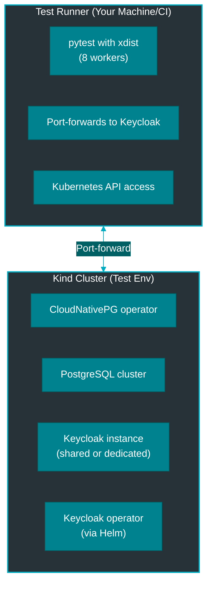

# Testing Guide

This guide explains the testing philosophy, infrastructure, and best practices for the Keycloak Operator project.

## Testing Philosophy

The project maintains high test coverage with two complementary approaches:

- **Unit Tests**: Fast, isolated tests that mock external dependencies
- **Integration Tests**: Real-world tests on actual Kubernetes clusters

Both are critical for maintaining code quality and preventing regressions.

## Quick Start

```bash
# Run all tests (quality + unit + integration)
task test:all

# Run only unit tests (fast)
task test:unit

# Run only integration tests
task test:integration

# Pre-commit: fresh cluster + all tests
task test:all
```

## Unit Testing

### What to Test

Unit tests focus on business logic without external dependencies:

- ✅ Data transformations (CRD spec → Keycloak API format)
- ✅ Validation logic
- ✅ Error handling
- ✅ Utility functions
- ✅ Pydantic model validation

### Example: Testing a Reconciler

```python
# tests/unit/test_realm_reconciler.py
import pytest
from keycloak_operator.models.realm import KeycloakRealmSpec, RealmSecurity
from keycloak_operator.services.realm_reconciler import RealmReconciler


@pytest.mark.asyncio
async def test_build_realm_config():
    """Test realm configuration generation from spec."""
    reconciler = RealmReconciler()

    spec = KeycloakRealmSpec(
        realm_name="my-realm",
        security=RealmSecurity(
            registration_allowed=True,
            reset_password_allowed=False,
        ),
    )

    config = reconciler._build_realm_config(spec)

    assert config.realm == "my-realm"
    assert config.registration_allowed is True
    assert config.reset_credentials_allowed is False
```

### Mocking Best Practices

```python
from unittest.mock import AsyncMock, MagicMock


@pytest.fixture
def mock_keycloak_admin():
    """Mock Keycloak admin client."""
    mock = AsyncMock()
    mock.get_realm.return_value = {
        "realm": "test",
        "enabled": True,
    }
    return mock


@pytest.mark.asyncio
async def test_with_mock(mock_keycloak_admin):
    """Test using mocked client."""
    realm = await mock_keycloak_admin.get_realm("test")
    assert realm["realm"] == "test"
```

## Integration Testing

### Test Infrastructure

Integration tests run on real Kubernetes clusters:



### Setup Flow

1. **Cluster Creation**: Kind cluster created (if not exists)
2. **Operator Deployment**: Installed via Helm with production-like setup
3. **Test Keycloak**: Shared instance deployed (~60s startup)
4. **Test Execution**: Tests run in parallel (8 workers)
5. **Cleanup**: Resources cleaned up, cluster kept for next run

### Shared vs Dedicated Instances

#### Shared Instance (Recommended)

Use for simple tests that don't modify global state:

```python
@pytest.mark.integration
@pytest.mark.timeout(300)
async def test_simple_client(
    shared_operator,
    test_namespace,
    k8s_custom_objects,
):
    """Test using shared Keycloak instance."""
    keycloak_name = shared_operator["name"]
    keycloak_namespace = shared_operator["namespace"]

    # Your test logic here
    # Uses pre-deployed Keycloak (~60s startup amortized)
```

**Benefits:**
- ⚡ Fast (no Keycloak startup wait)
- 💰 Resource efficient
- ✅ Suitable for 80% of tests

#### Dedicated Instance

Use for complex tests requiring isolation:

```python
@pytest.mark.integration
@pytest.mark.timeout(600)  # Longer timeout
async def test_complex_feature(
    test_namespace,
    k8s_custom_objects,
    sample_keycloak_spec,
):
    """Test requiring dedicated Keycloak instance."""
    import uuid
    keycloak_name = f"dedicated-{uuid.uuid4().hex[:8]}"

    try:
        # Create dedicated instance
        k8s_custom_objects.create_namespaced_custom_object(
            group="vriesdemichael.github.io",
            version="v1",
            namespace=test_namespace,
            plural="keycloaks",
            body={**sample_keycloak_spec, "metadata": {"name": keycloak_name}},
        )

        # Wait for ready (~60s)
        await wait_for_keycloak_ready(keycloak_name, test_namespace)

        # Your test logic here

    finally:
        # ALWAYS cleanup
        with contextlib.suppress(ApiException):
            k8s_custom_objects.delete_namespaced_custom_object(
                group="vriesdemichael.github.io",
                version="v1",
                namespace=test_namespace,
                plural="keycloaks",
                name=keycloak_name,
            )
```

**When to use:**
- 🔒 Modifying global Keycloak state
- 🧪 Testing cascading deletions
- 🎭 Testing authentication flows
- 🔄 Testing complex multi-step operations

### Critical Rule: Port-Forwarding

**ALWAYS use `keycloak_port_forward` fixture when accessing Keycloak from tests.**

Tests run on your machine (not in cluster) and cannot resolve cluster DNS.

#### ❌ WRONG - Will Fail

```python
async def test_something(test_namespace):
    # ❌ DNS resolution will fail!
    admin_client = get_keycloak_admin_client("my-keycloak", test_namespace)
```

#### ✅ CORRECT - Use Port-Forward

```python
async def test_something(test_namespace, keycloak_port_forward):
    # ✅ Port-forward to localhost
    local_port = await keycloak_port_forward("my-keycloak", test_namespace)

    from keycloak_operator.utils.keycloak_admin import KeycloakAdminClient
    from keycloak_operator.utils.kubernetes import get_admin_credentials

    username, password = get_admin_credentials("my-keycloak", test_namespace)
    admin_client = KeycloakAdminClient(
        server_url=f"http://localhost:{local_port}",
        username=username,
        password=password,
    )
    admin_client.authenticate()

    # Now you can use admin_client
```

### Parallel Test Safety

Tests run with **8 parallel workers** by default. Follow these rules:

#### ✅ Safe Patterns

```python
import uuid

# Always use unique names
client_name = f"test-client-{uuid.uuid4().hex[:8]}"

# Use test_namespace fixture (unique per test)
async def test_something(test_namespace):
    # Each test gets unique namespace
    pass
```

#### ❌ Unsafe Patterns

```python
# ❌ WRONG: Fixed names cause race conditions
client_name = "test-client"

# ❌ WRONG: Shared namespace causes conflicts
namespace = "test"

# ❌ WRONG: Modifying global state in shared instance
admin_client.update_realm("master", {...})
```

### Wait Helpers with Auto-Debugging

Use consolidated wait helpers from `wait_helpers.py` - they automatically collect debugging info on timeout.

```python
from tests.integration.wait_helpers import (
    wait_for_resource_ready,
    wait_for_resource_condition,
    wait_for_resource_deleted,
)


async def test_something(
    k8s_custom_objects,
    test_namespace,
    operator_namespace,
):
    # Create resource
    k8s_custom_objects.create_namespaced_custom_object(...)

    # Wait with automatic debugging on timeout
    await wait_for_resource_ready(
        k8s_custom_objects=k8s_custom_objects,
        group="vriesdemichael.github.io",
        version="v1",
        namespace=test_namespace,
        plural="keycloakrealms",
        name="my-realm",
        timeout=120,
        operator_namespace=operator_namespace,  # Enables log collection
    )
```

**On timeout, automatically shows:**
- Last resource status
- Kubernetes events
- Operator logs (last 100 lines)
- Any exceptions

### Complete Test Template

```python
"""Integration test for [feature description]."""

from __future__ import annotations

import contextlib
import uuid

import pytest
from kubernetes.client.rest import ApiException
from tests.integration.wait_helpers import wait_for_resource_ready


@pytest.mark.integration
@pytest.mark.timeout(300)
async def test_feature_name(
    k8s_custom_objects,
    test_namespace,
    operator_namespace,
    shared_operator,
    keycloak_port_forward,
) -> None:
    """Test description explaining what this verifies."""

    # Use shared instance
    keycloak_name = shared_operator["name"]
    keycloak_namespace = shared_operator["namespace"]

    # Generate unique names
    realm_name = f"test-realm-{uuid.uuid4().hex[:8]}"

    try:
        # Create test resource
        realm_manifest = {
            "apiVersion": "vriesdemichael.github.io/v1",
            "kind": "KeycloakRealm",
            "metadata": {
                "name": realm_name,
                "namespace": test_namespace,
            },
            "spec": {
                "realmName": realm_name,
                "operatorRef": {
                    "namespace": keycloak_namespace,
                },
            },
        }

        k8s_custom_objects.create_namespaced_custom_object(
            group="vriesdemichael.github.io",
            version="v1",
            namespace=test_namespace,
            plural="keycloakrealms",
            body=realm_manifest,
        )

        # Wait for ready with auto-debugging
        await wait_for_resource_ready(
            k8s_custom_objects=k8s_custom_objects,
            group="vriesdemichael.github.io",
            version="v1",
            namespace=test_namespace,
            plural="keycloakrealms",
            name=realm_name,
            timeout=120,
            operator_namespace=operator_namespace,
        )

        # Verify in Keycloak if needed
        local_port = await keycloak_port_forward(keycloak_name, keycloak_namespace)

        from keycloak_operator.utils.keycloak_admin import KeycloakAdminClient
        from keycloak_operator.utils.kubernetes import get_admin_credentials

        username, password = get_admin_credentials(keycloak_name, keycloak_namespace)
        admin_client = KeycloakAdminClient(
            server_url=f"http://localhost:{local_port}",
            username=username,
            password=password,
        )
        admin_client.authenticate()

        # Assertions
        realm = await admin_client.get_realm(realm_name)
        assert realm is not None
        assert realm.realm == realm_name

    finally:
        # Cleanup
        with contextlib.suppress(ApiException):
            k8s_custom_objects.delete_namespaced_custom_object(
                group="vriesdemichael.github.io",
                version="v1",
                namespace=test_namespace,
                plural="keycloakrealms",
                name=realm_name,
            )
```

## Running Tests

### Basic Commands

```bash
# All tests (recommended)
task test:all

# Only unit tests (fast)
task test:unit

# Only integration tests (reuses cluster)
task test:integration

# Fresh cluster + all tests (pre-commit)
task test:all
```

### Advanced Commands

```bash
# Specific test file
uv run pytest tests/integration/test_realm.py -v

# Specific test function
uv run pytest tests/integration/test_realm.py::test_realm_creation -v

# Less parallelism (useful for debugging)
uv run pytest tests/integration/ -n 2 -v

# Sequential execution (no parallelism)
uv run pytest tests/integration/ -n 0 -v

# With verbose output
uv run pytest tests/integration/ -v -s

# With debugger on failure
uv run pytest tests/integration/ --pdb
```

### Cluster Management

```bash
# Destroy cluster completely
task cluster:destroy

# Create fresh cluster
task cluster:create

# Check cluster status
kubectl cluster-info
kind get clusters
```

## Debugging Failed Tests

### 1. Check Operator Logs

```bash
# Recent logs
kubectl logs -n keycloak-test-system -l app.kubernetes.io/name=keycloak-operator --tail=200

# Follow logs in real-time
kubectl logs -n keycloak-test-system -l app.kubernetes.io/name=keycloak-operator -f
```

### 2. Check Resource Status

```bash
# List all resources
kubectl get keycloaks,keycloakrealms,keycloakclients -A

# Describe specific resource
kubectl describe keycloakrealm my-realm -n test-abc123

# Get resource YAML
kubectl get keycloakrealm my-realm -n test-abc123 -o yaml
```

### 3. Check Events

```bash
# Recent events in namespace
kubectl get events -n test-abc123 --sort-by='.lastTimestamp'

# Events for specific resource
kubectl describe keycloakrealm my-realm -n test-abc123 | grep -A 10 Events:
```

### 4. Clean Up Stuck Resources

```bash
# List test namespaces
kubectl get namespaces | grep test-

# Delete stuck namespace
kubectl delete namespace test-abc123 --force --grace-period=0
```

## Common Pitfalls

### ❌ Forgetting Port-Forward

**Symptom:** `NameResolutionError` or DNS failures

**Fix:** Always use `keycloak_port_forward` fixture:

```python
async def test_something(keycloak_port_forward):
    local_port = await keycloak_port_forward("keycloak", namespace)
    # Use localhost:local_port
```

### ❌ Using Shared Instance for Destructive Tests

**Symptom:** Random test failures in parallel runs

**Fix:** Create dedicated instance for tests that modify global state

### ❌ Hardcoded Resource Names

**Symptom:** `AlreadyExists` errors in parallel runs

**Fix:** Always use UUID for unique names:

```python
import uuid
realm_name = f"test-realm-{uuid.uuid4().hex[:8]}"
```

### ❌ Missing Cleanup

**Symptom:** Namespace stuck in Terminating state

**Fix:** Always use `finally` blocks:

```python
try:
    # Test logic
    pass
finally:
    with contextlib.suppress(ApiException):
        k8s_custom_objects.delete_namespaced_custom_object(...)
```

### ❌ Insufficient Timeouts

**Symptom:** Tests timeout waiting for Ready

**Fix:** Use appropriate timeouts:

```python
# Simple tests
@pytest.mark.timeout(300)  # 5 minutes

# With dedicated Keycloak
@pytest.mark.timeout(600)  # 10 minutes
```

## Best Practices

### 1. Write Idempotent Tests

Tests should be runnable multiple times:

```python
# ✅ Good: Cleanup in finally
try:
    create_resource()
    test_something()
finally:
    cleanup_resource()

# ❌ Bad: Assumes clean state
create_resource()  # Fails if resource exists
test_something()
```

### 2. Test One Thing Per Test

```python
# ✅ Good: Focused test
async def test_realm_creation():
    """Test realm can be created."""
    # ... create and verify realm ...

async def test_realm_update():
    """Test realm can be updated."""
    # ... update and verify realm ...

# ❌ Bad: Testing multiple things
async def test_realm_crud():
    """Test realm CRUD operations."""
    # ... create, update, delete all in one test ...
```

### 3. Use Descriptive Names

```python
# ✅ Good: Clear what's being tested
async def test_realm_creation_with_smtp_configuration():
    """Test realm creation with SMTP server configured."""

# ❌ Bad: Vague name
async def test_realm_stuff():
    """Test realm things."""
```

### 4. Add Helpful Failure Messages

```python
# ✅ Good: Helpful assertion message
assert realm.enabled is True, (
    f"Realm {realm_name} should be enabled but got: {realm.enabled}"
)

# ❌ Bad: Generic failure
assert realm.enabled is True
```

## Advanced Topics

For advanced testing patterns and detailed guidelines, see the following in the repository:

- **tests/integration/TESTING.md** - Comprehensive rules and patterns
- **tests/integration/wait_helpers.py** - Auto-debugging wait utilities
- **tests/integration/conftest.py** - Fixture implementations

## Contributing Tests

When contributing, ensure:

1. ✅ All existing tests pass
2. ✅ New features have unit tests
3. ✅ New features have integration tests
4. ✅ Tests follow parallel-safe patterns
5. ✅ Tests use wait helpers for debugging
6. ✅ Tests clean up resources
7. ✅ Run `task test:all` before pushing

Return to [Development Guide](../development.md).
