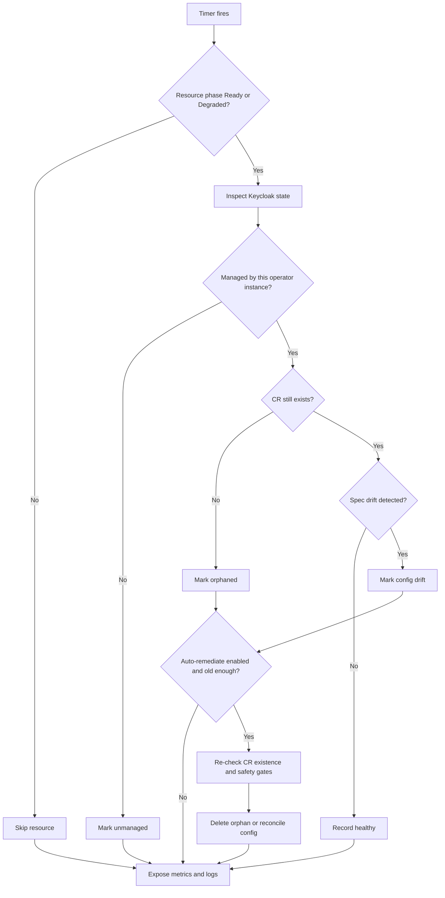

# Drift Detection

The operator can periodically compare Keycloak state with the Kubernetes resources that are supposed to own it.

Drift detection helps with:

- orphaned resources left behind after CR deletion
- unmanaged resources that were not created by any operator instance
- configuration drift between a CR and the live Keycloak object

## How It Works

Drift detection runs as a background timer inside the operator.

It:

1. scans managed realms and clients
2. checks whether the corresponding CR still exists
3. evaluates whether the live Keycloak state has drifted from the CR
4. reports drift through metrics and logs
5. optionally remediates eligible drift when auto-remediation is enabled



## Important Requirement: Admin Events

Admin events are mandatory for drift detection.

When drift detection is enabled, the reconciler enforces:

- `adminEventsEnabled: true`
- `adminEventsDetailsEnabled: true`

This is not optional. Drift detection depends on admin events to determine what changed and when.

## Helm Configuration

Configure drift detection in the operator chart under `monitoring.driftDetection`.

```yaml
monitoring:
  driftDetection:
    enabled: true
    intervalSeconds: 300
    autoRemediate: false
    minimumAgeHours: 24
    scope:
      realms: true
      clients: true
      identityProviders: true
      roles: true
```

Notes:

- `minimumAgeHours` is configurable and defaults to `24` when you do not set it.
- auto-remediation only acts on drift that is at least `minimumAgeHours` old.

## Environment Variables

If you manage the operator without Helm, the equivalent settings are:

```bash
DRIFT_DETECTION_ENABLED=true
DRIFT_DETECTION_INTERVAL_SECONDS=300
DRIFT_DETECTION_AUTO_REMEDIATE=false
DRIFT_DETECTION_MINIMUM_AGE_HOURS=24
DRIFT_DETECTION_SCOPE_REALMS=true
DRIFT_DETECTION_SCOPE_CLIENTS=true
DRIFT_DETECTION_SCOPE_IDENTITY_PROVIDERS=true
DRIFT_DETECTION_SCOPE_ROLES=true
```

## Phases That Are Scanned

Drift detection only processes resources in:

- `Ready`
- `Degraded`

Resources in other phases are skipped, including:

- `Pending`
- `Reconciling`
- `Failed`
- `Updating`
- `Paused`

That skip behavior avoids fighting normal reconciliation, error handling, or intentional pause windows.

## Ownership and Multi-Operator Behavior

Each operator instance manages exactly one Keycloak instance.

Ownership markers written into Keycloak resources allow the operator to distinguish:

- resources created by this operator instance
- resources created by another operator instance
- resources not managed by any operator instance

This matters in multi-operator deployments because orphan cleanup and config remediation are scoped to the current operator instance.

## Auto-Remediation

When `autoRemediate=true`:

- orphaned resources can be deleted after they exceed `minimumAgeHours`
- configuration drift can be reconciled back toward the CR spec

Safety checks include:

- minimum age gate
- CR existence re-check before deletion
- operator-instance ownership verification

## Metrics

Drift detection exports these metrics:

```prometheus
keycloak_operator_orphaned_resources{resource_type,operator_instance}
keycloak_operator_config_drift{resource_type,cr_namespace}
keycloak_operator_unmanaged_resources{resource_type}
keycloak_operator_remediation_total{resource_type,action,reason}
keycloak_operator_remediation_errors_total{resource_type,action}
keycloak_operator_drift_check_duration_seconds{resource_type}
keycloak_operator_drift_check_errors_total{resource_type}
keycloak_operator_drift_check_last_success_timestamp
```

Example queries:

```prometheus
keycloak_operator_orphaned_resources > 0
```

```prometheus
increase(keycloak_operator_drift_check_errors_total[5m]) > 0
```

```prometheus
(time() - keycloak_operator_drift_check_last_success_timestamp) > 900
```

## Alerts

```yaml
apiVersion: monitoring.coreos.com/v1
kind: PrometheusRule
metadata:
  name: keycloak-operator-drift-alerts
spec:
  groups:
    - name: keycloak-drift
      rules:
        - alert: KeycloakOrphanedResources
          expr: keycloak_operator_orphaned_resources > 0
          for: 30m
        - alert: KeycloakDriftCheckFailure
          expr: increase(keycloak_operator_drift_check_errors_total[5m]) > 3
          for: 5m
        - alert: KeycloakDriftCheckStale
          expr: (time() - keycloak_operator_drift_check_last_success_timestamp) > 900
          for: 5m
```

## Operational Notes

- drift detection is background protection, not a replacement for normal reconciliation
- paused resources are intentionally skipped
- enabling auto-remediation is safer in development first, then in production after you verify the ownership and age semantics

## See Also

- [ADR 019](../decisions/019-drift-detection-and-continuous-reconciliation.yaml)
- [Multi-Tenant Guide](../how-to/multi-tenant.md)
- [Observability](./observability.md)
