# End-to-End Setup Guide

This guide walks you through deploying a **production-ready** Keycloak setup from scratch, including database configuration, high availability, TLS, and monitoring.

For a simpler quick start, see the [Quick Start Guide](../quickstart/README.md).

## Overview

This guide covers:

1. **Infrastructure Setup** - Kubernetes cluster, ingress, cert-manager, CloudNativePG
2. **Operator Installation** - Deploy the Keycloak operator with monitoring
3. **Database Configuration** - PostgreSQL with CloudNativePG, backup, HA
4. **Keycloak Deployment** - Multi-replica Keycloak with TLS and ingress
5. **Multi-Tenant Setup** - Platform team configures RBAC and namespace grants
6. **Realm Creation** - Application teams create and manage realms
7. **Client Configuration** - OAuth2/OIDC client setup with credential management
8. **Verification & Testing** - End-to-end OAuth2 flow validation
9. **Production Checklist** - Security, monitoring, backup verification

**Estimated Time**: 45-60 minutes

---

## Prerequisites

### Required

| Component | Version | Purpose | Installation |
|-----------|---------|---------|--------------|
| **Kubernetes** | 1.26+ | Container orchestration | [kubernetes.io](https://kubernetes.io) |
| **kubectl** | 1.26+ | Kubernetes CLI | [Install Guide](https://kubernetes.io/docs/tasks/tools/) |
| **Helm** | 3.8+ | Package manager | [helm.sh](https://helm.sh/docs/intro/install/) |
| **CloudNativePG** | 1.20+ | PostgreSQL operator | [CNPG Docs](https://cloudnative-pg.io/documentation/current/installation_upgrade/) |

### Recommended for Production

| Component | Purpose | Installation |
|-----------|---------|--------------|
| **Ingress Controller** | External access (nginx, traefik) | [Ingress NGINX](https://kubernetes.github.io/ingress-nginx/deploy/) |
| **cert-manager** | Automatic TLS certificates | [cert-manager Docs](https://cert-manager.io/docs/installation/) |
| **Prometheus** | Metrics collection | [Prometheus Operator](https://github.com/prometheus-operator/prometheus-operator) |
| **Grafana** | Dashboards | [Grafana Helm Chart](https://grafana.com/docs/grafana/latest/setup-grafana/installation/helm/) |

### Cluster Requirements

- **Nodes**: 3+ nodes for high availability
- **CPU**: 4+ cores per node recommended
- **Memory**: 8+ GB per node recommended
- **Storage**: 100+ GB available (for database)
- **RBAC**: Cluster admin permissions required for installation

---

## Part 1: Infrastructure Setup

### 1.1 Install Prerequisites

#### CloudNativePG Operator

```bash
# Add CloudNativePG Helm repository
helm repo add cnpg https://cloudnative-pg.io/charts
helm repo update

# Install CloudNativePG operator
helm install cnpg cnpg/cloudnative-pg \
  --namespace cnpg-system \
  --create-namespace \
  --set monitoring.podMonitorEnabled=true

# Verify installation
kubectl get pods -n cnpg-system
```

#### Ingress Controller (nginx)

```bash
# Install ingress-nginx
helm repo add ingress-nginx https://kubernetes.github.io/ingress-nginx
helm repo update

helm install ingress-nginx ingress-nginx/ingress-nginx \
  --namespace ingress-nginx \
  --create-namespace \
  --set controller.metrics.enabled=true \
  --set controller.service.type=LoadBalancer

# Get external IP (may take a few minutes)
kubectl get svc -n ingress-nginx ingress-nginx-controller
```

#### cert-manager (for TLS)

```bash
# Install cert-manager
helm repo add jetstack https://charts.jetstack.io
helm repo update

helm install cert-manager jetstack/cert-manager \
  --namespace cert-manager \
  --create-namespace \
  --set installCRDs=true

# Verify installation
kubectl get pods -n cert-manager
```

### 1.2 Configure DNS

Point your domain to the ingress controller's external IP:

```bash
# Get ingress external IP
INGRESS_IP=$(kubectl get svc -n ingress-nginx ingress-nginx-controller \
  -o jsonpath='{.status.loadBalancer.ingress[0].ip}')

echo "Configure DNS:"
echo "  keycloak.example.com  →  $INGRESS_IP"
```

Create DNS A records:
- `keycloak.example.com` → Ingress IP
- `*.keycloak.example.com` → Ingress IP (for realm subdomains, optional)

### 1.3 Create TLS Issuer

```bash
kubectl apply -f - <<EOF
apiVersion: cert-manager.io/v1
kind: ClusterIssuer
metadata:
  name: letsencrypt-prod
spec:
  acme:
    server: https://acme-v02.api.letsencrypt.org/directory
    email: admin@example.com  # ← Update this
    privateKeySecretRef:
      name: letsencrypt-prod-account-key
    solvers:
      - http01:
          ingress:
            class: nginx
EOF
```

Verify the issuer is ready:

```bash
kubectl get clusterissuer letsencrypt-prod
# Should show READY=True
```

---

## Part 2: Operator Installation

### 2.1 Create Operator Namespace

```bash
kubectl create namespace keycloak-operator-system
```

### 2.2 Install Operator with Monitoring

```bash
# Install from Helm repository (or local chart)
helm install keycloak-operator ./charts/keycloak-operator \
  --namespace keycloak-operator-system \
  --set metrics.enabled=true \
  --set replicas=2 \
  --set resources.requests.cpu=100m \
  --set resources.requests.memory=256Mi \
  --set resources.limits.cpu=500m \
  --set resources.limits.memory=512Mi
```

### 2.3 Verify Operator

```bash
# Check pods are running
kubectl get pods -n keycloak-operator-system
# Expected: 2 replicas running

# Check operator logs
kubectl logs -n keycloak-operator-system -l app=keycloak-operator --tail=50

# Verify CRDs are installed
kubectl get crd | grep vriesdemichael.github.io
# Expected output:
#   keycloakclients.vriesdemichael.github.io
#   keycloakrealms.vriesdemichael.github.io
#   keycloaks.vriesdemichael.github.io
```

### 2.4 Configure Service Monitor (Prometheus)

```bash
kubectl apply -f - <<EOF
apiVersion: monitoring.coreos.com/v1
kind: ServiceMonitor
metadata:
  name: keycloak-operator
  namespace: keycloak-operator-system
spec:
  selector:
    matchLabels:
      app: keycloak-operator
  endpoints:
    - port: metrics
      interval: 30s
EOF
```

---

## Part 3: Database Configuration

### 3.1 Create Database Namespace

```bash
kubectl create namespace keycloak-db
```

### 3.2 Configure Database Storage

Create a StorageClass for database storage (example for cloud providers):

```bash
# For AWS EBS
kubectl apply -f - <<EOF
apiVersion: storage.k8s.io/v1
kind: StorageClass
metadata:
  name: fast-ssd
provisioner: ebs.csi.aws.com
parameters:
  type: gp3
  iops: "3000"
  throughput: "125"
allowVolumeExpansion: true
EOF
```

### 3.3 Deploy PostgreSQL Cluster

```bash
kubectl apply -f - <<EOF
apiVersion: postgresql.cnpg.io/v1
kind: Cluster
metadata:
  name: keycloak-db
  namespace: keycloak-db
spec:
  instances: 3  # High availability
  primaryUpdateStrategy: unsupervised

  postgresql:
    parameters:
      max_connections: "200"
      shared_buffers: "256MB"
      effective_cache_size: "1GB"
      work_mem: "16MB"

  bootstrap:
    initdb:
      database: keycloak
      owner: keycloak
      secret:
        name: keycloak-db-credentials

  storage:
    storageClass: fast-ssd
    size: 50Gi

  monitoring:
    enabled: true
    podMonitorEnabled: true

  backup:
    barmanObjectStore:
      destinationPath: s3://my-backup-bucket/keycloak-db  # ← Update this
      s3Credentials:
        accessKeyId:
          name: backup-s3-credentials
          key: ACCESS_KEY_ID
        secretAccessKey:
          name: backup-s3-credentials
          key: ACCESS_SECRET_KEY
      wal:
        compression: gzip
      data:
        compression: gzip
    retentionPolicy: "30d"
EOF
```

### 3.4 Create Database Credentials Secret

```bash
# Generate secure password
DB_PASSWORD=$(python3 -c 'import secrets; print(secrets.token_urlsafe(32))')

kubectl create secret generic keycloak-db-credentials \
  --from-literal=username=keycloak \
  --from-literal=password="$DB_PASSWORD" \
  --namespace=keycloak-db
```

### 3.5 Create Backup S3 Credentials (if using S3 backup)

```bash
kubectl create secret generic backup-s3-credentials \
  --from-literal=ACCESS_KEY_ID="your-access-key" \
  --from-literal=ACCESS_SECRET_KEY="your-secret-key" \
  --namespace=keycloak-db
```

### 3.6 Verify Database Cluster

```bash
# Check cluster status
kubectl get cluster -n keycloak-db
# Expected: STATUS=Cluster in healthy state

# Check pods
kubectl get pods -n keycloak-db
# Expected: 3 pods (1 primary, 2 replicas)

# Check which is primary
kubectl get cluster keycloak-db -n keycloak-db -o jsonpath='{.status.currentPrimary}'

# Test database connection
kubectl exec -it -n keycloak-db keycloak-db-1 -- psql -U keycloak -c "SELECT version();"
```

---

## Part 4: Keycloak Deployment

### 4.1 Create Keycloak Namespace

```bash
kubectl create namespace keycloak-system
```

### 4.2 Deploy Keycloak Instance

```bash
kubectl apply -f - <<EOF
apiVersion: vriesdemichael.github.io/v1
kind: Keycloak
metadata:
  name: keycloak
  namespace: keycloak-system
spec:
  replicas: 3  # High availability

  image:
    repository: quay.io/keycloak/keycloak
    tag: "26.0.0"

  database:
    type: cnpg
    cluster: keycloak-db
    namespace: keycloak-db
    credentialsSecret: keycloak-db-credentials

  service:
    type: ClusterIP
    http:
      port: 8080
    management:
      port: 9000

  tls:
    enabled: true
    termination: edge  # TLS terminated at ingress

  ingress:
    enabled: true
    className: nginx
    hostname: keycloak.example.com  # ← Update this
    annotations:
      cert-manager.io/cluster-issuer: letsencrypt-prod
      nginx.ingress.kubernetes.io/ssl-redirect: "true"
      nginx.ingress.kubernetes.io/backend-protocol: "HTTP"
    tls:
      - secretName: keycloak-tls
        hosts:
          - keycloak.example.com

  resources:
    requests:
      cpu: 500m
      memory: 1Gi
    limits:
      cpu: 2000m
      memory: 2Gi

  jvm:
    heapSize: "1536m"

  probes:
    liveness:
      initialDelaySeconds: 120
      periodSeconds: 30
    readiness:
      initialDelaySeconds: 60
      periodSeconds: 10
EOF
```

### 4.3 Wait for Keycloak to Become Ready

```bash
# This takes 3-5 minutes for initial startup
kubectl wait --for=condition=Ready keycloak/keycloak \
  -n keycloak-system \
  --timeout=10m

# Check status
kubectl get keycloak -n keycloak-system
# Expected: PHASE=Ready

# Check pods
kubectl get pods -n keycloak-system -l app=keycloak
# Expected: 3/3 pods running
```

### 4.4 Retrieve Admin Credentials

```bash
# Get admin username
kubectl get secret keycloak-admin-credentials \
  -n keycloak-system \
  -o jsonpath='{.data.username}' | base64 -d && echo

# Get admin password
kubectl get secret keycloak-admin-credentials \
  -n keycloak-system \
  -o jsonpath='{.data.password}' | base64 -d && echo

# Store for later use
export KEYCLOAK_ADMIN_USER=$(kubectl get secret keycloak-admin-credentials -n keycloak-system -o jsonpath='{.data.username}' | base64 -d)
export KEYCLOAK_ADMIN_PASS=$(kubectl get secret keycloak-admin-credentials -n keycloak-system -o jsonpath='{.data.password}' | base64 -d)
```

**Note:** Admin credentials are managed by the operator and stored in secrets. You should never need direct access to the Keycloak admin console - all configuration is done through CRDs.

---

## Part 5: Multi-Tenant Setup (Platform Team)

This section is for platform teams setting up multi-tenant Keycloak access.

### 5.1 Understanding Multi-Tenant Authorization

The operator uses **namespace grant lists** for multi-tenant authorization:

```mermaid
%%{init: {'theme':'base', 'themeVariables': { 'primaryColor':'#00b8d9','primaryTextColor':'#fff','primaryBorderColor':'#0097a7','lineColor':'#00acc1','secondaryColor':'#006064','tertiaryColor':'#fff'}}}%%
graph LR
    subgraph platform["👥 Platform Team"]
        realm["Create Realm (central)<br/>with clientAuthorizationGrants"]
    end

    subgraph app["👥 Application Team"]
        create["Create Client Resources<br/><small>(authorized via grant list)</small>"]
        manage["Manage Own Clients<br/><small>(full self-service)</small>"]
    end

    realm -.->|authorize| create
    create --> manage

    style platform fill:#263238,stroke:#00acc1,stroke-width:2px,color:#fff
    style app fill:#263238,stroke:#00acc1,stroke-width:2px,color:#fff
    style realm fill:#00838f,stroke:#006064,color:#fff
    style create fill:#00838f,stroke:#006064,color:#fff
    style manage fill:#00838f,stroke:#006064,color:#fff
```



**Key Concepts:**
- **Realm Creation**: Controlled by Kubernetes RBAC
- **Client Creation**: Controlled by realm's `clientAuthorizationGrants`
- **No Tokens**: Authorization is declarative (namespace names in manifest)
- **GitOps-Friendly**: All authorization changes via PR workflow

### 5.2 Create Namespace for Application Team

```bash
# Create namespace for team-alpha
kubectl create namespace team-alpha
kubectl label namespace team-alpha team=alpha
```

### 5.3 Grant Team Permissions via RBAC

```bash
# Create Role for realm management
kubectl apply -f - <<EOF
apiVersion: rbac.authorization.k8s.io/v1
kind: Role
metadata:
  name: keycloak-realm-manager
  namespace: team-alpha
rules:
  - apiGroups: ["vriesdemichael.github.io"]
    resources: ["keycloakrealms", "keycloakclients"]
    verbs: ["get", "list", "watch", "create", "update", "patch", "delete"]
EOF

# Bind to team's ServiceAccount (for GitOps)
kubectl apply -f - <<EOF
apiVersion: rbac.authorization.k8s.io/v1
kind: RoleBinding
metadata:
  name: team-alpha-keycloak-manager
  namespace: team-alpha
subjects:
  - kind: ServiceAccount
    name: argocd-application-controller
    namespace: argocd
  - kind: Group
    name: team-alpha
    apiGroup: rbac.authorization.k8s.io
roleRef:
  kind: Role
  name: keycloak-realm-manager
  apiGroup: rbac.authorization.k8s.io
EOF
```

### 5.4 Create Realm with Client Authorization Grants

Platform team creates realm and grants team-alpha access:

```bash
kubectl apply -f - <<EOF
apiVersion: vriesdemichael.github.io/v1
kind: KeycloakRealm
metadata:
  name: team-alpha-realm
  namespace: team-alpha
spec:
  realmName: team-alpha
  displayName: "Team Alpha Identity"
  instanceRef:
    name: keycloak
    namespace: keycloak-system
  enabled: true
  # Grant team-alpha namespace permission to create clients
  clientAuthorizationGrants:
    - team-alpha
  security:
    registrationAllowed: false
    resetPasswordAllowed: true
    rememberMe: true
  loginConfig:
    rememberMe: true
  themes:
    loginTheme: keycloak
    accountTheme: keycloak
EOF
```

Wait for realm to be ready:

```bash
kubectl wait --for=condition=Ready keycloakrealm/team-alpha-realm \
  -n team-alpha \
  --timeout=2m
```

### 5.5 Share Realm Information with Team

**Option A: GitOps (Recommended)**

```bash
# Export realm manifest to team's GitOps repository
kubectl get keycloakrealm team-alpha-realm -n team-alpha -o yaml > team-alpha-realm.yaml

# Commit to team's repository
git add team-alpha-realm.yaml
git commit -m "feat(team-alpha): add Keycloak realm"
git push

# Team can now create clients via PR
```

**Option B: Direct Communication**

Share realm details with team:
- Realm name: `team-alpha`
- Namespace: `team-alpha`
- Authorization: `team-alpha` namespace can create clients

### 5.6 Team Creates First Client (Self-Service)

Team can now create clients without platform team intervention:

```bash
kubectl apply -f - <<EOF
apiVersion: vriesdemichael.github.io/v1
kind: KeycloakClient
metadata:
  name: team-alpha-app
  namespace: team-alpha
spec:
  clientId: team-alpha-app
  realmRef:
    name: team-alpha-realm
    namespace: team-alpha
  name: "Team Alpha Application"
  enabled: true
  publicClient: false
  standardFlowEnabled: true
  directAccessGrantsEnabled: true
  redirectUris:
    - "https://team-alpha-app.example.com/callback"
  webOrigins:
    - "https://team-alpha-app.example.com"
EOF
```

**Key Points:**
- ✅ Team manages own clients (self-service)
- ✅ Platform team controls authorization via `clientAuthorizationGrants`
- ✅ All changes via GitOps/PR workflow
- ✅ No secrets to distribute or rotate

### 5.7 Add Cross-Namespace Authorization (Optional)

If team-alpha needs to create clients in another realm:

```bash
# Platform team updates realm to grant access
kubectl patch keycloakrealm shared-api-realm -n platform --type=merge -p '
spec:
  clientAuthorizationGrants:
    - platform
    - team-alpha  # ← Add this via PR
'
```

**Workflow:**
1. Team-alpha creates PR requesting access
2. Platform team reviews and approves PR
3. Realm manifest updated with new namespace
4. Team-alpha can create clients in that realm

---

## Part 6: Application Team Self-Service

### 6.1 Create Additional Clients

Application teams can create unlimited clients (within resource quotas):

```bash
kubectl apply -f - <<EOF
apiVersion: rbac.authorization.k8s.io/v1
kind: Role
metadata:
  name: keycloak-realm-manager
  namespace: team-alpha
rules:
  # Manage Keycloak resources
  - apiGroups: ["vriesdemichael.github.io"]
    resources: ["keycloakrealms", "keycloakclients"]
    verbs: ["create", "update", "patch", "delete", "get", "list", "watch"]

  # Read authorization tokens
  - apiGroups: [""]
    resources: ["secrets"]
    resourceNames: ["*"]  # All secrets
    verbs: ["get"]

---
apiVersion: rbac.authorization.k8s.io/v1
kind: RoleBinding
metadata:
  name: team-alpha-keycloak-access
  namespace: team-alpha
roleRef:
  apiGroup: rbac.authorization.k8s.io
  kind: Role
  name: keycloak-realm-manager
subjects:
  - kind: ServiceAccount
    name: team-alpha-deployer
    namespace: team-alpha
EOF
```

---

## Part 6: Realm Creation (Application Team)

This section is for application teams creating their realms.

### 6.1 Create a Realm

```bash
kubectl apply -f - <<EOF
apiVersion: vriesdemichael.github.io/v1
kind: KeycloakRealm
metadata:
  name: team-alpha-prod
  namespace: team-alpha
spec:
  realmName: team-alpha-prod

  operatorRef:
    namespace: keycloak-system

  clientAuthorizationGrants:
    - team-alpha

  security:
    registrationAllowed: false
    resetPasswordAllowed: true
    rememberMe: true
    verifyEmail: true
    loginWithEmailAllowed: true

  sessions:
    ssoSessionIdleTimeout: 1800
    ssoSessionMaxLifespan: 36000

  tokens:
    accessTokenLifespan: 300
    refreshTokenMaxReuse: 0

  themes:
    loginTheme: keycloak
    accountTheme: keycloak

  smtp:
    host: smtp.sendgrid.net
    port: 587
    from: noreply@example.com
    fromDisplayName: Team Alpha
    auth: true
    starttls: true
    credentialsSecret: team-alpha-smtp-credentials
EOF
```

### 6.2 Wait for Realm

```bash
# Wait for realm to become ready (10-30 seconds)
kubectl wait --for=condition=Ready keycloakrealm/team-alpha-prod \
  -n team-alpha \
  --timeout=2m

```

**What happened:**
1. ✅ Operator validated RBAC permissions
2. ✅ Realm created in Keycloak
3. ✅ OIDC endpoints populated in status
4. ✅ Realm ready for client creation

### 6.3 Create Additional Realms

Create more realms as needed:

```bash
kubectl apply -f - <<EOF
apiVersion: vriesdemichael.github.io/v1
kind: KeycloakRealm
metadata:
  name: team-alpha-staging
  namespace: team-alpha
spec:
  realmName: team-alpha-staging

  operatorRef:
    namespace: keycloak-system

  clientAuthorizationGrants:
    - team-alpha

  security:
    registrationAllowed: false
    resetPasswordAllowed: true
EOF
```


---

## Part 7: Client Configuration

### 7.1 Create OAuth2 Client (Web Application)

```bash
kubectl apply -f - <<EOF
apiVersion: vriesdemichael.github.io/v1
kind: KeycloakClient
metadata:
  name: team-alpha-webapp
  namespace: team-alpha
spec:
  clientId: team-alpha-webapp

  realmRef:
    name: team-alpha-prod
    namespace: team-alpha
      key: token

  settings:
    publicClient: false
    standardFlowEnabled: true
    directAccessGrantsEnabled: false
    serviceAccountsEnabled: false

    redirectUris:
      - "https://app.example.com/callback"
      - "https://app.example.com/silent-check-sso.html"

    webOrigins:
      - "https://app.example.com"

    attributes:
      pkce.code.challenge.method: "S256"
      post.logout.redirect.uris: "https://app.example.com/"

  protocolMappers:
    - name: audience-mapper
      protocol: openid-connect
      protocolMapper: oidc-audience-mapper
      config:
        included.client.audience: "team-alpha-api"
        access.token.claim: "true"
EOF
```

### 7.2 Wait for Client Creation

```bash
kubectl wait --for=condition=Ready keycloakclient/team-alpha-webapp \
  -n team-alpha \
  --timeout=2m

# Check status
kubectl get keycloakclient -n team-alpha
```

### 7.3 Retrieve Client Credentials

```bash
# Get credentials secret
kubectl get secret team-alpha-webapp-credentials -n team-alpha -o yaml

# Extract for application use
kubectl get secret team-alpha-webapp-credentials -n team-alpha \
  -o jsonpath='{.data.client_id}' | base64 -d && echo

kubectl get secret team-alpha-webapp-credentials -n team-alpha \
  -o jsonpath='{.data.client_secret}' | base64 -d && echo

kubectl get secret team-alpha-webapp-credentials -n team-alpha \
  -o jsonpath='{.data.issuer_url}' | base64 -d && echo
```

### 7.4 Create Environment File for Application

```bash
# Generate .env file for application
kubectl get secret team-alpha-webapp-credentials -n team-alpha -o json | \
  jq -r '.data | to_entries[] | "\(.key | ascii_upcase)=\(.value | @base64d)"' > team-alpha-webapp.env

cat team-alpha-webapp.env
```

---

## Part 8: Verification & Testing

### 8.1 Verify All Resources

```bash
# Check operator
kubectl get pods -n keycloak-operator-system
kubectl logs -n keycloak-operator-system -l app=keycloak-operator --tail=50

# Check Keycloak
kubectl get keycloak -n keycloak-system
kubectl get pods -n keycloak-system

# Check database
kubectl get cluster -n keycloak-db
kubectl get pods -n keycloak-db

# Check realm
kubectl get keycloakrealm -n team-alpha

# Check client
kubectl get keycloakclient -n team-alpha
```

All resources should show `PHASE=Ready` or `STATUS=Cluster in healthy state`.

### 8.2 Test OIDC Discovery

```bash
# Get discovery URL from secret
ISSUER_URL=$(kubectl get secret team-alpha-webapp-credentials -n team-alpha \
  -o jsonpath='{.data.issuer_url}' | base64 -d)

# Test OIDC discovery endpoint
curl -s "$ISSUER_URL/.well-known/openid-configuration" | jq .
```

Expected output: JSON with `authorization_endpoint`, `token_endpoint`, etc.

### 8.4 Test OAuth2 Authorization Code Flow

```bash
# Get OAuth2 endpoints
CLIENT_ID=$(kubectl get secret team-alpha-webapp-credentials -n team-alpha \
  -o jsonpath='{.data.client_id}' | base64 -d)

AUTH_ENDPOINT="https://keycloak.example.com/realms/team-alpha-prod/protocol/openid-connect/auth"
REDIRECT_URI="https://app.example.com/callback"

# Generate authorization URL
AUTH_URL="${AUTH_ENDPOINT}?client_id=${CLIENT_ID}&redirect_uri=${REDIRECT_URI}&response_type=code&scope=openid%20profile%20email"

echo "Open in browser:"
echo "$AUTH_URL"
```

**Expected behavior:**
1. Redirects to Keycloak login page
2. After login, redirects to `https://app.example.com/callback?code=...`
3. Application exchanges code for tokens

### 8.5 Test Token Endpoint

```bash
# Get client credentials
CLIENT_ID=$(kubectl get secret team-alpha-webapp-credentials -n team-alpha \
  -o jsonpath='{.data.client_id}' | base64 -d)
CLIENT_SECRET=$(kubectl get secret team-alpha-webapp-credentials -n team-alpha \
  -o jsonpath='{.data.client_secret}' | base64 -d)
TOKEN_URL=$(kubectl get secret team-alpha-webapp-credentials -n team-alpha \
  -o jsonpath='{.data.token_url}' | base64 -d)

# Test client credentials grant (if serviceAccounts enabled)
curl -X POST "$TOKEN_URL" \
  -d "grant_type=client_credentials" \
  -d "client_id=$CLIENT_ID" \
  -d "client_secret=$CLIENT_SECRET" | jq .
```

---

## Part 9: Production Checklist

### 9.1 Security Checklist

- [ ] **TLS enabled** - All traffic encrypted (ingress handles TLS termination)
- [ ] **Admin credentials rotated** - Changed from initial auto-generated password
- [ ] **Secret references used** - All sensitive values use Kubernetes secrets with proper labels
- [ ] **RBAC configured** - Application teams have least privilege access
- [ ] **Network policies** - Limit pod-to-pod communication (optional)
- [ ] **Audit logging enabled** - Kubernetes audit logs capture secret access

### 9.2 High Availability Checklist

- [ ] **Operator replicas** - 2+ operator pods running
- [ ] **Keycloak replicas** - 3+ Keycloak pods running
- [ ] **Database replicas** - 3+ PostgreSQL pods (1 primary, 2+ replicas)
- [ ] **Pod anti-affinity** - Pods spread across nodes
- [ ] **Load balancer** - Ingress controller distributes traffic
- [ ] **Health checks** - Liveness and readiness probes configured

### 9.3 Backup & Disaster Recovery Checklist

- [ ] **Database backups enabled** - CloudNativePG barman backups to S3
- [ ] **Backup retention policy** - 30 days configured
- [ ] **Backup tested** - Restore tested at least once
- [ ] **Realm exports** - Regular exports of realm configurations
- [ ] **Documentation** - Disaster recovery procedures documented

### 9.4 Monitoring Checklist

- [ ] **Metrics enabled** - Operator, Keycloak, database expose Prometheus metrics
- [ ] **ServiceMonitors created** - Prometheus scrapes all components
- [ ] **Dashboards created** - Grafana dashboards for operator, Keycloak, database
- [ ] **Alerts configured** - Pod failures, database issues, drift detection
- [ ] **Log aggregation** - Logs forwarded to centralized system (ELK, Loki)

### 9.5 Authorization Management Checklist

- [ ] **Namespace grants documented** - Each realm's clientAuthorizationGrants tracked in Git
- [ ] **Access reviews scheduled** - Quarterly review of namespace authorization grants
- [ ] **Approval workflow** - PRs required for adding new namespace grants
- [ ] **Drift detection enabled** - Monitors for unauthorized manual changes
- [ ] **Audit trail maintained** - Git history tracks all authorization changes

### 9.6 Testing Checklist

- [ ] **OAuth2 flow tested** - Authorization code flow works end-to-end
- [ ] **Token refresh tested** - Refresh tokens work correctly
- [ ] **User login tested** - Users can authenticate to realms
- [ ] **Client registration tested** - New clients can be created
- [ ] **Realm isolation tested** - Realms are properly isolated
- [ ] **Multi-namespace tested** - Multiple teams can create realms

---

## Troubleshooting

### Database Connection Issues

```bash
# Check database cluster status
kubectl get cluster keycloak-db -n keycloak-db

# Check database pods
kubectl get pods -n keycloak-db

# Test connection from Keycloak pod
kubectl exec -it -n keycloak-system <keycloak-pod> -- \
  psql -h keycloak-db-rw.keycloak-db.svc -U keycloak -d keycloak -c "SELECT 1;"
```

### TLS Certificate Issues

```bash
# Check certificate status
kubectl get certificate -n keycloak-system

# Check cert-manager logs
kubectl logs -n cert-manager -l app=cert-manager

# Describe certificate for details
kubectl describe certificate keycloak-tls -n keycloak-system
```

### Token Rotation Issues

```bash
# Check token metadata
kubectl get configmap keycloak-operator-token-metadata \
  -n keycloak-operator-system -o yaml | grep team-alpha

# Check operator logs for rotation
kubectl logs -n keycloak-operator-system -l app=keycloak-operator | grep -i rotation
```

### Ingress Not Working

```bash
# Check ingress
kubectl get ingress -n keycloak-system

# Check ingress controller logs
kubectl logs -n ingress-nginx -l app.kubernetes.io/component=controller

# Verify service endpoints
kubectl get endpoints keycloak-keycloak -n keycloak-system
```

---

## Next Steps

After completing this guide, you have:

- ✅ Production-ready Keycloak operator installation
- ✅ High-availability Keycloak instance with TLS
- ✅ PostgreSQL database with backups
- ✅ Multi-tenant token system configured
- ✅ Working OAuth2/OIDC setup
- ✅ Monitoring and observability

**Recommended next actions:**

1. **Configure Additional Teams** - Repeat Part 5-7 for other teams
2. **Set Up Monitoring** - Create Grafana dashboards (see [Observability](../guides/observability.md))
3. **Configure Identity Providers** - Add SAML/OIDC providers (see [Identity Providers](../guides/identity-providers.md))
4. **Implement Backup Testing** - Schedule regular backup restore tests
5. **Document Runbooks** - Create team-specific runbooks for common operations
6. **Set Up Alerts** - Configure PagerDuty/OpsGenie for critical alerts

**Further Reading:**

- [Troubleshooting Guide](../operations/troubleshooting.md)
- [Multi-Tenant Configuration](./multi-tenant.md)
- [Database Setup Guide](./database-setup.md)
- [Backup & Restore](./backup-restore.md)
- [High Availability](./ha-deployment.md)
