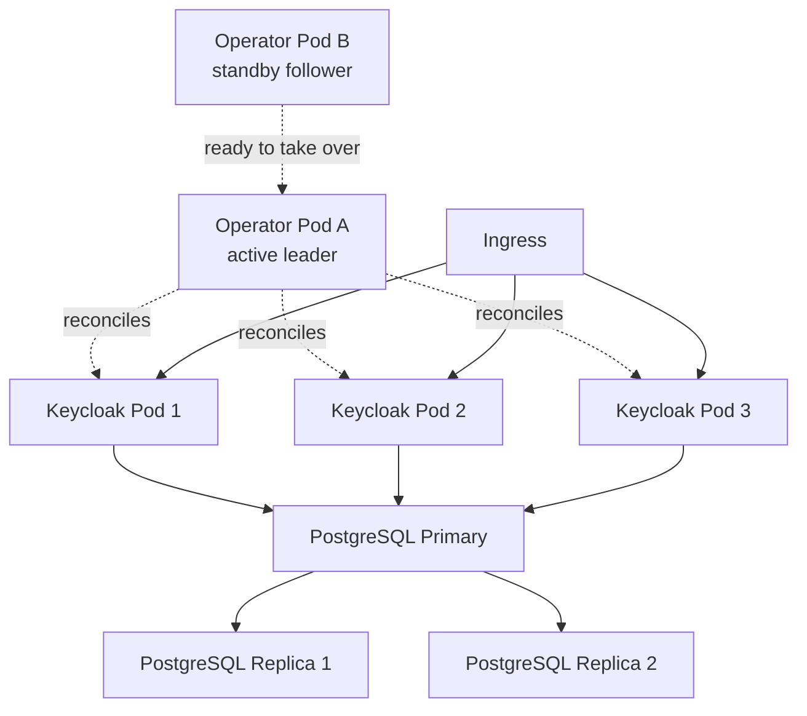

# High Availability Deployment

This guide covers high-availability deployment for the operator, managed Keycloak, and PostgreSQL.

Use Helm values as the primary configuration path. Raw manifests remain useful for supporting resources such as PodDisruptionBudgets, but the managed Keycloak configuration itself should start from the chart values.

## What HA Means Here


```mermaid
flowchart TD
  ingress[Ingress]
  opA[Operator Pod A\nactive leader]
  opB[Operator Pod B\nstandby follower]
  kc1[Keycloak Pod 1]
  kc2[Keycloak Pod 2]
  kc3[Keycloak Pod 3]
  pgp[PostgreSQL Primary]
  pgr1[PostgreSQL Replica 1]
  pgr2[PostgreSQL Replica 2]

  opA -. reconciles .-> kc1
  opA -. reconciles .-> kc2
  opA -. reconciles .-> kc3
  opB -. ready to take over .-> opA

  ingress --> kc1
  ingress --> kc2
  ingress --> kc3

  kc1 --> pgp
  kc2 --> pgp
  kc3 --> pgp

  pgp --> pgr1
  pgp --> pgr2
```

High availability has three separate layers:

1. operator availability through multiple operator replicas with leader election
2. Keycloak availability through multiple managed Keycloak replicas
3. database availability through a replicated PostgreSQL topology, ideally CNPG

Do not treat those as interchangeable.

- extra operator replicas improve control-plane availability, not Keycloak request capacity
- extra Keycloak replicas improve application availability and throughput
- database HA is mandatory if you want real failover instead of just more Keycloak pods

## Managed Keycloak HA Basics

For managed Keycloak instances, the primary HA control is `keycloak.replicas`.

```yaml
keycloak:
  replicas: 3
  ingress:
    enabled: true
    className: nginx
    host: keycloak.example.com
    annotations:
      nginx.ingress.kubernetes.io/affinity: cookie
      nginx.ingress.kubernetes.io/session-cookie-name: keycloak-affinity
      nginx.ingress.kubernetes.io/session-cookie-hash: sha1
  resources:
    requests:
      cpu: 500m
      memory: 1Gi
    limits:
      cpu: 2000m
      memory: 2Gi
```

When `replicas > 1`, the operator automatically configures JGroups clustering for the managed Keycloak deployment:

- a headless discovery Service is created
- `KC_CACHE_STACK=kubernetes` is configured
- JGroups DNS_PING discovery is wired automatically
- port `7800` is exposed for cluster communication

All currently supported Keycloak versions already satisfy the clustering stack requirement for this path.

Session affinity is still recommended at the ingress or load balancer layer even though distributed caching is enabled. It reduces avoidable churn during login flows and failover events.

## Operator HA

Operator HA is configured separately from the managed Keycloak instance.

```yaml
operator:
  replicaCount: 2
  resources:
    requests:
      cpu: 200m
      memory: 512Mi
```

Use at least two operator replicas in production so reconciliation continues during a pod restart or node failure.

Operator HA is active-passive:

- one replica holds leadership and performs reconciliation work
- other replicas stay ready and take over if the leader disappears
- adding replicas improves availability, not reconciliation throughput

## Database HA With CNPG

CNPG is the strongest HA path because it gives you failover, backups, and recovery primitives that the operator can integrate with.

Typical production-oriented values:

```yaml
keycloak:
  database:
    type: postgresql
    cnpg:
      enabled: true
      clusterName: keycloak-postgres
      instances: 3
      storage:
        size: 100Gi
        storageClass: fast-ssd
      postgresql:
        maxConnections: "200"
        sharedBuffers: "512MB"
```

Key CNPG concepts:

- `instances: 3` gives one primary and two replicas
- `minSyncReplicas` and `maxSyncReplicas` are CNPG-level durability controls when you manage the database cluster directly
- connection limits must be sized for the Keycloak replica count, admin activity, and background jobs

For full CNPG examples, use [Database Setup](./database-setup.md).

## Resource Sizing Guidance

Replica count, JVM memory, and database capacity move together.

Practical rules:

- raising `keycloak.replicas` increases total database connection demand
- larger realms and login bursts usually need both more CPU and more heap
- ingress or load-balancer stickiness reduces cross-pod cache chatter during hot paths
- do not raise Keycloak replicas without checking PostgreSQL connection capacity

A reasonable starting point for production is:

- Keycloak: `3` replicas, `500m` CPU request, `1Gi` memory request
- CNPG: `3` instances, storage sized for backups and WAL growth, connection limits reviewed for the expected concurrency

Tune from there with real metrics, not cargo-cult numbers.

## Upgrade Strategy For HA

If you want the lowest-disruption upgrade path, configure blue-green upgrades.

```yaml
keycloak:
  replicas: 3
  cacheIsolation:
    autoRevision: true
  upgradePolicy:
    strategy: BlueGreen
    backupTimeout: 600
    autoTeardown: true
```

This gives you:

- pre-upgrade backups for supported database tiers
- isolated JGroups cluster identity during the cutover
- traffic switch only after the green deployment is ready

See [Migration & Upgrade Guide](../operations/migration.md).

## Scheduling And Disruption Controls

The managed Keycloak CR does not expose arbitrary pod affinity or anti-affinity fields today. Do not document unsupported `affinity` examples as if they were part of the CRD.

For disruption control:

- use cluster scheduling policy and node topology consciously
- manage PodDisruptionBudgets as separate GitOps-managed manifests if you need them
- validate that your ingress or load balancer is distributing traffic the way you expect

Example PDB managed alongside the Helm release:

```yaml
apiVersion: policy/v1
kind: PodDisruptionBudget
metadata:
  name: keycloak-pdb
  namespace: keycloak-system
spec:
  minAvailable: 2
  selector:
    matchLabels:
      app.kubernetes.io/name: keycloak
```

## Failover Validation

### Keycloak Pod Failure

```bash
kubectl get pods -n keycloak-system
kubectl delete pod -n keycloak-system <one-keycloak-pod>
kubectl get pods -n keycloak-system -w
```

What to verify:

- replacement pod becomes ready
- ingress still serves login requests during the disruption
- an active session or repeated token request continues to work

### CNPG Primary Failover

```bash
kubectl get cluster keycloak-postgres -n keycloak-system \
  -o jsonpath='{.status.currentPrimary}{"\n"}'
kubectl delete pod -n keycloak-system <current-primary-pod>
kubectl get cluster keycloak-postgres -n keycloak-system -w
```

What to verify:

- a new primary is elected
- Keycloak reconnects automatically
- authentication and token issuance recover without manual reconfiguration

### Traffic Continuity Check

A useful HA test is not just pod replacement. Verify a real flow:

1. authenticate through the ingress
2. keep issuing token refreshes or authenticated requests
3. delete a Keycloak pod or trigger CNPG failover
4. confirm the client experience remains acceptable

If you only watch pod status, you are testing Kubernetes cosmetics, not service continuity.

## Monitoring And Alerting

Start with these checks:

```bash
kubectl get keycloak -n keycloak-system
kubectl get pods -n keycloak-system
kubectl get cluster -n keycloak-system
```

Useful Prometheus queries:

```promql
sum(up{job="keycloak"}) / count(up{job="keycloak"})
max(cnpg_pg_replication_lag_seconds) by (pod)
rate(kube_pod_container_status_restarts_total{namespace="keycloak-system"}[1h])
```

Reasonable starting alert thresholds:

- availability below `1` for the managed Keycloak target set
- CNPG replication lag consistently above `1s` for latency-sensitive setups
- restart rates that are non-zero for a sustained window instead of a single rollout blip

Tune the thresholds to your own traffic and SLOs.

## S3 Backup Prerequisites

If you use CNPG object-store backups, verify the prerequisites before treating them as HA protection:

- object storage bucket exists and is reachable
- credentials secret exists in the CNPG namespace
- lifecycle or retention rules match your recovery objectives
- restore procedures have been exercised, not just configured

Backups you have never restored are optimism with YAML attached.

## See Also

- [Database Setup](./database-setup.md)
- [Backup & Restore](../operations/backup-restore.md)
- [Migration & Upgrade Guide](../operations/migration.md)
- [Keycloak Version Support](../reference/keycloak-version-support.md)
