# High Availability Deployment

Configure Keycloak and PostgreSQL for high availability with automatic failover.

## Architecture Overview

```mermaid
%%{init: {'theme':'base', 'themeVariables': { 'primaryColor':'#00b8d9','primaryTextColor':'#fff','primaryBorderColor':'#0097a7','lineColor':'#00acc1','secondaryColor':'#006064','tertiaryColor':'#fff'}}}%%
graph TD
    ingress["⚡ Ingress"]

    kc1["🔐 Keycloak<br/>Pod 1"]
    kc2["🔐 Keycloak<br/>Pod 2"]
    kc3["🔐 Keycloak<br/>Pod 3"]

    pg_primary["🗄️ PostgreSQL<br/>Primary"]
    pg_replica1["🗄️ PostgreSQL<br/>Replica 1"]
    pg_replica2["🗄️ PostgreSQL<br/>Replica 2"]

    ingress --> kc1
    ingress --> kc2
    ingress --> kc3

    kc1 --> pg_primary
    kc2 --> pg_primary
    kc3 --> pg_primary

    pg_primary --> pg_replica1
    pg_primary --> pg_replica2

    style ingress fill:#00838f,stroke:#006064,color:#fff
    style kc1 fill:#00838f,stroke:#006064,color:#fff
    style kc2 fill:#00838f,stroke:#006064,color:#fff
    style kc3 fill:#00838f,stroke:#006064,color:#fff
    style pg_primary fill:#1565c0,stroke:#0d47a1,color:#fff
    style pg_replica1 fill:#1565c0,stroke:#0d47a1,color:#fff
    style pg_replica2 fill:#1565c0,stroke:#0d47a1,color:#fff
```



---

## Quick Start: HA Configuration

### Keycloak HA

```yaml
apiVersion: vriesdemichael.github.io/v1
kind: Keycloak
metadata:
  name: keycloak
  namespace: keycloak-system
spec:
  replicas: 3  # HA: minimum 3 replicas

  resources:
    requests:
      cpu: 500m
      memory: 1Gi
    limits:
      cpu: 2000m
      memory: 2Gi

  # Pod anti-affinity: spread across nodes
  affinity:
    podAntiAffinity:
      requiredDuringSchedulingIgnoredDuringExecution:
        - labelSelector:
            matchLabels:
              app: keycloak
          topologyKey: kubernetes.io/hostname

  database:
    type: cnpg
    cluster: keycloak-db
    namespace: keycloak-db

  ingress:
    enabled: true
    className: nginx
    hostname: keycloak.example.com
```

### PostgreSQL HA

```yaml
apiVersion: postgresql.cnpg.io/v1
kind: Cluster
metadata:
  name: keycloak-db
  namespace: keycloak-db
spec:
  instances: 3  # 1 primary + 2 replicas

  primaryUpdateStrategy: unsupervised  # Automatic failover
  minSyncReplicas: 1
  maxSyncReplicas: 2

  # Spread across zones
  affinity:
    podAntiAffinityType: required
    topologyKey: topology.kubernetes.io/zone

  storage:
    size: 100Gi
    storageClass: fast-ssd

  backup:
    barmanObjectStore:
      destinationPath: s3://backups/keycloak-db
      s3Credentials:
        accessKeyId:
          name: backup-s3-credentials
          key: ACCESS_KEY_ID
        secretAccessKey:
          name: backup-s3-credentials
          key: ACCESS_SECRET_KEY
      wal:
        compression: gzip
      data:
        compression: gzip
    retentionPolicy: "30d"
```

---

## Component Configuration

### 1. Operator HA

```bash
helm install keycloak-operator ./charts/keycloak-operator \
  --namespace keycloak-operator-system \
  --create-namespace \
  --set replicas=2 \
  --set resources.requests.cpu=200m \
  --set resources.requests.memory=512Mi
```

### 2. Load Balancer Configuration

**Ingress (Recommended)**:
```yaml
ingress:
  enabled: true
  className: nginx
  annotations:
    nginx.ingress.kubernetes.io/affinity: cookie
    nginx.ingress.kubernetes.io/session-cookie-name: keycloak-affinity
    nginx.ingress.kubernetes.io/session-cookie-hash: sha1
  hostname: keycloak.example.com
```

**Service LoadBalancer** (Cloud):
```yaml
service:
  type: LoadBalancer
  annotations:
    service.beta.kubernetes.io/aws-load-balancer-type: nlb
    service.beta.kubernetes.io/aws-load-balancer-cross-zone-load-balancing-enabled: "true"
```

### 3. Pod Disruption Budget

```yaml
apiVersion: policy/v1
kind: PodDisruptionBudget
metadata:
  name: keycloak-pdb
  namespace: keycloak-system
spec:
  minAvailable: 2
  selector:
    matchLabels:
      app: keycloak
```

### 4. Resource Limits

**Keycloak**:
```yaml
resources:
  requests:
    cpu: 500m
    memory: 1Gi
  limits:
    cpu: 2000m
    memory: 2Gi

jvm:
  heapSize: "1536m"
```

**PostgreSQL**:
```yaml
resources:
  requests:
    cpu: 1000m
    memory: 2Gi
  limits:
    cpu: 2000m
    memory: 4Gi

postgresql:
  parameters:
    max_connections: "200"
    shared_buffers: "512MB"
    effective_cache_size: "2GB"
```

---

## Failover Testing

### Simulate Keycloak Pod Failure

```bash
# Kill a Keycloak pod
kubectl delete pod keycloak-0 -n keycloak-system

# Watch rollout
kubectl get pods -n keycloak-system -w

# Verify traffic continues (2/3 pods handling requests)
# New pod starts automatically
```

### Simulate Database Primary Failure

```bash
# Identify primary
kubectl get cluster keycloak-db -n keycloak-db \
  -o jsonpath='{.status.currentPrimary}'

# Delete primary pod
kubectl delete pod keycloak-db-1 -n keycloak-db

# Watch failover (30-60 seconds)
kubectl get cluster keycloak-db -n keycloak-db -w

# Verify new primary elected
kubectl get cluster keycloak-db -n keycloak-db \
  -o jsonpath='{.status.currentPrimary}'
```

### Simulate Node Failure

```bash
# Cordon node (simulates failure)
kubectl cordon <node-name>

# Watch pods reschedule
kubectl get pods -n keycloak-system -o wide -w

# Uncordon when done
kubectl uncordon <node-name>
```

---

## Monitoring HA Health

### Check Keycloak Replicas

```bash
kubectl get pods -n keycloak-system -l app=keycloak
# All pods should be Running

# Check endpoints
kubectl get endpoints keycloak-keycloak -n keycloak-system
# Should show all pod IPs
```

### Check Database Replication

```bash
# Check cluster status
kubectl get cluster keycloak-db -n keycloak-db

# Check replication lag
kubectl exec -it -n keycloak-db keycloak-db-1 -- \
  psql -U postgres -c "SELECT * FROM pg_stat_replication;"
```

### Prometheus Queries

```promql
# Keycloak availability (should be 1.0 = 100%)
sum(up{job="keycloak"}) / count(up{job="keycloak"})

# Database replication lag (should be < 1s)
max(cnpg_pg_replication_lag_seconds) by (pod)

# Pod restart rate (should be near 0)
rate(kube_pod_container_status_restarts_total{namespace="keycloak-system"}[1h])
```

---

## Zone Distribution

### Multi-Zone Keycloak

```yaml
affinity:
  podAntiAffinity:
    requiredDuringSchedulingIgnoredDuringExecution:
      - labelSelector:
          matchLabels:
            app: keycloak
        topologyKey: topology.kubernetes.io/zone  # Spread across zones

  nodeAffinity:
    preferredDuringSchedulingIgnoredDuringExecution:
      - weight: 100
        preference:
          matchExpressions:
            - key: topology.kubernetes.io/zone
              operator: In
              values: ["us-east-1a", "us-east-1b", "us-east-1c"]
```

### Multi-Zone Database

```yaml
affinity:
  podAntiAffinityType: required
  topologyKey: topology.kubernetes.io/zone
  nodeSelector:
    node.kubernetes.io/instance-type: m5.2xlarge
```

---

## Performance Tuning

### Connection Pooling

**Keycloak Database Pool**:
```yaml
env:
  - name: KC_DB_POOL_INITIAL_SIZE
    value: "10"
  - name: KC_DB_POOL_MIN_SIZE
    value: "10"
  - name: KC_DB_POOL_MAX_SIZE
    value: "50"
```

**PostgreSQL Connections**:
```yaml
postgresql:
  parameters:
    max_connections: "200"  # Keycloak pods * connections per pod + buffer
```

### Caching

```yaml
env:
  - name: KC_CACHE
    value: "ispn"  # Infinispan (default, supports clustering)
  - name: KC_CACHE_STACK
    value: "kubernetes"  # Auto-discovery in K8s
```

---

## Disaster Recovery

### Backup Strategy

```yaml
apiVersion: postgresql.cnpg.io/v1
kind: ScheduledBackup
metadata:
  name: keycloak-db-backup
  namespace: keycloak-db
spec:
  schedule: "0 2 * * *"  # Daily at 2 AM
  backupOwnerReference: self
  cluster:
    name: keycloak-db
```

### Multi-Region Backup

```yaml
backup:
  barmanObjectStore:
    destinationPath: s3://backups-us-east/keycloak-db
    # Replicate to secondary region

# Then replicate S3 bucket to other region via AWS S3 replication
```

### Recovery Time Objective (RTO)

| Component | Failure | RTO | Procedure |
|-----------|---------|-----|-----------|
| Keycloak Pod | Single pod failure | < 1 min | Automatic (K8s recreates) |
| Keycloak Node | Node failure | 2-5 min | Automatic (pods reschedule) |
| Database Primary | Primary failure | 30-60s | Automatic (CNPG failover) |
| Database Corruption | Data corruption | 10-30 min | Manual restore from backup |
| Full Cluster Loss | Region outage | 1-4 hours | Manual restore in new region |

---

## Troubleshooting HA

### Split Brain Detection

```bash
# Check if multiple primaries exist (should never happen)
kubectl get pods -n keycloak-db -l role=primary
# Should show exactly 1 pod

# Check cluster status
kubectl describe cluster keycloak-db -n keycloak-db
```

### Replication Lag Too High

```bash
# Check lag
kubectl exec -it -n keycloak-db keycloak-db-1 -- \
  psql -U postgres -c "
    SELECT
      client_addr,
      state,
      sent_lsn,
      write_lsn,
      flush_lsn,
      replay_lsn,
      sync_state,
      EXTRACT(EPOCH FROM (now() - replay_timestamp)) AS lag_seconds
    FROM pg_stat_replication;
  "

# Solutions:
# - Increase wal_sender_timeout
# - Check network latency between pods
# - Verify replica has sufficient resources
```

### Session Affinity Issues

```bash
# Verify ingress session affinity
kubectl get ingress keycloak-ingress -n keycloak-system -o yaml | grep affinity

# Test with curl
curl -v -c cookies.txt https://keycloak.example.com/realms/master
curl -v -b cookies.txt https://keycloak.example.com/realms/master
# Should hit same pod (check response headers/logs)
```

---

## Related Documentation

- [Database Setup Guide](./database-setup.md)
- [Backup & Restore Guide](./backup-restore.md)
- [End-to-End Setup Guide](./end-to-end-setup.md)
- [Troubleshooting Guide](../operations/troubleshooting.md)
