# Multi-Tenant Configuration Guide

Configure the operator for multi-tenant environments where multiple teams manage their own realms and clients independently.

## Team Responsibilities & Onboarding

When introducing the Keycloak Operator to your organization, clear role definitions are essential for a smooth "Realm-as-Tenant" adoption.

### Roles & Responsibilities Matrix

| Responsibility | Platform Team 🛠️ | Realm Owner (App Team A) 👑 | Client Owner (App Team B) 👤 |
| :--- | :--- | :--- | :--- |
| **Scope** | Cluster Infrastructure & Operator | Specific Realm (Tenant) | Specific Application (Client) |
| **Infrastructure** | Deploys Operator & CRDs.<br>Ensures Keycloak availability.<br>Manages global limits/quotas. | N/A | N/A |
| **Security Boundary** | Manages ClusterRoles.<br>No access to Realm secrets by default. | **Owns the Realm boundary.**<br>Controls `clientAuthorizationGrants`.<br>Manages Realm Users/Groups. | Manages Client Secrets.<br>Configures Redirect URIs. |
| **Onboarding** | Creates Namespaces.<br>Grants Realm Creation rights. | Creates Realm CR.<br>Approves Client access via PRs. | Creates Client CR in own Namespace.<br>Requests access to Realm. |
| **Troubleshooting** | Operator logs, Pod health, Network policies. | Realm configuration errors.<br>Auth flows, Theme issues. | Client connection errors.<br>Invalid Redirect URIs. |

### Onboarding New Teams

**1. For Platform Engineers:**
*   **Explain:** "We provide the Keycloak *service* and the *operator*. You own your configuration."
*   **Configure:** Set up namespaces and RBAC so teams can create `KeycloakRealm` resources.
*   **Security:** You don't need to see their secrets. The Operator only accesses namespaces where it is explicitly invited via the Realm Helm chart.

**2. For Realm Owners (Tenant Managers):**
*   **Explain:** "You own a 'Virtual Keycloak'. You control who can connect to it."
*   **Action:** Deploy your Realm using the `keycloak-realm` Helm chart.
*   **Gatekeeping:** Use the `clientAuthorizationGrants` list in your Realm YAML to whitelist other team's namespaces. You are the gatekeeper.

**3. For Application Developers (Client Owners):**
*   **Explain:** "You define your app's auth client as code, right next to your deployment."
*   **Action:** Deploy a `KeycloakClient` CR in *your* namespace.
*   **Access:** If you need to connect to a shared Realm, ask the Realm Owner to add your namespace to their allowlist.

---

## Architecture

```mermaid
%%{init: {'theme':'base', 'themeVariables': { 'primaryColor':'#00b8d9','primaryTextColor':'#fff','primaryBorderColor':'#0097a7','lineColor':'#00acc1','secondaryColor':'#006064','tertiaryColor':'#fff'}}}%%
graph LR
    subgraph platform["👥 Platform Team"]
        deploy["Deploy Operator"]
        instance["Create Keycloak Instance"]
        rbac["Grant RBAC Permissions"]
    end

    subgraph app["👥 Application Teams"]
        realms["Create Realms<br/><small>(RBAC-controlled)</small>"]
        grants["Set clientAuthorizationGrants"]
        clients["Manage Clients<br/><small>(grant list-controlled)</small>"]
    end

    deploy --> instance
    instance --> rbac
    rbac -.->|authorize| realms
    realms --> grants
    grants --> clients

    style platform fill:#263238,stroke:#00acc1,stroke-width:2px,color:#fff
    style app fill:#263238,stroke:#00acc1,stroke-width:2px,color:#fff
    style deploy fill:#00838f,stroke:#006064,color:#fff
    style instance fill:#00838f,stroke:#006064,color:#fff
    style rbac fill:#00838f,stroke:#006064,color:#fff
    style realms fill:#00838f,stroke:#006064,color:#fff
    style grants fill:#00838f,stroke:#006064,color:#fff
    style clients fill:#00838f,stroke:#006064,color:#fff
```



**Key Concepts:**

- **Realm Creation**: Controlled by Kubernetes RBAC (RoleBinding)
- **Client Creation**: Controlled by realm's `clientAuthorizationGrants` list
- **Declarative**: All authorization via manifest fields, no secrets/tokens
- **GitOps-Friendly**: Everything in version control

---

## Platform Team Setup

### 1. Deploy Shared Keycloak

Install the operator with Keycloak instance using Helm:

```bash
helm install keycloak-operator oci://ghcr.io/vriesdemichael/charts/keycloak-operator \
  --namespace platform \
  --set keycloak.enabled=true \
  --set keycloak.replicas=3 \
  --set keycloak.database.cnpg.enabled=true \
  --set keycloak.ingress.enabled=true \
  --set keycloak.ingress.hosts[0].host=keycloak.company.com \
  --set keycloak.ingress.hosts[0].paths[0].path=/ \
  --set keycloak.ingress.hosts[0].paths[0].pathType=Prefix
```

### 2. Create Namespaces for Teams

```bash
# Create namespaces
kubectl create namespace team-alpha
kubectl create namespace team-beta
kubectl create namespace team-gamma

# Label for organization
kubectl label namespace team-alpha team=alpha env=prod
kubectl label namespace team-beta team=beta env=prod
kubectl label namespace team-gamma team=gamma env=prod
```

### 3. Grant Realm Creation Permissions

Create ClusterRole for realm management:

```yaml
apiVersion: rbac.authorization.k8s.io/v1
kind: ClusterRole
metadata:
  name: keycloak-realm-manager
rules:
  - apiGroups: ["vriesdemichael.github.io"]
    resources: ["keycloakrealms"]
    verbs: ["get", "list", "watch", "create", "update", "patch", "delete"]
  - apiGroups: ["vriesdemichael.github.io"]
    resources: ["keycloakclients"]
    verbs: ["get", "list", "watch", "create", "update", "patch", "delete"]
```

Grant to each team:

```bash
# Team Alpha
kubectl create rolebinding realm-manager-alpha \
  --clusterrole=keycloak-realm-manager \
  --serviceaccount=team-alpha:default \
  --namespace=team-alpha

# Team Beta
kubectl create rolebinding realm-manager-beta \
  --clusterrole=keycloak-realm-manager \
  --serviceaccount=team-beta:default \
  --namespace=team-beta

# Team Gamma
kubectl create rolebinding realm-manager-gamma \
  --clusterrole=keycloak-realm-manager \
  --serviceaccount=team-gamma:default \
  --namespace=team-gamma
```

### 4. Grant Operator Namespace Access

The operator needs to read secrets in each team namespace:

```bash
# Create RoleBinding for each team namespace
for TEAM in team-alpha team-beta team-gamma; do
  kubectl create rolebinding keycloak-operator-access \
    --clusterrole=keycloak-operator-namespace-access \
    --serviceaccount=platform:keycloak-operator \
    --namespace=$TEAM
done
```

---

## Application Team Usage

### Create a Realm

Each team creates realms in their own namespace using the Helm chart:

```bash
helm install alpha-production oci://ghcr.io/vriesdemichael/charts/keycloak-realm \
  --namespace team-alpha \
  --set realmName=alpha-production \
  --set operatorRef.namespace=platform \
  --set clientAuthorizationGrants[0]=team-alpha \
  --set clientAuthorizationGrants[1]=team-alpha-dev \
  --set security.registrationAllowed=false \
  --set security.resetPasswordAllowed=true \
  --set security.verifyEmail=true
```

### Create Clients in Authorized Namespaces

Team Alpha can create clients in their namespace using the Helm chart:

```bash
helm install alpha-app oci://ghcr.io/vriesdemichael/charts/keycloak-client \
  --namespace team-alpha \
  --set clientId=alpha-app \
  --set realmRef.name=alpha-production \
  --set realmRef.namespace=team-alpha \
  --set publicClient=false \
  --set redirectUris[0]=https://app.team-alpha.com/callback
```

### Cross-Namespace Client Creation

If a realm grants access, other namespaces can create clients:

```bash
# In team-alpha-dev namespace
helm install dev-app oci://ghcr.io/vriesdemichael/charts/keycloak-client \
  --namespace team-alpha-dev \
  --set clientId=dev-app \
  --set realmRef.name=alpha-production \
  --set realmRef.namespace=team-alpha \
  --set redirectUris[0]=https://dev.team-alpha.com/callback
```

---

## Multi-Realm Scenarios

### Shared Platform Realm

Platform team creates a central realm that all teams can use:

```bash
helm install company-sso oci://ghcr.io/vriesdemichael/charts/keycloak-realm \
  --namespace platform \
  --set realmName=company-sso \
  --set operatorRef.namespace=platform \
  --set clientAuthorizationGrants[0]=team-alpha \
  --set clientAuthorizationGrants[1]=team-beta \
  --set clientAuthorizationGrants[2]=team-gamma \
  --set security.registrationAllowed=false \
  --set security.resetPasswordAllowed=true
```

All teams can now create clients in this realm.

### Team-Specific Realms with Selective Sharing

Team creates realm and selectively grants access:

```bash
helm install beta-services oci://ghcr.io/vriesdemichael/charts/keycloak-realm \
  --namespace team-beta \
  --set realmName=beta-services \
  --set operatorRef.namespace=platform \
  --set clientAuthorizationGrants[0]=team-beta \
  --set clientAuthorizationGrants[1]=team-beta-staging \
  --set clientAuthorizationGrants[2]=partner-integration-team
```

---

## Security Model

### Realm Creation Authorization

**Who can create realms?**
- Users/ServiceAccounts with RoleBinding granting `create` permission on `KeycloakRealm`
- Platform team controls via RBAC policies

**Verification:**
```bash
# Check if team can create realms
kubectl auth can-i create keycloakrealms.vriesdemichael.github.io \
  --as=system:serviceaccount:team-alpha:default \
  --namespace=team-alpha
```

### Client Creation Authorization

**Who can create clients?**
- Namespaces listed in realm's `clientAuthorizationGrants`
- Defined by realm owner (application team)
- Fully declarative (no secret distribution)

**Verification:**
```bash
# Check realm's grants
kubectl get keycloakrealm alpha-production -n team-alpha \
  -o jsonpath='{.spec.clientAuthorizationGrants}' | jq
```

### Namespace Isolation

- Teams cannot access other teams' namespaces (Kubernetes RBAC)
- Teams cannot modify other teams' realms (resource ownership)
- Clients can only reference realms that grant their namespace access
- Operator enforces authorization at reconciliation time

---

## GitOps Workflow

### ArgoCD Application Structure

```
gitops-repo/
├── platform/
│   ├── keycloak-operator.yaml
│   └── shared-realms/
│       └── company-sso.yaml
├── team-alpha/
│   ├── realms/
│   │   └── alpha-production.yaml
│   └── clients/
│       ├── web-app.yaml
│       └── mobile-app.yaml
└── team-beta/
    ├── realms/
    │   └── beta-services.yaml
    └── clients/
        └── api-gateway.yaml
```

### Updating Authorization Grants

To grant a new namespace access:

```bash
# Update realm via helm upgrade
helm upgrade alpha-production oci://ghcr.io/vriesdemichael/charts/keycloak-realm \
  --namespace team-alpha \
  --reuse-values \
  --set clientAuthorizationGrants[0]=team-alpha \
  --set clientAuthorizationGrants[1]=team-alpha-dev \
  --set clientAuthorizationGrants[2]=new-namespace
```

Changes apply immediately - new namespace can create clients.

---

## Common Patterns

### Development/Staging/Production Separation

```bash
# Production realm - strict grants
helm install prod-realm oci://ghcr.io/vriesdemichael/charts/keycloak-realm \
  --namespace team-prod \
  --set realmName=prod-realm \
  --set operatorRef.namespace=platform \
  --set clientAuthorizationGrants[0]=team-prod

# Staging realm - more permissive
helm install staging-realm oci://ghcr.io/vriesdemichael/charts/keycloak-realm \
  --namespace team-staging \
  --set realmName=staging-realm \
  --set operatorRef.namespace=platform \
  --set clientAuthorizationGrants[0]=team-staging \
  --set clientAuthorizationGrants[1]=team-dev \
  --set clientAuthorizationGrants[2]=qa-team
```

### Partner Integration

```bash
helm install partner-api oci://ghcr.io/vriesdemichael/charts/keycloak-realm \
  --namespace platform \
  --set realmName=partner-api \
  --set operatorRef.namespace=platform \
  --set clientAuthorizationGrants[0]=partner-a \
  --set clientAuthorizationGrants[1]=partner-b \
  --set clientAuthorizationGrants[2]=internal-gateway \
  --set security.registrationAllowed=false \
  --set security.bruteForceProtected=true
```

---

## Troubleshooting

### Permission Denied Creating Realm

```bash
# Check RBAC permissions
kubectl auth can-i create keycloakrealms.vriesdemichael.github.io \
  --namespace=team-alpha

# Check RoleBindings
kubectl get rolebinding -n team-alpha \
  -o json | jq '.items[] | select(.subjects[]?.kind=="ServiceAccount")'
```

**Solution:** Create RoleBinding granting realm creation permission.

### Client Creation Fails - Not Authorized

```bash
# Check realm's grants
kubectl get keycloakrealm <realm> -n <realm-namespace> \
  -o jsonpath='{.spec.clientAuthorizationGrants[*]}'

# Check operator logs
kubectl logs -n platform -l app=keycloak-operator \
  | grep -i "authorization\|grant"
```

**Solution:** Add client's namespace to realm's `clientAuthorizationGrants`.

### Operator Can't Read Secrets

```bash
# Check operator has access to namespace
kubectl auth can-i get secrets \
  --as=system:serviceaccount:platform:keycloak-operator \
  --namespace=team-alpha
```

**Solution:** Create RoleBinding for operator in the namespace.

---


---

## Best Practices

✅ **Use least-privilege grants** - Only grant namespaces that need access
✅ **Document grants** - Comment why each namespace is granted
✅ **Review regularly** - Audit `clientAuthorizationGrants` periodically
✅ **Separate environments** - Different realms for dev/staging/prod
✅ **Use GitOps** - All changes via PR workflow
✅ **Monitor authorization** - Alert on denied client creation attempts

---

## Related Documentation

- [Security Model](../concepts/security.md)
- [RBAC Implementation](../rbac-implementation.md)
- [End-to-End Setup Guide](end-to-end-setup.md)
- [KeycloakRealm CRD Reference](../reference/keycloak-realm-crd.md)
