# Multi-Tenant Configuration Guide

Configure the operator for multi-tenant environments where multiple teams manage their own realms and clients independently.

## Architecture

```mermaid
%%{init: {'theme':'base', 'themeVariables': { 'primaryColor':'#00b8d9','primaryTextColor':'#fff','primaryBorderColor':'#0097a7','lineColor':'#00acc1','secondaryColor':'#006064','tertiaryColor':'#fff'}}}%%
graph LR
    subgraph platform["👥 Platform Team"]
        deploy["Deploy Operator"]
        instance["Create Keycloak Instance"]
        rbac["Grant RBAC Permissions"]
    end

    subgraph app["👥 Application Teams"]
        realms["Create Realms<br/><small>(RBAC-controlled)</small>"]
        grants["Set clientAuthorizationGrants"]
        clients["Manage Clients<br/><small>(grant list-controlled)</small>"]
    end

    deploy --> instance
    instance --> rbac
    rbac -.->|authorize| realms
    realms --> grants
    grants --> clients

    style platform fill:#263238,stroke:#00acc1,stroke-width:2px,color:#fff
    style app fill:#263238,stroke:#00acc1,stroke-width:2px,color:#fff
    style deploy fill:#00838f,stroke:#006064,color:#fff
    style instance fill:#00838f,stroke:#006064,color:#fff
    style rbac fill:#00838f,stroke:#006064,color:#fff
    style realms fill:#00838f,stroke:#006064,color:#fff
    style grants fill:#00838f,stroke:#006064,color:#fff
    style clients fill:#00838f,stroke:#006064,color:#fff
```



**Key Concepts:**

- **Realm Creation**: Controlled by Kubernetes RBAC (RoleBinding)
- **Client Creation**: Controlled by realm's `clientAuthorizationGrants` list
- **Declarative**: All authorization via manifest fields, no secrets/tokens
- **GitOps-Friendly**: Everything in version control

---

## Platform Team Setup

### 1. Deploy Shared Keycloak

```yaml
apiVersion: vriesdemichael.github.io/v1
kind: Keycloak
metadata:
  name: keycloak
  namespace: platform
spec:
  replicas: 3
  database:
    type: cnpg
    cluster: keycloak-db
    namespace: platform
  ingress:
    enabled: true
    hostname: keycloak.company.com
```

### 2. Create Namespaces for Teams

```bash
# Create namespaces
kubectl create namespace team-alpha
kubectl create namespace team-beta
kubectl create namespace team-gamma

# Label for organization
kubectl label namespace team-alpha team=alpha env=prod
kubectl label namespace team-beta team=beta env=prod
kubectl label namespace team-gamma team=gamma env=prod
```

### 3. Grant Realm Creation Permissions

Create ClusterRole for realm management:

```yaml
apiVersion: rbac.authorization.k8s.io/v1
kind: ClusterRole
metadata:
  name: keycloak-realm-manager
rules:
  - apiGroups: ["vriesdemichael.github.io"]
    resources: ["keycloakrealms"]
    verbs: ["get", "list", "watch", "create", "update", "patch", "delete"]
  - apiGroups: ["vriesdemichael.github.io"]
    resources: ["keycloakclients"]
    verbs: ["get", "list", "watch", "create", "update", "patch", "delete"]
```

Grant to each team:

```bash
# Team Alpha
kubectl create rolebinding realm-manager-alpha \
  --clusterrole=keycloak-realm-manager \
  --serviceaccount=team-alpha:default \
  --namespace=team-alpha

# Team Beta
kubectl create rolebinding realm-manager-beta \
  --clusterrole=keycloak-realm-manager \
  --serviceaccount=team-beta:default \
  --namespace=team-beta

# Team Gamma
kubectl create rolebinding realm-manager-gamma \
  --clusterrole=keycloak-realm-manager \
  --serviceaccount=team-gamma:default \
  --namespace=team-gamma
```

### 4. Grant Operator Namespace Access

The operator needs to read secrets in each team namespace:

```bash
# Create RoleBinding for each team namespace
for TEAM in team-alpha team-beta team-gamma; do
  kubectl create rolebinding keycloak-operator-access \
    --clusterrole=keycloak-operator-namespace-access \
    --serviceaccount=platform:keycloak-operator \
    --namespace=$TEAM
done
```

---

## Application Team Usage

### Create a Realm

Each team creates realms in their own namespace:

```yaml
apiVersion: vriesdemichael.github.io/v1
kind: KeycloakRealm
metadata:
  name: alpha-production
  namespace: team-alpha
spec:
  realmName: alpha-production

  operatorRef:
    namespace: platform

  # Grant these namespaces permission to create clients
  clientAuthorizationGrants:
    - team-alpha           # Our namespace
    - team-alpha-dev       # Our dev namespace
    - partner-namespace    # External partner (if needed)

  security:
    registrationAllowed: false
    resetPasswordAllowed: true
    verifyEmail: true

  smtp:
    host: smtp.company.com
    from: noreply@team-alpha.com
    credentialsSecret: smtp-credentials
```

### Create Clients in Authorized Namespaces

Team Alpha can create clients in their namespace:

```yaml
apiVersion: vriesdemichael.github.io/v1
kind: KeycloakClient
metadata:
  name: alpha-app
  namespace: team-alpha
spec:
  clientId: alpha-app

  realmRef:
    name: alpha-production
    namespace: team-alpha

  redirectUris:
    - https://app.team-alpha.com/callback

  publicClient: false
```

### Cross-Namespace Client Creation

If a realm grants access, other namespaces can create clients:

```yaml
# In team-alpha-dev namespace
apiVersion: vriesdemichael.github.io/v1
kind: KeycloakClient
metadata:
  name: dev-app
  namespace: team-alpha-dev
spec:
  clientId: dev-app

  realmRef:
    name: alpha-production
    namespace: team-alpha  # Cross-namespace reference

  redirectUris:
    - https://dev.team-alpha.com/callback
```

---

## Multi-Realm Scenarios

### Shared Platform Realm

Platform team creates a central realm that all teams can use:

```yaml
apiVersion: vriesdemichael.github.io/v1
kind: KeycloakRealm
metadata:
  name: company-sso
  namespace: platform
spec:
  realmName: company-sso

  operatorRef:
    namespace: platform

  # Grant all team namespaces access
  clientAuthorizationGrants:
    - team-alpha
    - team-beta
    - team-gamma
    - "*-dev"  # All dev namespaces

  security:
    registrationAllowed: false
    resetPasswordAllowed: true
```

All teams can now create clients in this realm.

### Team-Specific Realms with Selective Sharing

Team creates realm and selectively grants access:

```yaml
apiVersion: vriesdemichael.github.io/v1
kind: KeycloakRealm
metadata:
  name: beta-services
  namespace: team-beta
spec:
  realmName: beta-services

  operatorRef:
    namespace: platform

  # Only beta team and specific partners
  clientAuthorizationGrants:
    - team-beta
    - team-beta-staging
    - partner-integration-team  # External partner
```

---

## Security Model

### Realm Creation Authorization

**Who can create realms?**
- Users/ServiceAccounts with RoleBinding granting `create` permission on `KeycloakRealm`
- Platform team controls via RBAC policies

**Verification:**
```bash
# Check if team can create realms
kubectl auth can-i create keycloakrealms.vriesdemichael.github.io \
  --as=system:serviceaccount:team-alpha:default \
  --namespace=team-alpha
```

### Client Creation Authorization

**Who can create clients?**
- Namespaces listed in realm's `clientAuthorizationGrants`
- Defined by realm owner (application team)
- Fully declarative (no secret distribution)

**Verification:**
```bash
# Check realm's grants
kubectl get keycloakrealm alpha-production -n team-alpha \
  -o jsonpath='{.spec.clientAuthorizationGrants}' | jq
```

### Namespace Isolation

- Teams cannot access other teams' namespaces (Kubernetes RBAC)
- Teams cannot modify other teams' realms (resource ownership)
- Clients can only reference realms that grant their namespace access
- Operator enforces authorization at reconciliation time

---

## GitOps Workflow

### ArgoCD Application Structure

```
gitops-repo/
├── platform/
│   ├── keycloak-operator.yaml
│   └── shared-realms/
│       └── company-sso.yaml
├── team-alpha/
│   ├── realms/
│   │   └── alpha-production.yaml
│   └── clients/
│       ├── web-app.yaml
│       └── mobile-app.yaml
└── team-beta/
    ├── realms/
    │   └── beta-services.yaml
    └── clients/
        └── api-gateway.yaml
```

### Updating Authorization Grants

To grant a new namespace access:

```bash
# Update realm manifest
kubectl patch keycloakrealm alpha-production -n team-alpha --type=merge -p '
spec:
  clientAuthorizationGrants:
    - team-alpha
    - team-alpha-dev
    - new-namespace  # Add new namespace
'

# Or update in Git and let ArgoCD sync
```

Changes apply immediately - new namespace can create clients.

---

## Common Patterns

### Development/Staging/Production Separation

```yaml
# Production realm - strict grants
apiVersion: vriesdemichael.github.io/v1
kind: KeycloakRealm
metadata:
  name: prod-realm
  namespace: team-prod
spec:
  clientAuthorizationGrants:
    - team-prod  # Only production namespace

---
# Staging realm - more permissive
apiVersion: vriesdemichael.github.io/v1
kind: KeycloakRealm
metadata:
  name: staging-realm
  namespace: team-staging
spec:
  clientAuthorizationGrants:
    - team-staging
    - team-dev
    - qa-team  # QA can create test clients
```

### Partner Integration

```yaml
apiVersion: vriesdemichael.github.io/v1
kind: KeycloakRealm
metadata:
  name: partner-api
  namespace: platform
spec:
  clientAuthorizationGrants:
    - partner-a
    - partner-b
    - internal-gateway  # Our API gateway

  # Strict security for external partners
  security:
    registrationAllowed: false
    bruteForceProtected: true
```

---

## Troubleshooting

### Permission Denied Creating Realm

```bash
# Check RBAC permissions
kubectl auth can-i create keycloakrealms.vriesdemichael.github.io \
  --namespace=team-alpha

# Check RoleBindings
kubectl get rolebinding -n team-alpha \
  -o json | jq '.items[] | select(.subjects[]?.kind=="ServiceAccount")'
```

**Solution:** Create RoleBinding granting realm creation permission.

### Client Creation Fails - Not Authorized

```bash
# Check realm's grants
kubectl get keycloakrealm <realm> -n <realm-namespace> \
  -o jsonpath='{.spec.clientAuthorizationGrants[*]}'

# Check operator logs
kubectl logs -n platform -l app=keycloak-operator \
  | grep -i "authorization\|grant"
```

**Solution:** Add client's namespace to realm's `clientAuthorizationGrants`.

### Operator Can't Read Secrets

```bash
# Check operator has access to namespace
kubectl auth can-i get secrets \
  --as=system:serviceaccount:platform:keycloak-operator \
  --namespace=team-alpha
```

**Solution:** Create RoleBinding for operator in the namespace.

---


---

## Best Practices

✅ **Use least-privilege grants** - Only grant namespaces that need access
✅ **Document grants** - Comment why each namespace is granted
✅ **Review regularly** - Audit `clientAuthorizationGrants` periodically
✅ **Separate environments** - Different realms for dev/staging/prod
✅ **Use GitOps** - All changes via PR workflow
✅ **Monitor authorization** - Alert on denied client creation attempts

---

## Related Documentation

- [Security Model](../concepts/security.md)
- [RBAC Implementation](../rbac-implementation.md)
- [End-to-End Setup Guide](end-to-end-setup.md)
- [KeycloakRealm CRD Reference](../reference/keycloak-realm-crd.md)
