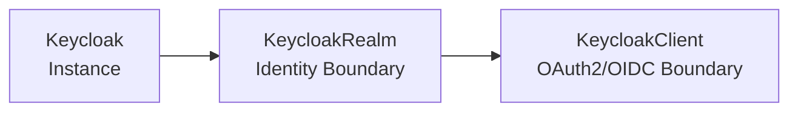

---
hide:
  - toc
---

# Keycloak Operator

A GitOps-friendly Kubernetes operator for managing Keycloak instances, realms, and OAuth2/OIDC clients declaratively.

## Why Use This Operator?

### vs. Official Keycloak Operator
- ✅ **True Multi-Tenancy**: Cross-namespace realm and client provisioning
- ✅ **GitOps Native**: Namespace grant lists instead of manual secret distribution
- ✅ **Declarative Provisioning Authorization**: Kubernetes RBAC + namespace grants for realm/client provisioning, while applications still use normal OAuth2/OIDC tokens
- ✅ **Built for Production**: Rate limiting, drift detection, admission webhooks
- ✅ **Comprehensive Status**: Rich status fields with observedGeneration tracking

### vs. Manual Keycloak Management
- ✅ **No Admin Console Access**: Everything through Kubernetes CRDs
- ✅ **Drift Detection**: Automatic detection of manual changes
- ✅ **Automated Credentials**: Client secrets managed as Kubernetes secrets
- ✅ **Full Observability**: Prometheus metrics, structured logging

## 🚀 Quick Start (3 Helm Charts)

Deploy a complete Keycloak setup with database, operator, realm, and client:

```bash
# 1. Deploy PostgreSQL (CloudNativePG)
helm install cnpg cloudnative-pg/cloudnative-pg \
  --namespace cnpg-system --create-namespace

# 2. Install operator + Keycloak instance
helm install keycloak-operator oci://ghcr.io/vriesdemichael/charts/keycloak-operator \
  --namespace keycloak-system --create-namespace \
  --set keycloak.managed=true \
  --set keycloak.database.cnpg.enabled=true

# 3. Create realm (in your app namespace)
helm install my-realm oci://ghcr.io/vriesdemichael/charts/keycloak-realm \
  --namespace my-app --create-namespace \
  --set realmName=my-app \
  --set operatorRef.namespace=keycloak-system \
  --set 'clientAuthorizationGrants={my-app}'

# 4. Create OAuth2 client
helm install my-client oci://ghcr.io/vriesdemichael/charts/keycloak-client \
  --namespace my-app \
  --set clientId=my-app \
  --set realmRef.name=my-realm \
  --set 'redirectUris={https://my-app.example.com/callback}'
```

**📖 [Complete Quick Start Guide →](quickstart/README.md)**

**Need to choose between Helm and raw manifests?** See [Helm vs Direct CR Deployments](how-to/helm-vs-cr-deployments.md).

## ✨ Key Features

- **🔒 Secure by Default** - Kubernetes RBAC controls all access, no separate auth system
- **📦 GitOps Ready** - Declarative CRDs with full status reporting and drift detection
- **🎯 Multi-Tenant** - Cross-namespace realm and client provisioning with namespace grants
- **⚡ Production Ready** - Rate limiting, admission webhooks, HA support with CloudNativePG
- **📊 Observable** - Prometheus metrics, structured logging, comprehensive status conditions
- **🔄 Drift Detection** - Automatic detection and remediation of configuration drift

## 🏗️ Architecture

The operator manages three core resources:



- **Keycloak**: Identity server instance with PostgreSQL database
- **KeycloakRealm**: Identity domain containing users, roles, and settings
- **KeycloakClient**: OAuth2/OIDC applications with automated credentials

## 📚 Documentation

### Getting Started
- **[Quick Start Guide](quickstart/README.md)** - Get running in 10 minutes
- **[Helm vs Direct CR Deployments](how-to/helm-vs-cr-deployments.md)** - Recommended workflow versus advanced manual path
- **[Architecture Overview](concepts/architecture.md)** - How the operator works
- **[Security Model](concepts/security.md)** - Authorization and access control

### Configuration
- **[KeycloakRealm Reference](reference/keycloak-realm-crd.md)** - Complete realm options
- **[KeycloakClient Reference](reference/keycloak-client-crd.md)** - Complete client options
- **[Identity Providers](guides/identity-providers.md)** - Integrate Google, GitHub, Azure AD, etc.

### Operations
- **[Admission Webhooks](admission-webhooks.md)** - Validation and resource quotas
- **[Drift Detection](guides/drift-detection.md)** - Orphan detection and remediation
- **[Observability](guides/observability.md)** - Metrics, logging, and monitoring
- **[Troubleshooting](operations/troubleshooting.md)** - Common issues and solutions

### Development
- **[Development Guide](development.md)** - Contributing to the project
- **[Decision Records](decisions/README.md)** - Architecture decisions and rationale

## 🔒 Security & Authorization

The normal path is Helm-first. Platform teams install the operator chart, application teams install the realm and client charts, and the charts create the expected RBAC wiring for the supported flow.

The operator uses **Kubernetes RBAC** together with declarative namespace grant lists for provisioning authorization. There is no separate provisioning token system for realm/client management. That statement is about operator-side provisioning access, not about the OAuth2/OIDC tokens issued by Keycloak to applications.

### Realm Creation
Any user or GitOps controller with Kubernetes permission to install the `keycloak-realm` chart in a namespace can create realms there. Under the hood, the realm still lands as a `KeycloakRealm` resource, so standard Kubernetes RBAC remains the ultimate control point.

If you choose to manage raw manifests directly instead of Helm, treat that as an advanced/manual workflow and wire the RBAC pieces yourself. See [Helm vs Direct CR Deployments](how-to/helm-vs-cr-deployments.md) and [RBAC Implementation](rbac-implementation.md).

### Client Creation
Clients require **namespace authorization** from the realm. Realm owners grant access via `clientAuthorizationGrants`:

```yaml
apiVersion: vriesdemichael.github.io/v1
kind: KeycloakRealm
metadata:
  name: my-realm
spec:
  clientAuthorizationGrants:
    - dev-team-namespace
    - staging-namespace
```

Only namespaces in the grant list can create clients in that realm.

**📖 [Full Security Model Documentation →](concepts/security.md)**

**FAQ:** See [FAQ](faq.md) for common questions such as why there is no `User` CR and why the API surface is centered on realms and clients.

## 📊 Status & Observability

All resources provide comprehensive status information:

```yaml
status:
  phase: Ready
  conditions:
    - type: Ready
      status: "True"
      reason: ReconciliationSucceeded
      message: "Realm is healthy and synchronized"
  observedGeneration: 5
  realmId: "a1b2c3d4-5678-90ab-cdef-1234567890ab"
  internalUrl: "http://keycloak.keycloak-system.svc:8080/realms/my-app"
  publicUrl: "https://keycloak.example.com/realms/my-app"
```

**📖 [Observability Guide →](guides/observability.md)**

## 🔄 Drift Detection

The operator continuously monitors for:
- **Orphaned Resources** - Realms/clients in Keycloak not tracked by CRs
- **Configuration Drift** - Manual changes to Keycloak resources
- **Missing Resources** - CRs referencing deleted Keycloak objects

**📖 [Drift Detection Guide →](guides/drift-detection.md)**

## 🚦 Admission Webhooks

Validate resources before they reach etcd:
- ✅ Immediate error feedback on `kubectl apply`
- ✅ Enforce resource quotas (max realms per namespace)
- ✅ Validate cross-resource references
- ✅ Prevent invalid configurations

**📖 [Admission Webhooks Guide →](admission-webhooks.md)**

## 🤝 Contributing

Contributions welcome! See the [Development Guide](development.md) for:
- Setting up your development environment
- Running tests
- Submitting pull requests
- Architecture decision records (ADRs)

## 📝 License

MIT License - see [LICENSE](../LICENSE) for details.

## 🔗 Links

- **[GitHub Repository](https://github.com/vriesdemichael/keycloak-operator)**
- **[Issue Tracker](https://github.com/vriesdemichael/keycloak-operator/issues)**
- **[Discussions](https://github.com/vriesdemichael/keycloak-operator/discussions)**
- **[Releases](https://github.com/vriesdemichael/keycloak-operator/releases)**
