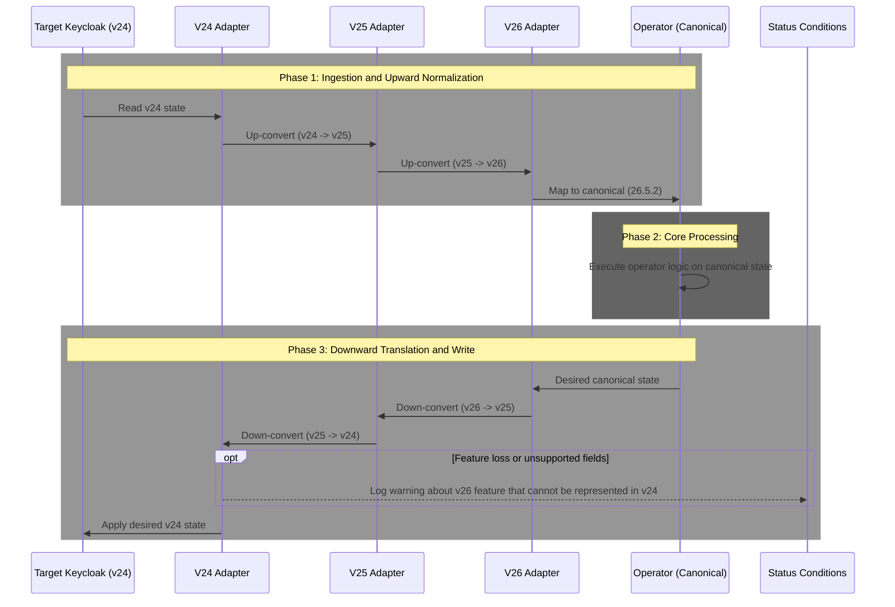

# Keycloak Version Support

This page is the user-facing source of truth for which Keycloak versions the operator supports, how version-specific behavior is handled, and where compatibility failures show up.

## Supported Versions

The operator supports Keycloak `24.0.0` and later.

| Major version | Supported range | Status |
| --- | --- | --- |
| `26.x` | `26.0.8+` | fully supported, canonical model is `26.5.2` |
| `25.x` | `25.0.0+` | supported |
| `24.x` | `24.0.0+` | supported |
| `23.x` and earlier | unsupported | rejected by project support policy |

## Validated Versions

These versions are currently recorded in `scripts/keycloak_versions.yaml` as having passed the full validation flow.

| Version | Date | Result | Notes |
| --- | --- | --- | --- |
| `24.0.0` | `2026-01-28` | pass | full suite |
| `25.0.0` | `2026-01-28` | pass | full suite |
| `26.0.8` | `2026-01-29` | pass | full suite |
| `26.1.5` | `2026-01-29` | pass | full suite |
| `26.2.0` | `2026-01-29` | pass | full suite |
| `26.3.0` | `2026-01-29` | pass | full suite |
| `26.4.0` | `2026-01-29` | pass | full suite |
| `26.5.2` | `2026-01-28` | pass | canonical version used in CI |

Freshness note: this table is derived from the checked-in version metadata in `scripts/keycloak_versions.yaml`. When you need the latest repository truth, inspect that file directly.

## Canonical Model Architecture

The operator does not maintain separate handwritten codepaths for every supported Keycloak version. It uses one canonical model plus adapters.



What that means in practice:

1. operator code is written against the canonical `26.5.2` model
2. the runtime detects the actual Keycloak version, or uses `spec.keycloakVersion` when you set an override for custom images
3. the matching adapter upgrades older payloads step-by-step until they match the canonical model
4. unsupported fields or feature mismatches are surfaced as admission failures or status conditions instead of being silently ignored

When the operator writes back to a target Keycloak version, the same adapter layer renders the canonical model back down to the version-specific API shape.

## Image Tag And `keycloakVersion` Rules

### Always true

- the minimum supported Keycloak version is `24.0.0`
- `spec.keycloakVersion` can override capability detection when the image tag alone is not enough

### Only true when `spec.upgradePolicy` is set

When `spec.upgradePolicy` is configured, the admission webhook requires a semantic-version image tag. Tags such as `latest`, `nightly`, or digest-only references are rejected.

That requirement exists because upgrade orchestration depends on deterministic version information for:

- detecting upgrades and downgrades
- deciding when backup logic applies
- selecting version-specific runtime behavior

Examples that pass when `upgradePolicy` is set:

- `quay.io/keycloak/keycloak:26.5.2`
- `myregistry.io/custom-keycloak:26.5.2-custom`
- `myregistry.io/custom-keycloak:26.5.2-rc.1`

Examples that fail when `upgradePolicy` is set:

- `quay.io/keycloak/keycloak:latest`
- `quay.io/keycloak/keycloak:nightly`
- `quay.io/keycloak/keycloak@sha256:...`
- `quay.io/keycloak/keycloak`

`spec.keycloakVersion` helps with capability detection, but it does not bypass the semver-tag requirement when upgrade orchestration is enabled.

## Version-Specific Behavior

### 24.x versus 25.x health and metrics ports

`24.x` exposes health checks on the main HTTP port `8080`.

`25.x` and later use the management port `9000` for health and metrics endpoints. The operator switches probe behavior automatically.

### 26.0.0+ organizations

Realm organizations are only supported on Keycloak `26.0.0+`.

If you use `organizations` or `organizationsEnabled` against `24.x` or `25.x`, reconciliation fails with a version-compatibility error.

### 26.3.0 client-policy configuration shape

Client policy condition and executor configuration changed shape in `26.3.0`.

The adapter converts between older list-style payloads and the canonical dict-style model. This is typically non-blocking and is reported as a compatibility warning rather than a hard failure.

### 26.4.0 removed OAuth2 device fields

The following realm fields were removed in `26.4.0`:

- `oAuth2DeviceCodeLifespan`
- `oAuth2DevicePollingInterval`

If you target `26.4.0+` and still configure them, reconciliation fails with a clear compatibility error.

## Where Compatibility Failures Surface

Compatibility failures show up in two different places.

### Admission-time failures

The Keycloak validating webhook rejects invalid `Keycloak` specs before they are stored, for example when:

- more than one `Keycloak` is created in the same namespace
- the spec fails Pydantic validation
- `upgradePolicy` is set but the Keycloak image tag is not semver-compatible

### Reconciliation-time failures

Realm and client compatibility checks are reported through status conditions such as:

```yaml
status:
  conditions:
    - type: VersionCompatibility/OrganizationsNotSupported
      status: "False"
      reason: OrganizationsNotSupported
      message: "Organizations feature is not supported in Keycloak 25.0.0. Upgrade to Keycloak 26.0.0+ to use this feature."
```

Useful inspection commands:

```bash
kubectl get keycloak my-keycloak -n keycloak-system -o jsonpath='{.status.version}{"\n"}'
kubectl get keycloakrealm my-realm -n my-team -o yaml
kubectl describe keycloakrealm my-realm -n my-team
```

## How To Validate Another Version

Use the full repository flow so the result matches the project’s support policy:

```bash
KEYCLOAK_VERSION=26.3.0 task test:all
```

If that passes, update `scripts/keycloak_versions.yaml` so the validation history stays authoritative.

For API compatibility maintenance work:

```bash
task keycloak:verify-api
task keycloak:models
```

## Related Guidance

- [Versioning](../versioning.md)
- [Migration & Upgrade Guide](../operations/migration.md)
- [End-to-End Setup](../how-to/end-to-end-setup.md)
- [FAQ](../faq.md)
