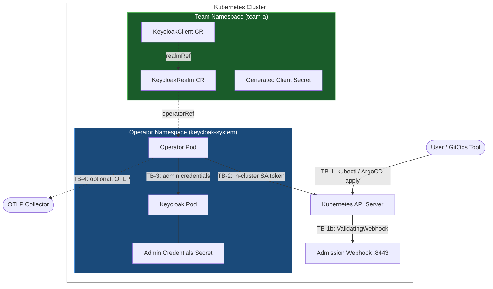

# Threat Model

This document is an adversarial security assessment of the Keycloak operator. It is intended for security engineers, platform architects, and auditors evaluating the operator before production deployment or during a security review.

It is deliberately honest. Gaps are called out explicitly alongside the controls that are in place, because your threat model is only useful to you if it reflects reality.

For the authorization model and how teams use it day-to-day, see [Security Model](../concepts/security.md). For deployment security recommendations, see [Secret Management](../operations/secret-management.md).

---

## Scope and Protected Assets

This assessment covers:

- The operator pod and its service account
- The Keycloak admin credential stored as a Kubernetes Secret
- The Keycloak instance managed by the operator
- The `Keycloak`, `KeycloakRealm`, and `KeycloakClient` Custom Resources
- Client credentials (OAuth2 secrets) generated and stored by the operator

Out of scope:

- End-user authentication flows (Keycloak handles these independently of the operator)
- Platform-level security (etcd encryption, node security, container runtime)
- Identity Providers connected to realms (external systems)

### Asset Criticality

| Asset | Criticality | Why |
|---|---|---|
| Keycloak admin credential Secret | **Critical** | Gives full admin access to Keycloak — all realms, all clients, all users |
| Operator service account token | **High** | Can read labeled Secrets across opted-in namespaces, manage CRDs cluster-wide |
| `Keycloak` CR | **High** | Controls Keycloak deployment configuration |
| `KeycloakRealm` CR | **Medium** | Controls identity configuration for a tenant; includes `clientAuthorizationGrants` |
| `KeycloakClient` CR | **Medium** | Controls OAuth2 client registration; spec includes redirect URIs and role assignments |
| Generated client Secret | **Medium** | Application credentials; stored only in the client's namespace |

---

## Architecture and Trust Boundaries



### Trust Boundary Definitions

| ID | Boundary | From | To | Trust Level |
|---|---|---|---|---|
| TB-1 | User to Kubernetes API | Users, GitOps controllers | K8s API server | **Untrusted input** — validated by admission webhook and Pydantic |
| TB-1b | K8s API to webhook | Kubernetes API server | Operator webhook server | Mutual authentication via cert-manager TLS |
| TB-2 | Operator to Kubernetes API | Operator pod | K8s API server | High trust — in-cluster SA token, minimal RBAC |
| TB-3 | Operator to Keycloak | Operator pod | Keycloak admin API | High trust — full admin credentials, HTTP within cluster |
| TB-4 | Operator to OTLP | Operator pod | Trace/metrics collector | Low sensitivity — telemetry only |

---

## STRIDE Analysis

### TB-1: User / GitOps → Kubernetes API (CRD creation)

#### Spoofing
**Threat**: Attacker impersonates a legitimate user to create or modify CRs.

**Controls**:
- ✅ Kubernetes API server enforces authentication for all requests (certificates, tokens, OIDC)
- ✅ RBAC gates who can `create`/`update`/`delete` each CRD per namespace
- ✅ GitOps tools (ArgoCD, Flux) authenticate with dedicated ServiceAccounts scoped to their namespace

**Residual risk**: None specific to this operator — depends on cluster authentication configuration.

---

#### Tampering
**Threat**: Attacker crafts a malicious CRD spec to cause unintended behavior in Keycloak.

**Controls**:
- ✅ **Admission webhook** validates all CR specs synchronously before persistence to etcd (TLS-protected, cert-manager)
- ✅ **Pydantic models** enforce strict typing, field constraints, and field-level validators on every reconciliation
- ✅ `realmName` validator blocks path traversal characters (`/`, `\`, `?`, `#`, `%`, `&`, `=`, `+`, space)
- ✅ `clientId` validated as non-empty, max 255 chars; embedded in Keycloak API calls via the Keycloak-assigned UUID, not the raw string
- ✅ `protocol` field is an enum (`openid-connect`, `saml`, `docker-v2`) — no free-text injection
- ✅ Redirect URI validator blocks bare wildcards, domain wildcards (`https://*.example.com`), wildcards not at end of path, and non-scheme URIs
- ✅ Script-based protocol mappers blocked by default (`KEYCLOAK_ALLOW_SCRIPT_MAPPERS=false`), preventing arbitrary JavaScript execution in Keycloak token flows
- ✅ Case-insensitive check on mapper type prevents case-variation bypass

**Residual risk**: Low. Multiple independent validation layers.

---

#### Repudiation
**Threat**: Actor denies having created or modified a CR.

**Controls**:
- ✅ Kubernetes audit logging captures all API calls (who, what, when) — platform responsibility to enable
- ✅ GitOps PR history provides an immutable record of intent
- ✅ Operator logs RBAC decisions with full context (source namespace, target namespace, operation, resource name)

**Residual risk**: Low when Kubernetes audit logging is enabled. Without it, only GitOps history remains.

---

#### Information Disclosure
**Threat**: CR spec content exposes sensitive information.

**Controls**:
- ✅ **No plaintext secrets in CR specs** (ADR-005) — all sensitive values are Kubernetes Secret references (`secretKeyRef`)
- ✅ Admission webhook rejects specs containing plaintext where a Secret reference is required

**Gap**: The `.status` field on CRDs is not a formal Kubernetes status subresource (no `subresources: {status: {}}` in the CRD). Anyone with `patch` or `update` on a CR can write status fields. This is a low-risk monitoring integrity issue (a user could forge `phase: Ready` on a failing resource, suppressing alerts). The reconciler corrects status on the next cycle regardless. Compared to having general `update` permission on the CR — which implies the user is trusted — status forging is a minor concern.

---

#### Denial of Service
**Threat**: Attacker creates large numbers of CRs to overwhelm the operator or Keycloak.

**Controls**:
- ✅ **Three-layer rate limiting** protects Keycloak: startup jitter (0–10s random delay), per-namespace limiter (5 req/s), global limiter (50 req/s)
- ✅ **Circuit breaker** (`aiobreaker`) stops runaway reconciliation loops when Keycloak is unavailable
- ✅ **Exponential backoff** on reconciliation failures prevents hammering
- ✅ Kopf's built-in queue management prevents unbounded event accumulation

**Residual risk**: An attacker with CR creation permissions can queue work for the operator. The rate limiters absorb the load and protect Keycloak, but reconciliation latency increases. Kubernetes resource quotas at the namespace level are the appropriate additional control.

---

#### Elevation of Privilege
**Threat**: Attacker uses a CR to grant themselves elevated roles in Keycloak.

**Controls**:
- ✅ **Blocked realm roles**: `admin` cannot be assigned via `KeycloakClient` spec
- ✅ **Blocked realm-management client roles**: `realm-admin`, `manage-realm`, `manage-authorization`, `manage-users`, `manage-clients`, `manage-events`, `manage-identity-providers` are all blocked
- ✅ **Impersonation blocked by default**: `impersonation` role cannot be assigned unless `KEYCLOAK_ALLOW_IMPERSONATION=true` is explicitly set
- ✅ Checks run on every reconciliation, not just at creation — drift is corrected

**Gap**: The blocked-role list prevents the *operator* from assigning dangerous roles through CRDs. Someone with direct access to the Keycloak admin API (separate credentials or UI) can still assign these roles manually. If that happens, the operator will not detect or revert it — it only reconciles what it owns. This is addressed under the drift window discussion in TB-3.

**Gap**: A realm owner can add any Kubernetes namespace to `clientAuthorizationGrants`. There is no operator-native blocklist. This is a platform incident-response concern — without an external control, a platform team cannot prevent a realm owner's GitOps tool from continuously re-applying a grant list that includes a namespace the platform wants to block. See [GAP-2](#gap-2-no-platform-veto-on-clientauthorizationgrants) for the recommended mitigation.

---

### TB-2: Operator → Kubernetes API

#### Spoofing
**Threat**: Another process impersonates the operator's service account.

**Controls**:
- ✅ SA token is mounted automatically by the kubelet; not distributable outside the pod
- ✅ `automountServiceAccountToken: true` only on the operator deployment — other pods in the namespace do not inherit it
- ✅ Token is short-lived and automatically rotated by the kubelet

**Residual risk**: If the operator pod is compromised and the SA token is extracted, it is valid until expiry (typically 1h for projected tokens). Pod security controls (next section) reduce this risk.

---

#### Tampering / Elevation of Privilege
**Threat**: Operator's SA is used to modify resources beyond its intended scope.

**Controls**:
- ✅ Operator SA has **no blanket cluster-wide Secret read** access
- ✅ Namespace Secret access is **opt-in per namespace** via RoleBinding created by Helm charts (`rbac.create=true`)
- ✅ Even with Secret access, the operator requires the Secret to carry `vriesdemichael.github.io/keycloak-allow-operator-read=true` label — defense in depth
- ✅ Cluster-wide permissions limited to: list/watch CRDs, patch CRD status, manage Keycloak deployments in operator namespace only
- ✅ Operator uses `SubjectAccessReview` at runtime to verify its own permissions before cross-namespace operations
- ✅ RBAC checks are performed fresh per reconciliation (not cached)
- ✅ All cross-namespace RBAC decisions are audit-logged with structured JSON

**Residual risk**: Minimal given the layered design (ADR-032, ADR-073).

---

#### Information Disclosure
**Threat**: Operator SA reads Secrets it should not have access to.

**Controls**:
- ✅ Double-gating: K8s RBAC must allow the read **and** the Secret must have the allow label
- ✅ Secret contents are never logged (structured logging with explicit exclusion of sensitive fields)
- ✅ Metrics (Prometheus) carry no Secret values — cardinality policy enforced (ADR-084)

**Residual risk**: Low. Any granted access is explicitly auditable via K8s audit logs.

---

### TB-3: Operator → Keycloak Admin API

This is the highest-criticality boundary. Full admin credentials transit this channel.

#### Spoofing
**Threat**: Operator authenticates to a fake Keycloak instance and leaks admin credentials.

**Controls**:
- ✅ Operator-managed Keycloak is addressed by internal cluster DNS (`{name}.{namespace}.svc.cluster.local`) over in-cluster HTTP
- ✅ External Keycloak connections derive TLS verification from `KEYCLOAK_URL`: `https://` defaults to certificate verification, `http://` defaults to no TLS verification
- ✅ Operators can explicitly override TLS verification via `KEYCLOAK_VERIFY_SSL` / `keycloak.verifySsl`, which makes insecure external HTTPS an explicit configuration choice instead of an implicit default

**Residual risk**: Low for operator-managed Keycloak (HTTP, same-namespace, not interceptable from outside the cluster). Low for external HTTPS when verification is left at the secure default. Medium only when external HTTPS deployments explicitly disable certificate verification for self-signed or non-standard PKI.

---

#### Tampering
**Threat**: Keycloak API response is manipulated to cause the operator to take incorrect actions.

**Controls**:
- ✅ Responses are deserialized into typed Pydantic models — malformed or unexpected fields are rejected or ignored
- ✅ Same cluster-internal network as above — MITM requires cluster-level access

**Residual risk**: Low.

---

#### Repudiation
**Threat**: Keycloak-side admin changes cannot be attributed to a source.

**Controls**:
- ✅ Keycloak admin events API is queried by the drift detection service to detect out-of-band changes
- ✅ Admin events include the user/session that made the change — if the Keycloak admin console is used directly, the event records the user account

**Gap**: The operator does not currently emit a distinct security alert when drift is detected. Drift is treated as a consistency issue and reconciled silently. In a security context, drift may indicate unauthorized access to the Keycloak admin API and should trigger an alert. **Tracked in issue #760.**

---

#### Information Disclosure
**Threat**: Admin credentials are leaked through logs, metrics, or error messages.

**Controls**:
- ✅ Admin credentials loaded from K8s Secret at startup — never logged
- ✅ HTTP response bodies are not logged at INFO level
- ✅ Bearer tokens used for subsequent calls (credential not re-sent per request)
- ✅ Token refresh uses the refresh token, not re-authenticating with password each time
- ✅ Prometheus metrics contain no credential values

**Residual risk**: Low. Risk increases if `LOG_LEVEL=DEBUG` is enabled in production — review log pipeline before doing so.

---

#### Denial of Service
**Threat**: Keycloak admin API is overwhelmed by operator reconciliation.

**Controls**:
- ✅ Three-layer rate limiting (jitter, namespace, global) — see TB-1 DoS section
- ✅ Circuit breaker opens after sustained Keycloak failures, stops all API calls until Keycloak recovers
- ✅ Drift detection interval is configurable — can be reduced at the cost of detection latency

**Residual risk**: Very low. The rate limiting architecture is specifically designed for this scenario.

---

#### Elevation of Privilege — Admin Credential Scope

**Threat**: If the admin credential Secret is compromised, the attacker gains full Keycloak admin access.

**Context**: This is the highest-impact risk in the system. The operator uses a full master-realm admin account because realm *creation* requires master realm access — there is no Keycloak-native way to scope realm-creation permission to less than master admin. For realm-internal operations (clients, IDPs), a realm-scoped account would suffice but introduces a bootstrap problem (the realm-scoped account cannot exist before the realm does).

**Controls**:
- ✅ The admin credential Secret requires the allow label AND namespace RoleBinding to be readable by the operator — two independent gates
- ✅ Operator pod is hardened: non-root (UID 1001), read-only root filesystem, all Linux capabilities dropped, `allowPrivilegeEscalation: false`, `seccompProfile: RuntimeDefault`
- ✅ Operator namespace is dedicated — workload pods do not run alongside it
- ✅ Pod Security Standards can be enforced at the namespace level

**Gap**: **No automatic rotation workflow exists for the Keycloak admin credential.** The admin client is cached at startup with the password stored in memory — the Secret is not re-read on subsequent reconciliations. Rotating the password requires updating the Secret **and restarting the operator pod** to force a re-read. For long-running deployments, this means the credential age is unbounded unless an external secret manager (Vault, AWS Secrets Manager) manages rotation. **Tracked in issue #761.**

**Residual risk**: High if the admin credential is compromised. Reduce the window by integrating external secret rotation and by restricting who can read the admin Secret to the operator SA only.

---

### TB-4: Operator → OTLP Collector

#### Information Disclosure
**Threat**: Trace data sent to the OTLP collector contains sensitive operation details.

**Controls**:
- ✅ Spans contain operation names and timing, not payload content or credentials
- ✅ Correlation IDs do not encode secrets

**Gap**: `OTEL_EXPORTER_OTLP_INSECURE=true` is a supported configuration option. If set, trace data is transmitted without TLS. This is a platform configuration decision — if you configure an insecure OTLP endpoint, that is on you. The receiving collector should enforce authentication. Do not expose an unauthenticated OTLP endpoint on a non-loopback interface.

**Residual risk**: Low with secure collector configuration.

---

## Kubernetes-Specific Attack Vectors (MITRE ATT&CK for Containers)

| Technique | Threat | Control | Status |
|---|---|---|---|
| **Initial Access** — Malicious admission controller | Compromise webhook to allow bad specs | Webhook protected by cert-manager TLS; cert rotation automatic | ✅ Mitigated |
| **Execution** — Script mappers | Inject arbitrary JS into Keycloak token flows via CRD | Script mapper types blocked by default; case-insensitive check | ✅ Mitigated |
| **Persistence** — Keycloak admin account creation | Create a persistent backdoor admin account via operator | Operator does not manage Keycloak users — out of scope by design | ✅ Not applicable |
| **Persistence** — Malicious operator image | Supply-chain attack via compromised container image | Image built in GitHub Actions with SBOM; Dependabot updates dependencies | ✅ Partial — no image signing currently |
| **Privilege Escalation** — Role assignment via CRD | Assign `realm-admin` or `manage-realm` to a service account | Explicit blocked-role list enforced every reconciliation | ✅ Mitigated |
| **Privilege Escalation** — Impersonation via CRD | Assign `impersonation` role to allow acting as any user | Blocked unless `KEYCLOAK_ALLOW_IMPERSONATION=true` explicitly set | ✅ Mitigated by default |
| **Defense Evasion** — Status field forgery | Forge `phase: Ready` to suppress monitoring alerts | No status subresource; anyone with CR update can write status. Low impact — reconciler corrects on next cycle | ⚠️ Low residual risk |
| **Lateral Movement** — Cross-namespace client creation | Unauthorized namespace creates client in another team's realm | `clientAuthorizationGrants` allowlist enforced before any Keycloak API call | ✅ Mitigated |
| **Lateral Movement** — Platform veto bypass | Realm owner adds adversary namespace to grant list; platform cannot block without operator changes | Kyverno/OPA ClusterPolicy recommended as platform-level control | ⚠️ Requires external policy engine |
| **Collection** — Admin credential exfiltration | Read Keycloak admin Secret via operator SA | Double-gating: RBAC + label contract; SA cannot read unlabeled Secrets | ✅ Mitigated |
| **Collection** — Client secret harvest | Read generated OAuth2 client secrets | Secrets written only to client's namespace; operator SA access is namespace-opt-in | ✅ Mitigated |
| **Impact** — Destructive realm deletion | Delete all realms via CRD delete cascade | Cascading delete requires explicit `kubectl delete keycloakrealm` — no force-delete annotation (ADR-064) | ✅ Mitigated |
| **Impact** — Drift exploitation | Make out-of-band Keycloak changes that escape detection | Admin events API detects changes; operator reconciles drift. No security alerting on drift detection currently | ⚠️ Gap in alerting |

---

## Security Controls Inventory

### Authentication and Authorization

| Control | Implementation | Status |
|---|---|---|
| CRD creation gated by K8s RBAC | Standard Kubernetes RBAC roles per namespace | ✅ In place |
| Cross-namespace client creation gated by `clientAuthorizationGrants` | Checked by reconciler and admission webhook before any Keycloak call | ✅ In place |
| Secret access double-gated | RBAC + `vriesdemichael.github.io/keycloak-allow-operator-read` label | ✅ In place |
| Cross-namespace RBAC validated at runtime | `SubjectAccessReview` on every cross-namespace operation | ✅ In place |
| No Keycloak-internal user authentication | Users interact only with CRDs, never with Keycloak admin UI (ADR-017) | ✅ In place |

### Input Validation

| Control | Implementation | Status |
|---|---|---|
| Schema validation at API boundary | Kubernetes-enforced JSON schema (CRD spec) | ✅ In place |
| Semantic validation at API boundary | Admission webhook (Kopf + cert-manager TLS) | ✅ In place |
| Deep validation in reconciler | Pydantic models with field-level validators | ✅ In place |
| Realm name path traversal prevention | Explicit character blocklist in `validate_realm_name` | ✅ In place |
| Redirect URI wildcard safety | Validator blocks domain wildcards and bare wildcards | ✅ In place |
| Protocol allowlist | Enum: `openid-connect`, `saml`, `docker-v2` | ✅ In place |
| Script mapper blocking | Case-insensitive type check, blocked by default | ✅ In place |

### Privilege Controls

| Control | Implementation | Status |
|---|---|---|
| Blocked realm roles | `admin` cannot be assigned via CRD | ✅ In place |
| Blocked realm-management roles | `realm-admin`, `manage-realm`, `manage-authorization`, `manage-users`, `manage-clients`, `manage-events`, `manage-identity-providers` blocked | ✅ In place |
| Impersonation blocked by default | `KEYCLOAK_ALLOW_IMPERSONATION=false` default | ✅ In place |
| Checks enforced on every reconciliation | Not just at creation time | ✅ In place |

### Secret and Credential Handling

| Control | Implementation | Status |
|---|---|---|
| No plaintext secrets in CRD specs | ADR-005; enforced by admission webhook | ✅ In place |
| Admin credentials via K8s Secret reference | Never stored in CRD or configmap | ✅ In place |
| Client secrets written atomically | ADR-080; old credential never leaves a partial state | ✅ In place |
| Client secrets scoped to client namespace | Not accessible from other namespaces | ✅ In place |
| Automatic admin credential rotation | No workflow currently exists — issue #761 | ❌ Gap |

### Container and Pod Security

| Control | Implementation | Status |
|---|---|---|
| Non-root user | UID 1001 | ✅ In place |
| Read-only root filesystem | `readOnlyRootFilesystem: true` | ✅ In place |
| No privilege escalation | `allowPrivilegeEscalation: false` | ✅ In place |
| All capabilities dropped | `capabilities: drop: [ALL]` | ✅ In place |
| Seccomp profile | `RuntimeDefault` | ✅ In place |
| Pod Security Standards | Configurable via `podSecurityContext`; `restricted` profile compatible | ✅ Available |

### Network Security

| Control | Implementation | Status |
|---|---|---|
| Operator → Keycloak over cluster-internal DNS | Not accessible from outside the cluster | ✅ In place |
| Webhook TLS | cert-manager-issued certificate, automatic rotation | ✅ In place |
| Network policies | Not shipped in Helm chart (ADR-076) | ⚠️ Platform responsibility |
| TLS verification for Keycloak connections | Derived from URL scheme by default; explicit override available for self-signed or non-standard PKI | ✅ In place |

### Observability and Audit

| Control | Implementation | Status |
|---|---|---|
| Structured JSON logging with correlation IDs | All reconciliation events | ✅ In place |
| RBAC decision audit logging | Cross-namespace operations logged with context | ✅ In place |
| Prometheus metrics | Operator activity, rate limiting, health | ✅ In place |
| OpenTelemetry distributed tracing | Full span tree for reconciliation operations | ✅ In place |
| Drift detection | Periodic comparison of desired vs actual Keycloak state | ✅ In place |
| Keycloak admin event attribution | Out-of-band changes attributable via Keycloak admin events API | ✅ Available |
| Security alerting on drift | No distinct alert/metric for drift detection results | ❌ Gap — issue #760 |

### Resilience

| Control | Implementation | Status |
|---|---|---|
| Three-layer rate limiting | Jitter, per-namespace limiter, global limiter | ✅ In place |
| Circuit breaker | Stops reconciliation when Keycloak is unhealthy | ✅ In place |
| Exponential backoff | Permanent failures do not retry indefinitely | ✅ In place |
| Reconciliation pause | Operator can be paused per-resource without restart | ✅ In place |

---

## Known Gaps and Accepted Risks

These are explicit gaps in the security posture. They are documented here rather than hidden.

### GAP-1: Full Keycloak Admin Credentials Required

**Severity**: High (impact if exploited) / Low (likelihood given controls)

The operator authenticates to Keycloak using full master-realm admin credentials. This is architecturally required: realm creation needs master-realm admin access, and there is no Keycloak API for finer-grained realm creation. For realm-internal operations, a realm-scoped account would suffice but introduces an unsolvable bootstrap dependency.

**Accepted because**: No viable alternative exists within Keycloak's current permission model.

**Mitigations in place**: Hardened pod (non-root, read-only FS, capabilities dropped); double-gated Secret access; dedicated operator namespace; K8s RBAC limits who can read the Secret.

**What would reduce risk further**: External secret manager with automatic rotation; restricting who can `exec` into the operator pod.

---

### GAP-2: No Platform Veto on `clientAuthorizationGrants`

**Severity**: Medium

A realm owner with `update` permissions on a `KeycloakRealm` can add any namespace to `clientAuthorizationGrants`. There is no operator-native blocklist. A GitOps tool will continuously re-apply the realm manifest even if a platform team manually patches it.

**Not fixed in the operator because**: The correct home for cluster-scoped policy enforcement is a policy engine (Kyverno, OPA/Gatekeeper), not an application operator.

**Recommended mitigation**: Deploy a Kyverno `ClusterPolicy` that denies `KeycloakRealm` specs containing restricted namespaces in `clientAuthorizationGrants`. The integration with GitOps tooling is clean: Kyverno blocks the apply at the Kubernetes API boundary, ArgoCD reports the application as `Degraded`, and the realm manager has a clear signal to resolve the policy violation — without any platform team needing to take manual action.

```yaml
# Example: Kyverno policy blocking specific namespaces from appearing in grants
apiVersion: kyverno.io/v1
kind: ClusterPolicy
metadata:
  name: restrict-client-authorization-grants
spec:
  validationFailureAction: Enforce
  rules:
    - name: block-restricted-namespaces
      match:
        any:
          - resources:
              kinds: ["KeycloakRealm"]
      validate:
        message: "Namespace 'restricted-ns' cannot be added to clientAuthorizationGrants"
        deny:
          conditions:
            any:
              - key: "restricted-ns"
                operator: AnyIn
                value: "{{ request.object.spec.clientAuthorizationGrants }}"
```

---

### Accepted Risk-3: External HTTPS Deployments May Explicitly Disable TLS Verification

**Severity**: Medium when explicitly configured / Low by default

The operator now derives TLS verification from `KEYCLOAK_URL`: `https://` verifies certificates by default and `http://` does not. This closes the previous unsafe default described in issue #756.

**For operator-managed Keycloak**: HTTP is used on `svc.cluster.local` — TLS verification is not meaningful. Risk remains low because traffic stays on the cluster network.

**For external Keycloak (`KEYCLOAK_URL` configured)**: HTTPS is now verified by default. The remaining risk appears only when an operator explicitly sets `KEYCLOAK_VERIFY_SSL=false` / `keycloak.verifySsl=false` to tolerate self-signed or otherwise non-verifiable certificates.

**Accepted because**: Some environments still rely on self-signed or private PKI chains that are not trusted by the operator runtime, so a documented escape hatch is required.

**Mitigations in place**: Secure default for external HTTPS, scheme-derived behavior for managed in-cluster HTTP, explicit Helm/env configuration for the override, and startup warning when HTTPS verification is disabled.

**What would reduce risk further**: Mount a trusted CA bundle into the operator and keep `KEYCLOAK_VERIFY_SSL=true` for all HTTPS deployments.

---

### GAP-4: No Security Alerting on Drift Detection

**Severity**: Medium

The drift detection service identifies out-of-band Keycloak changes but treats them as consistency issues rather than potential security events. No distinct metric or alert is emitted when drift is detected.

**Why this matters**: Drift in a production Keycloak instance should be treated as a potential incident indicator — someone may have accessed the admin API or admin UI directly. Without alerting, the change is reconciled silently.

**Tracked**: Issue #760.

**Interim mitigation**: Review Keycloak admin events periodically. The admin events API records user, timestamp, and operation for every change.

---

### GAP-5: No Admin Credential Rotation Workflow

**Severity**: Medium

No built-in process exists to rotate the Keycloak admin credentials. Password age is unbounded unless an external secret manager manages rotation.

**Tracked**: Issue #761.

**Recommended mitigation**: Use an external secret management system (Vault, AWS Secrets Manager, External Secrets Operator) that rotates the credential and updates the K8s Secret. Note that the operator caches the admin client at startup and stores the password in memory — updating the Secret does not automatically take effect. After rotating the credential, restart the operator pod so it re-creates the admin client and reads the new Secret value.

---

### GAP-6: etcd Encryption is Cluster-Dependent

**Severity**: Low (as an operator concern) / High (as a deployment concern)

All Kubernetes Secrets — including the Keycloak admin credential — are stored in etcd. If etcd is not encrypted at rest and an attacker gains node-level access, they can extract secrets from the etcd data directory.

**This is out of scope for the operator to fix**: Encryption at rest is a cluster configuration responsibility. The operator's security model assumes it is enabled.

**Action**: Before deploying to production, verify that `--encryption-provider-config` is set on the API server or that your managed Kubernetes provider encrypts etcd by default (GKE, EKS, AKS all do).

---

## Network Hardening Recommendations

The operator does not ship Kubernetes `NetworkPolicy` resources (ADR-076 — network policies for application-to-Keycloak traffic are out of scope). However, restricting the operator pod's own network access meaningfully reduces blast radius if the pod is compromised.

The operator pod requires exactly these egress connections:

| Destination | Port | Protocol | Purpose |
|---|---|---|---|
| Kubernetes API server | 6443 (kubeadm) / 443 (managed) | HTTPS | In-cluster SA token operations |
| Keycloak service (`{name}.{namespace}.svc.cluster.local`) | 8080 (HTTP) / 8443 (HTTPS) | HTTP/S | Admin API |
| OTLP collector | Configurable | gRPC/HTTP | Telemetry (optional) |
| CoreDNS | 53 | UDP/TCP | DNS resolution |

**Example network policy for the operator pod:**

```yaml
apiVersion: networking.k8s.io/v1
kind: NetworkPolicy
metadata:
  name: keycloak-operator-egress
  namespace: keycloak-system
spec:
  podSelector:
    matchLabels:
      app.kubernetes.io/name: keycloak-operator
  policyTypes:
    - Egress
  egress:
    # Kubernetes API server.
    # NetworkPolicy selectors only work for pods; the API server is a node-level process
    # (or an external endpoint on managed clusters), so a podSelector cannot target it.
    # Replace the CIDR below with the actual API server IP from:
    #   kubectl get endpoints kubernetes -n default
    - to:
        - ipBlock:
            cidr: 10.96.0.1/32  # Replace with your cluster's API server IP
      ports:
        - port: 6443  # kubeadm default; use 443 for managed clusters (GKE/EKS/AKS)
          protocol: TCP
    # Keycloak admin API (same namespace, Keycloak pods only).
    # Port 8080 for HTTP (in-cluster default); use 8443 if Keycloak runs with TLS.
    # The operator talks only to the admin REST API — Keycloak's metrics port (9000)
    # is scraped by Prometheus, not the operator, and does not need egress here.
    - to:
        - namespaceSelector:
            matchLabels:
              kubernetes.io/metadata.name: keycloak-system
          podSelector:
            matchLabels:
              app.kubernetes.io/name: keycloak
      ports:
        - port: 8080
          protocol: TCP
    # DNS — permits DNS to any destination on port 53; tighten to CoreDNS pods if required
    - ports:
        - port: 53
          protocol: UDP
        - port: 53
          protocol: TCP
```

Add an additional egress rule for your OTLP collector if tracing is enabled.

---

## Deployment Security Baseline

### Minimum Baseline

1. **Enable Kubernetes audit logging** — required for repudiation controls to be effective
2. **Use a dedicated namespace** for the operator — do not co-locate with workload pods
3. **Deploy with `restricted` Pod Security Standards** on the operator namespace
4. **Encrypt etcd at rest** — verify your cluster configuration or managed provider defaults
5. **Enable admission webhooks** — `webhooks.enabled: true` in Helm values (requires cert-manager)
6. **Apply namespace quotas** to limit CR creation rate per namespace

### Hardened Configuration

7. **Deploy a network policy** restricting operator egress to Keycloak, K8s API, and OTLP
8. **Integrate external secret rotation** for the Keycloak admin credential (Vault, ESO)
9. **Deploy Kyverno or OPA/Gatekeeper** with policies restricting `clientAuthorizationGrants`
10. **Enable Keycloak admin event logging** and forward to your SIEM
11. **Set up alerts** on operator reconciliation failures and (once #760 is resolved) on drift detection
12. **Review `LOG_LEVEL=DEBUG`** before enabling in production — trace-level logs should be treated like sensitive data

---

## References

- [Security Model](../concepts/security.md) — authorization model and namespace grant system
- [RBAC Implementation](../rbac-implementation.md) — detailed RBAC wiring
- [Secret Management](../operations/secret-management.md) — credential handling operational guide
- [ADR-003](../decisions/generated-markdown/003-least-privilege-everywhere.md) — Least privilege everywhere
- [ADR-005](../decisions/generated-markdown/005-no-plaintext-secrets.md) — No plaintext secrets
- [ADR-017](../decisions/generated-markdown/017-kubernetes-rbac-over-keycloak-security.md) — Kubernetes RBAC over Keycloak security
- [ADR-032](../decisions/generated-markdown/032-minimal-rbac-with-namespaced-service-accounts.md) — Minimal RBAC with namespaced service accounts
- [ADR-040](../decisions/generated-markdown/040-admission-webhooks-for-validation.md) — Admission webhooks for validation
- [ADR-063](../decisions/generated-markdown/063-namespace-grant-list-authorization.md) — Namespace grant list authorization
- [ADR-073](../decisions/generated-markdown/073-security-and-multi-tenancy-model.md) — Security and multi-tenancy model
- [ADR-076](../decisions/generated-markdown/076-no-network-policies-in-helm-chart.md) — No network policies in Helm chart
- [ADR-078](../decisions/generated-markdown/078-restrict-privileged-roles-and-scripts.md) — Restrict privileged roles and script mappers
- [ADR-080](../decisions/generated-markdown/080-atomic-client-secret-rotation.md) — Atomic client secret rotation
- [MITRE ATT&CK for Containers](https://attack.mitre.org/matrices/enterprise/containers/)
- [OWASP Kubernetes Security Cheat Sheet](https://cheatsheetseries.owasp.org/cheatsheets/Kubernetes_Security_Cheat_Sheet.html)
- [NIST SP 800-190](https://csrc.nist.gov/publications/detail/sp/800/190/final) — Application Container Security Guide
- GitHub issue #94 — original threat model tracking issue
- GitHub issue #756 — resolved TLS verification fix
- GitHub issue #760 — drift detection alerting and credential rotation
